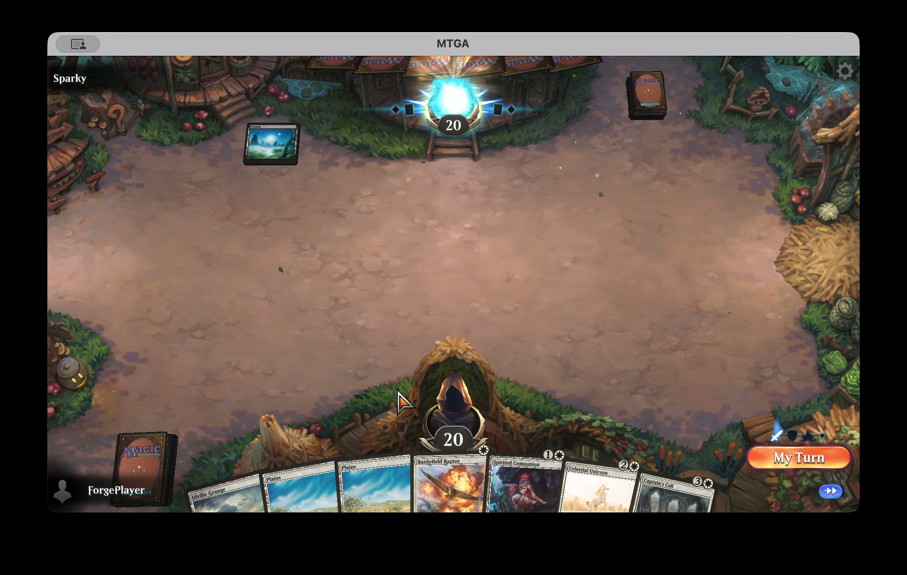
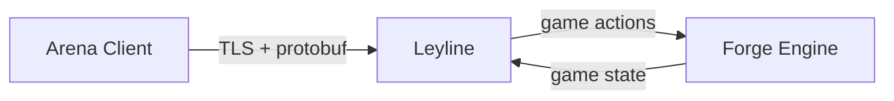

# Leyline

Open-source game server for Magic: The Gathering Arena.
Your client, open rules engine, no account required.

*A shuffler you can trust.*

> **Alpha — evolving weekly.** Core game loop works. Card pool growing.
> [See what works →](docs/catalog.yaml)

<p align="center">
  <a href="https://pub-ee18c3c0efd64ad5967c2972fae3edd3.r2.dev/1775215112-leyline-demo.mp4">
    
  </a>
</p>

## 🎮 Play

Download the launcher, point it at your Arena install, hit Play.

<p align="center">
  
</p>

1. **[Download the latest release](https://github.com/delebedev/leyline/releases)** — `.dmg` for macOS, `.msi` for Windows
2. **Launch** — the app auto-detects your Arena install
3. **Play** — click Play, Arena connects to your local server

Requires a legally obtained copy of [MTG Arena](https://magic.wizards.com/mtgarena).
[Installation guide →](docs/install.md)

## ⚙️ How it works

Arena speaks protobuf over TLS. Leyline speaks it back —
translating between the real client and [Forge](https://github.com/Card-Forge/forge)'s open-source rules engine.



The key pattern: Forge's engine blocks at each decision point.
Leyline's async handler completes the future when the client responds.

```
app/         Server startup, Netty pipeline, debug tools
account/     Auth, JWT — no Forge dependency
frontdoor/   Lobby, decks, matchmaking
matchdoor/   Game engine adapter — the big module
```

[Architecture deep-dive →](docs/architecture.md)

## 🔥 Forge

The heavy lifting — 20+ years of card rules, 20,000+ card implementations,
AI opponents — lives in [Forge](https://github.com/Card-Forge/forge),
the open-source MTG rules engine.

Leyline uses a [minimal fork](https://github.com/delebedev/forge) that adds
event hooks and controller seams for the Arena protocol bridge.
The rules engine itself is untouched.

## 🛠 Build from source

```bash
git clone --recursive https://github.com/delebedev/leyline.git
cd leyline
just bootstrap   # submodules + forge + build + seed DB
just serve        # server on :30003 + :30010
```

**Requires:** JDK 17+, [just](https://github.com/casey/just), macOS or Linux.
Arena client installed locally (reads card database at runtime — not distributed).
TLS certs needed for Arena connection — see `just dev-setup`.

### Testing

```bash
just test-gate         # lint + typecheck + all tests
just test-one MyTest   # single test class
just puzzle file.pzl   # run a puzzle scenario
```

[Puzzle-driven development →](docs/puzzle-driven-dev.md)

## 🧭 Design philosophy

**Player.log is the spec.** Real Arena logs are the conformance baseline. Trace, diff, close gaps.

**Minimal engine changes.** Leyline plugs into Forge's existing bridge interfaces. The fork adds event hooks and controller seams — the rules engine stays untouched.

**Puzzles as acceptance tests.** `.pzl` files define exact board states with one win path. An agent plays the game to verify the server.

**Protocol reimplementation.** Protobuf responses built from public protocol definitions. No client mods, no proxies, no distributed assets.

## 📋 What this is

A local game server for personal playtesting. It connects your Arena client to an open-source rules engine running on your own machine.

**What it is not:**

- Not a replacement for Arena or official servers
- Not a public or online server — local only
- Does not distribute card art, sounds, or game assets
- Does not support unauthorized public servers

## License

GPL-3.0 — inherited from [Forge](https://github.com/Card-Forge/forge). See [LICENSE](LICENSE), [LEGAL](LEGAL.md), and [NOTICE](NOTICE).

[Architecture](docs/architecture.md) · [What works](docs/catalog.yaml) · [Issues](https://github.com/delebedev/leyline/issues)

---

This project is not affiliated with, endorsed by, or connected to Wizards of the Coast, Hasbro, or any of their affiliates. "Magic: The Gathering" is a trademark of Wizards of the Coast LLC.
