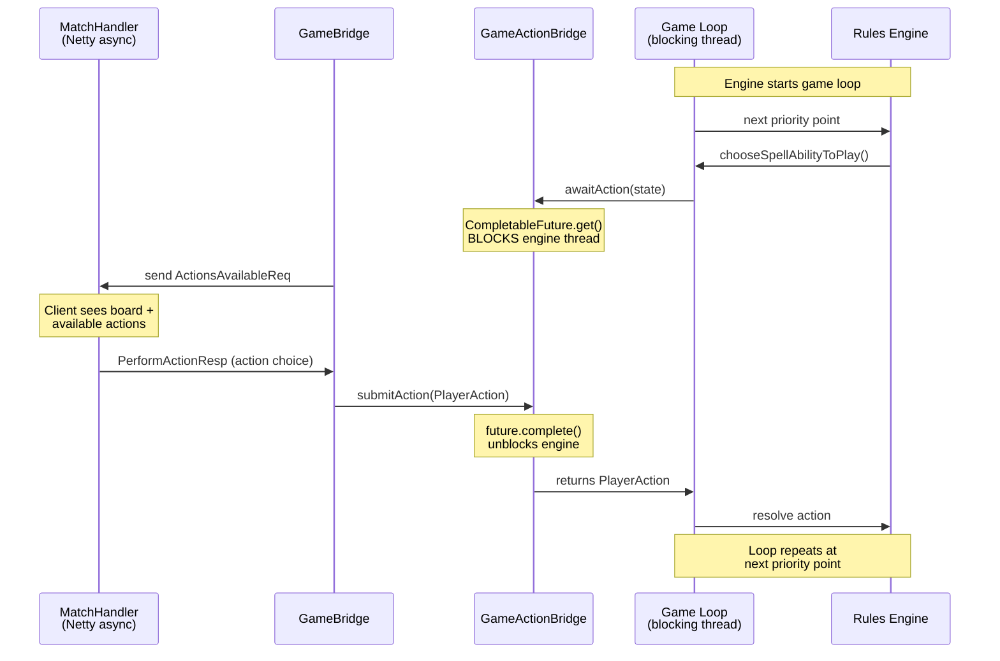
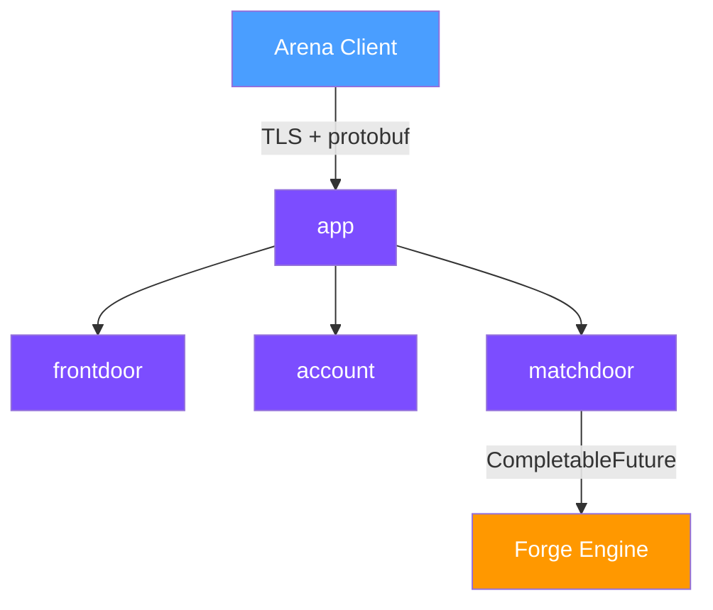

# Leyline

Open-source local game server that connects the real Arena client to [Forge](https://github.com/Card-Forge/forge)'s rules engine.

> **Alpha.** Core game loop works — creatures, spells, combat, puzzles. Lots still broken. APIs change. [What works →](docs/catalog.yaml)

## Design philosophy

**Player.log is the spec.** Arena logs from real server games are the source of truth for protocol conformance. Trace, diff, close gaps.

**Minimal engine changes.** Leyline plugs into Forge's existing bridge layer — `CompletableFuture` interfaces that block the engine thread at each decision point. The fork adds a handful of event hooks and controller seams; the rules engine is untouched.

**A server that playtests itself.** Puzzles define exact board states with one win path — an agent plays the game to verify the server.

**Protocol reimplementation, not interception.** Hand-written protobuf responses implementing a compatible wire format. No client mods, no distributed assets.

## How it works

The Arena client connects over TLS and speaks protobuf. Leyline translates Forge's game state into the wire format the client expects.

The key pattern: Forge's engine thread blocks on a `CompletableFuture` at each priority point. Leyline's async Netty handler completes that future when the client responds.



## Architecture



```
app/         Composition root — Netty pipeline, server startup, debug server
account/     Auth, registration, JWT, doorbell
frontdoor/   Lobby protocol — decks, events, matchmaking
matchdoor/   Game engine adapter — state mapping, annotations, combat
```

See [docs/architecture.md](docs/architecture.md) for the full deep-dive: wire protocol, match lifecycle, state mapping pipeline, and forge-web reuse boundary.

## Quick start

```bash
git clone --recursive https://github.com/delebedev/leyline.git
cd leyline
just install-forge   # build engine deps
just build           # compile + proto codegen
just dev-setup       # gen TLS certs, configure local routing
just seed-db         # create player database with starter decks
just serve           # start server on :30003 + :30010
```

**Requirements:** macOS, JDK 17+, MTG Arena client installed (for card database — not distributed), [just](https://github.com/casey/just) task runner, [mitmproxy](https://mitmproxy.org/) (for TLS CA).

## What this is not

- Not a replacement for Arena
- Not a public server — local playtesting only
- Does not distribute card art, sounds, or game assets
- Does not sponsor or support unauthorized public servers
- Requires a legally obtained copy of MTGA

## Links

[Architecture deep-dive](docs/architecture.md) · [What works](docs/catalog.yaml) · [Issues](https://github.com/delebedev/leyline/issues) · [Project Board](https://github.com/users/delebedev/projects/1) · GPL-3.0

---

This project provides a local game server for personal playtesting. It requires a legally obtained copy of Magic: The Gathering Arena. It is not affiliated with, endorsed by, or connected to Wizards of the Coast, Hasbro, or any of their affiliates. "Magic: The Gathering" is a trademark of Wizards of the Coast LLC. This project does not distribute any copyrighted game assets.

See [LICENSE](LICENSE) and [NOTICE](NOTICE).
