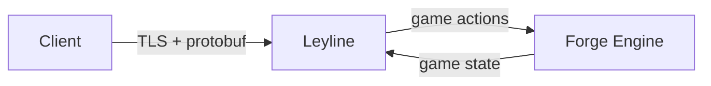

# Leyline

Open-source local playtesting server.
Protocol bridge + open rules engine.

## ⚙️ How it works

Leyline speaks the client protocol and translates game actions into
[Forge](https://github.com/Card-Forge/forge)'s open-source rules engine.


```mermaid
graph LR
    CLIENT["Client"] -- "TLS + protobuf" --> LEYLINE["Leyline"]
    LEYLINE -- "game actions" --> FORGE["Forge Engine"]
    FORGE -- "game state" --> LEYLINE
```

The key pattern: Forge's engine blocks at each decision point.
Leyline's async handler completes the future when the client responds.

```
app/         Server startup, Netty pipeline, debug tools
account/     Local account bootstrap + doorbell — no Forge dependency
frontdoor/   Lobby, decks, matchmaking
matchdoor/   Game engine adapter — the big module
```

[Architecture deep-dive →](docs/architecture.md)

## Forge

The heavy lifting lives in [Forge](https://github.com/Card-Forge/forge),
the open-source MTG rules engine.

Leyline uses a [minimal fork](https://github.com/delebedev/forge) that adds
event hooks and controller seams for the client protocol bridge.
The rules engine itself is untouched.

## 🛠 Build from source

```bash
git clone --recursive https://github.com/delebedev/leyline.git
cd leyline
just bootstrap   # submodules + forge + build + seed DB
just serve        # server on :30003 + :30010
```

**Requires:** JDK 17+, [just](https://github.com/casey/just), macOS or Linux.
Client installed locally for card data lookup at runtime; not distributed.
End-to-end client runs need local client setup. See [docs/local-client-setup.md](docs/local-client-setup.md).

### Testing

```bash
just test-gate         # lint + typecheck + all tests
just test-one MyTest   # single test class
just puzzle file.pzl   # run a puzzle scenario
```

For documentation-only changes, `just docs` lists the documentation map and
`just docs-lint` checks Markdown cross-references.

## 🧭 Design philosophy

**Architecture-first.** Keep the bridge small, explicit, and observable.

**Minimal engine changes.** Leyline plugs into Forge's existing bridge interfaces. The fork adds event hooks and controller seams — the rules engine stays untouched.

**Puzzles as acceptance tests.** `.pzl` files define exact board states with a focused success path. Agents and scripted suites play through them to verify the server without relying on game-ending goals.

**Protocol implementation.** Protobuf responses built from protocol documentation and project-owned tooling. No distributed client assets.

## 📋 What this is

A local server for personal playtesting and protocol/runtime experimentation.

**What it is not:**

- Not a public or online service
- Does not distribute card art, sounds, or game assets

## License

GPL-3.0 — inherited from [Forge](https://github.com/Card-Forge/forge). See [LICENSE](LICENSE), [LEGAL](LEGAL.md), and [NOTICE](NOTICE).

[Architecture](docs/architecture.md) · [Issues](https://github.com/delebedev/leyline/issues)

---

This project is not affiliated with, endorsed by, or connected to Wizards of the Coast, Hasbro, or any of their affiliates. "Magic: The Gathering" is a trademark of Wizards of the Coast LLC.
