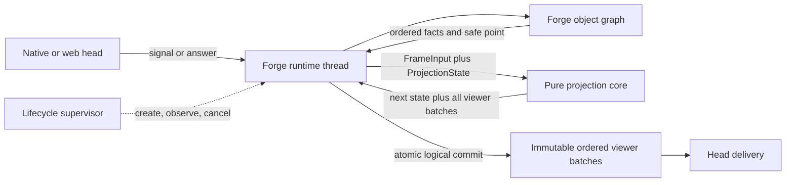

# Forge Runtime Architecture Direction

This document defines the accepted destination for Leyline's match runtime. It
is not a description of the current implementation and not an execution plan.
For current system shape, read [`architecture.md`](architecture.md). Until a
specific seam migrates, [`bridge-threading.md`](bridge-threading.md) remains
authoritative.

This is the evolving normative implementation contract. Update it when names,
state decomposition, migration steps, or proof requirements change within the
accepted boundary. [`ADR 0015`](decisions/0015-functional-core-imperative-shell.md)
is the durable decision record: it owns the rationale, withdrawn-slice
findings, fixed boundary, and rejected alternatives. Implementation may move
incrementally, but every slice must converge on the rules below.

## Architectural thesis

Forge is a synchronous, mutable rules engine that is deterministic for an
isolated random source and ordered commands. One per-match Forge runtime thread
is the imperative shell and the sole logical owner of the live engine graph,
ordered engine facts, logical protocol state, projection commit, and output
sequence.

At explicit safe points, that thread materializes a typed immutable input and
calls a pure projection core synchronously. The core returns a tentative next
state and frame batch. The runtime installs both in one logical commit, then
hands the immutable batch to delivery.

Transport and scheduler threads submit immutable signals or complete one
pending reply. They do not inspect Forge, compile protocol state, or advance
match progression.



The runtime thread may block in a Forge controller callback while waiting for a
client answer. Completing that bounded reply primitive is not a second logical
owner. The runtime thread resumes, validates, executes, materializes the next
input, and commits the result.

## Responsibility boundaries

| Component | Owns | Must not own |
|---|---|---|
| Lifecycle supervisor | Match admission, runtime creation, resource policy, cooperative cancellation, cleanup, health reporting | Semantic match transitions, projection state, protocol IDs, terminal frames, Forge state |
| Forge runtime thread | Live Forge graph, controller callbacks, ordered fact journal, retained handle tokens, pending interaction, projection state, core invocation, logical commit, output order | Transport channels, authentication, delivery retry policy |
| Forge adapter and safe-point hooks | Translating runtime commands into Forge operations, appending immutable facts, declaring mutation-complete cuts, materializing typed inputs | Client protocol builders, delivery, shared projection mutation |
| Pure projection core | Deterministic conversion of immutable input and prior projection state into next state and a frame batch | I/O, locks, clocks, randomness, live Forge reads, in-place allocation, reply primitives |
| Protocol heads and delivery | Connection lifecycle, decoding, authentication where applicable, submitting signals and answers, flushing immutable committed batches | Rules, match progression, projection repair, protocol ID allocation |

Forge remains authoritative for rules, legality, playable abilities, costs,
engine identity, causes, and final game state. Leyline remains authoritative for
interaction binding, client projection, frame cuts, visibility, client object
identity, sequencing, and delivery.

This decision makes protocol projection functional. Rules execution, blocked
interaction handling, semantic match lifecycle, cancellation, and delivery
remain in the imperative shell. Moving another responsibility into a pure
reducer requires separately demonstrated duplication and a separate decision.

## Non-negotiable invariants

1. **One logical owner advances a match.** The Forge runtime thread owns live
   engine state and every logical protocol transition. Other threads may submit
   immutable signals or answers, not apply them.
2. **The functional boundary carries values.** Core inputs contain immutable
   data, stable identities, and explicit correlation. They contain no callbacks,
   futures, channels, mutable engine objects, or shared counter references.
3. **Observation timing is explicit.** An event subscriber may append a fact
   and request a cut. Only a declared safe point may close the fact journal and
   materialize a projection input.
4. **State and facts are complementary.** A snapshot describes resulting state;
   ordered facts preserve cause, grouping, and intermediate operations. Neither
   is reconstructed from the other when information would be lost.
5. **Projection is referentially transparent.** Equal environment, prior state,
   input, and ordered viewer set produce equal viewer batches and equal next
   state.
6. **Commit is atomic at match level.** All viewer batches for one cut commit
   together. Failed or discarded compilation advances no ID, cursor, tracker,
   pending interaction, or output order, and retains the immutable pending cut.
7. **One commit defines gameplay output order.** Playback, prompts, lifecycle,
   ordinary state, spectator, and terminal batches join the same monotonic
   order before delivery.
8. **Heads share one runtime.** Native and web heads may decode and encode
   differently, but they consume the same committed match progression.

## Runtime cycle

The ordinary cycle is:

```text
head or scheduler submits immutable signal / completes pending answer
  -> Forge runtime consumes it at its owning interaction or safe point
  -> Forge advances synchronously
  -> event subscribers append immutable facts and may request cuts
  -> a mutation-complete safe point closes one fact journal
  -> runtime materializes PendingCut(FrameInput, prior ProjectionState)
  -> pure core computes next ProjectionState and every ViewerBatch
  -> runtime validates and commits the whole cut once
  -> immutable viewer batches enter the runtime's monotonic output order
  -> head delivery flushes without changing logical state
```

A lifecycle signal that arrives while Forge is running waits in a bounded
mailbox until the runtime reaches a safe point. An answer for a blocked
controller callback is correlated against a coordinator-owned window. Visible
priority offers carry immutable action views and opaque runtime tokens. A
SyncOnly priority stop commits a state-only cut before signalling and freezes
the next engine decision as reevaluate, require Visible, or allow SyncOnly.
Completing the barrier does not arm that decision; the engine arms it only
after its exact wait returns successfully. One drain
invocation delivers the queued horizon, releases only the exact stop observed
at entry, awaits once, and publishes the resulting horizon without releasing
it. Auto-pass may invoke the operation again explicitly; action handlers stop
at the single semantic horizon. A safe direct Skip allocates and publishes
nothing.
Optional, Numeric, Damage, explicitly bound Targeting and Search prompts, and all PayCosts windows carry typed value inputs. The
coordinator commits the complete batch before signalling and resolves retained
live handles only on the Forge thread. Targeting taps use a correlated mailbox;
the engine recomputes legality and commits each replacement request before its
delivery acknowledgement releases the mailbox. Candidate-backed Generic
prompts remain a named residual route rather than acquiring Targeting ownership
from live-handle presence.
Search freezes its library, candidate, source, and picker-shape facts on the
engine thread. Its state reveal and request commit as one cut; the correlated
instance-id answer resets the reveal baseline before the engine wait returns.
Convoke, Improvise, and Waterbend similarly freeze candidate, shard, source, and
mana-cost facts. Their initial and replacement PayCosts cuts commit before
signal or delivery acknowledgement; Pass and Cancel resolve only original
option indices through the bounded handle table.
The seven Select PayCosts routes freeze source, cardinality, weights, and exact
option handles. Their single state-and-request cut commits before signal, and
the correlated immutable response returns those original handles. The grounded
Hopeful Initiate `GatherCounters` row is a sibling one-shot window: it freezes
the activated stack ability identity, controlled-creature counter capacities,
and exact card handles, then commits its `GatherCounters` request before signal.
Its response validates unique positive source amounts against those capacities
and the exact total before returning the original handles. Timeout and
non-interactive execution use bounded source-order first-fit only when the
frozen capacities satisfy the total; cancel and insufficient capacity fail
without counter removal. Unsupported counter costs remain the residual Forge
chooser.
Timeout and disconnect handling use the same two mechanisms; they do not run
session logic concurrently.

## Runtime signals and typed inputs

Heads and schedulers submit a small semantic signal set demonstrated by current
interactions. Illustrative signals are:

- start from supported initial game data;
- submit a bound priority-action token;
- submit a typed prompt answer;
- submit a timeout or automatic decision;
- report disconnect or reconnect;
- request cooperative stop.

Signals are shell inputs, not a universal effects language. Add a shape when a
runtime seam requires it; do not mirror the Forge API.

The runtime materializes cut-specific projection inputs. Illustrative families
are:

- resulting state plus ordered facts;
- Visible priority window plus immutable action views and opaque action tokens;
- SyncOnly state cut with no action catalog or client timer and an exact
  engine-derived continuation policy (manual flow requires the next Visible
  stop; explicit auto-resolve may allow a subsequent SyncOnly stop);
- typed prompt, Targeting window, Search window, or mana-source payment window plus immutable display and validation facts;
- synthetic pre-mutation intent needed by the client UI;
- mulligan, reset, game-over, or intermission transition.

Each input identifies its cause, cut reason, command correlation, and stable
source identities. Expensive facts are family-specific. A non-priority cut does
not enumerate priority candidates; a readiness signal that emits nothing does
not require a full state snapshot.

Exact executable handles stay in a runtime-owned, bounded table. The input
carries a token and immutable projection facts. A response returns the token;
the runtime resolves and consumes the handle without re-enumerating abilities.
Completion, supersession, cancellation, and failure clear the table.

The same rule applies to prompt revalidation and other operations that need a
live Forge object. If projection needs information, materialize a value. If
execution needs a live object, retain it behind a token. The pure core never
uses a token to call back into Forge.

## State model

The runtime distinguishes six state categories:

- **Engine state:** the mutable Forge object graph, confined to the runtime
  thread.
- **Fact journal:** immutable facts appended in engine order since the last
  committed cut; closed only at a safe point.
- **Pending cut:** one immutable typed input plus the exact prior projection
  state; retained until the cut commits, retries unchanged, or terminates the
  match.
- **Projection state:** shared client identity allocation, protocol sequence,
  annotation and effect lifecycles, prompt/action bindings, and a map of
  viewer-specific baselines, visibility state, and synthetic reconciliation.
- **Interaction state:** runtime-owned reply primitives and bounded token tables
  for currently blocked engine operations. This is shell state, not core input.
- **Connection state:** channels, authentication, subscriptions, backpressure,
  and retry bookkeeping owned by protocol heads.

Projection state may be decomposed into smaller immutable values. Every value
read during compilation and changed because of compilation must be represented
in the returned next state. Monotonic allocators and drains are state; they are
not safe exceptions to purity.

Projection baselines are viewer-specific. A state compiled for one seat must
not become another seat's unredacted baseline. Shared facts feed one complete
multi-view transition. The compiler folds viewers in a stable declared order
over private tentative state so shared identities are allocated once, while
each viewer uses its own visibility and prior baseline. No viewer output becomes
visible until the final shared state and every viewer batch commit together.

## Safe points and frame cuts

An EventBus callback runs synchronously on the Forge thread, but it can occur
inside a larger engine operation. Thread confinement makes a read physically
stable while the callback runs; it does not prove the logical operation has
finished.

A safe point must guarantee:

1. the relevant Forge mutation burst is complete;
2. no later fact belongs to the fact journal being closed;
3. the runtime can materialize all required immutable data before Forge resumes;
4. projection and logical commit complete before another cut advances the same
   state.

Closing the fact journal produces a pending cut; it does not consume it. Forge
does not resume and a new journal does not open until that cut commits. A retry
uses the same immutable input and prior state. If input materialization or
compilation cannot be retried, the runtime terminates the match rather than
losing causal facts and continuing from an advanced engine graph.

The end of a complete `PhaseHandler.mainLoopStep` and the instant before a
controller callback blocks are natural safe points. Some client-visible
intermediate states need narrower hooks, such as after one combat declaration
operation but before the next combat operation. Add small UI-neutral Forge
hooks at those completed operations when required.

Event subscribers should become fact appenders and cut requesters. They should
not build protocol frames, advance projection IDs, send output, or hand a
still-open fact sequence to another owner.

Synthetic state remains valid when Forge blocks before performing a mutation
the client UI must already display. Represent the intended state explicitly in
the typed input and reconcile the following engine state against the committed
synthetic baseline. Do not mutate a cursor ad hoc or make the core query the
future engine state.

## Functional projection and commit

The central transition is:

```text
ProjectionEnvironment
  + ProjectionState
  + FrameInput
  + OrderedViewerSet
    -> ProjectionTransition(nextState, viewerBatches)
```

`ProjectionEnvironment` is immutable or read-only reference data. It excludes
live game state, clocks, transports, reply primitives, and mutable allocators.

Compilation can validate identity, ordering, visibility, prompt pairing, and
frame consistency before commit. It may use local mutation inside newly
allocated private builders and fold viewers in stable order, but no mutation
escapes unless represented in the returned complete transition.

The runtime installs `nextState` and assigns every viewer batch's monotonic
output order once. No output becomes visible before that commit. A compile
exception or rejected transition leaves the prior logical state intact and the
pending cut available for retry or terminal handling.

GRE protobuf messages may remain the output representation. The boundary is
not "protobuf outside engine"; it is deterministic protocol construction from
values without live Forge reads or shared logical writes.

## Delivery and supervision

One logical commit order does not require a specific outbox class. The runtime
may synchronously hand off a batch, append it to an in-memory queue, or later
use a durable outbox. In every implementation:

- the committed batch is immutable;
- its sequence is fixed before handoff;
- delivery cannot reorder batches or advance projection state;
- retry and backpressure cannot make a later batch visible before an earlier
  required batch.

Authentication and connection negotiation may remain head-local when they do
not depend on match progression. Gameplay and terminal meaning comes from the
runtime commit path.

The supervisor may create the runtime thread, observe health, request
cooperative cancellation, enforce resource policy, and clean up after a
terminal transition. It does not own a second copy of semantic match state.

An in-process thread cannot be safely terminated during arbitrary Java code.
Process isolation, checkpoints, and restart are separate decisions. The value
boundary should not be distorted merely to anticipate them.

Animation pacing is shell policy. It may delay Forge continuation at a safe
point or delay delivery of an already ordered batch, but it cannot run inside
the pure core or reorder logical output.

## Testing strategy

The architecture creates four test altitudes:

- **Functional-core tests:** construct projection state, synthetic snapshots,
  ordered facts, and an ordered viewer set directly; assert every viewer batch
  and next state without starting Forge or `GameBridge`.
- **Safe-point adapter tests:** drive a bounded Forge operation; assert the fact
  journal closes once, the input is complete, and no collection remains open to
  mutation.
- **Runtime tests:** use a fake deterministic engine driver and immutable input
  sequence; assert reply routing, commit atomicity, output order, terminal
  behavior, and delivery handoff.
- **End-to-end tests:** prove Forge execution, safe points, projection,
  bracketing, heads, and delivery agree.

Core purity tests must prove equal inputs produce equal complete multi-view
output, prior state is unchanged, and a discarded transition advances nothing.
They must also prove a failure for one viewer publishes no other viewer batch.
Architecture tests must prevent Forge and transport types from entering the
core.

Before deleting current synchronization, run repeated varied games with strict
state validation and exercise concurrent fact production / reply timing. Add a
specific regression for combat bursts and collection iteration. Performance
checks must guard against eager full snapshots and candidate enumeration at
cuts that do not need them.

Forge's current random source is process-global. Deterministic adapter replay
runs with one active match until a small Forge seam makes randomness game- or
runtime-owned. Concurrent game matrices remain required for ownership and
thread-safety proof, but they do not establish independent replay equality
before that change.

Rules and AI behavior still need Forge-backed tests. Protocol framing,
visibility, identity allocation, retry, ordering, and lifecycle reduction
should normally be tested below that altitude.

## Migration rules

Migration order is mandatory:

1. **Pure compute first.** Introduce `ProjectionState`; remove `GameBridge` and
   in-place tracker/allocator writes from compute signatures. Add zero-Forge
   fixture tests. Do not change threading or cut behavior.
2. **Typed inputs second.** Materialize the smallest cut-specific values at
   existing seams. Missing data fails explicitly. Do not introduce a universal
   eager observation.
3. **Safe points third.** Turn event subscribers into fact appenders and add
   narrow Forge hooks at mutation-complete seams. Prove combat, prompt,
   priority, reset, synthetic, and terminal cuts. Establish the pending-cut
   retry-or-terminal state machine. Confine randomness before relying on
   concurrent per-match deterministic replay.
4. **Ownership fourth.** Invoke compile and commit on the Forge runtime thread;
   make transport answer-only and delivery batch-only. Route every gameplay
   producer through the same commit path.
5. **Deletion last.** Remove current locks, queues, shared counters, cursor
   repair, and owner facades only after all their producers have moved.

Each slice names its current authority, destination authority, and concrete
deletion condition. An actor facade over still-shared state is incomplete. A
partial mutation batch that leaves allocators changing inside compute is not a
functional core.

Preserve client-visible frame semantics while moving ownership. A bracketing or
emission change needs its own focused evidence and review. Keep changes small
enough that one slice can be reverted without restoring a second architecture.

## Convergence criteria

The runtime has reached this direction when:

- one per-match Forge runtime thread owns engine and logical protocol progress;
- event subscribers append facts but do not build or send protocol output;
- all inputs are materialized at declared mutation-complete safe points;
- projection compiles from immutable inputs with no `GameBridge` dependency;
- all logical allocators and lifecycles advance through returned next state;
- all viewers for one cut compile and commit atomically against shared identity
  allocation and viewer-specific baselines;
- failed or discarded compilation leaves prior state unchanged, retains the
  pending cut, and does not resume Forge;
- ordinary, playback, prompt, spectator, lifecycle, and terminal output receive
  order from one commit path;
- transport handlers only decode, submit signals or answers, and deliver
  immutable batches;
- native and web heads consume the same runtime;
- broad protocol tests can push synthetic state through the core without Forge;
- performance remains bounded by cut-specific materialization.

## Related decisions

- [`ADR 0006`](decisions/0006-single-backbone-core-and-heads.md) establishes one
  backbone with native and web heads.
- [`ADR 0009`](decisions/0009-reuse-forge-human-cost-decisions.md) keeps cost
  rules in Forge and frontend choices at a controller seam.
- [`ADR 0010`](decisions/0010-bind-priority-actions-at-projection-source.md),
  [`ADR 0011`](decisions/0011-preserve-ability-definition-identity.md), and
  [`ADR 0012`](decisions/0012-bind-prompt-routes-once.md) bind action, ability,
  and prompt information while it is strongest.
- [`ADR 0013`](decisions/0013-finalize-annotation-frames-once.md) establishes a
  single finalization point within one frame.
- [`ADR 0014`](decisions/0014-command-yield-engine-boundary.md) established
  Forge confinement and value-only projection inputs; its mandatory
  owner/worker topology is superseded.
- [`ADR 0015`](decisions/0015-functional-core-imperative-shell.md) records the
  rationale and detailed constraints for this direction.
