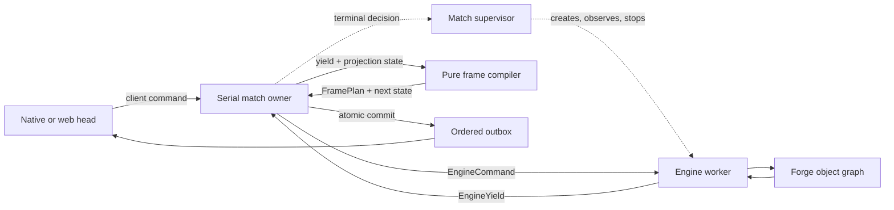

# Forge Runtime Architecture Direction

This document defines the accepted destination for Leyline's match runtime.
Implementation has converged at several seams but not across the complete
projection boundary. For concrete threads, current handoff primitives, and
remaining deletion horizons, read
[`bridge-threading.md`](bridge-threading.md); for the wider system shape, read
[`architecture.md`](architecture.md).

## Architectural thesis

Forge is a synchronous foreign rules engine. Leyline should treat it as an
exclusive state machine that accepts commands and yields immutable
observations. One serial match owner translates those observations into
client-visible frames, commits projection state, and appends output to one
ordered outbox. Transports decode, enqueue, and flush; they do not coordinate
the engine or repair ordering.



The names are conceptual. A future implementation may call the serial owner a
match runtime, cell, loop, or executor. The invariant matters: one owner makes
each match-level ordering decision.

## Responsibility boundaries

| Component | Owns | Must not own |
|---|---|---|
| Match supervisor | Match admission, execution-domain creation, resource policy, worker cancellation and cleanup after a terminal decision, health and failure reporting | Semantic match transitions, terminal frames, Forge state, protocol counters |
| Serial match owner | Command serialization, semantic match lifecycle, pending interaction lifecycle, projection state, protocol counters, frame commit, ordered outbox | Live Forge objects, transport channels, rules or legality |
| Engine worker | The live Forge graph, engine-thread callbacks, Forge event collection, immutable observation materialization | Protocol builders, client delivery, shared protocol counters |
| Pure frame compiler | Deterministic conversion of an immutable yield and projection state into a frame plan and next state | I/O, locks, Forge reads, counter mutation, hidden queues |
| Protocol heads | Channel lifecycle, decoding, authentication where applicable, reporting connection events, enqueueing commands, flushing outbox entries | Semantic match lifecycle, rules, match progression, projection repair |

Forge remains the authority for rules, legality, playable abilities, cost
candidates and payment semantics, engine identity, causes, and final game state.
Leyline owns interaction binding, protocol projection, client instance IDs,
frame cuts, visibility, sequencing, and delivery.

## Non-negotiable invariants

1. **One execution domain owns Forge.** Live Forge objects never leave the
   engine worker. Any child engine or AI work completes within that ownership
   domain before the worker yields.
2. **One serial owner advances the match.** Client commands, engine yields,
   timeouts, disconnects, and lifecycle signals are reduced in a single order.
3. **The boundary carries values.** Commands and yields contain immutable data,
   stable identities, and explicit correlation IDs—not callbacks, futures,
   mutable engine objects, or transport handles.
4. **Observation timing is explicit.** The engine adapter decides when a
   coherent observation can be taken and labels the reason for the cut. A
   projector never samples a moving Forge graph.
5. **Projection is deterministic.** Equal immutable inputs and projection state
   produce equal frame plans and next state.
6. **Commit is atomic at match level.** A failed frame build advances no
   cursor, counter, pending interaction, or delivery state. A successful plan
   commits once before its output becomes visible.
7. **One outbox defines delivery order.** Engine playback, prompts, lifecycle
   messages, and ordinary state updates join the same ordered stream. No
   transport or side queue re-sorts them later.
8. **Heads share one game runtime.** Native and web adapters may encode
   differently, but they consume the same committed match state and cannot
   fork rules or progression.

## Commands and yields

Client heads enqueue match commands such as connect, disconnect, and decoded
gameplay responses. The serial owner decides their semantic effect on the
match, including terminal transitions and terminal output. The supervisor acts
on that decision by cancelling the worker and releasing resources. The serial
owner sends a smaller semantic command set into the engine worker.

Illustrative engine-command families are:

- start a match from supported initial data;
- submit a bound priority action;
- submit a typed prompt answer;
- advance an automatic or timed decision;
- stop the match.

Illustrative yield families are:

- a coherent state observation with ordered engine facts;
- a priority window with executable candidates and stable identities;
- a typed interaction request;
- a lifecycle transition such as mulligan, game over, or intermission;
- an engine failure.

These are not a mandate for one universal event hierarchy. Add a command or
yield shape only when the engine boundary has demonstrated it. Prefer sealed,
typed families over a nullable property bag.

Every yield identifies its cause, command correlation, frame-cut reason, and
the stable engine identities needed by projection. The worker materializes all
required data while it exclusively owns Forge. The match owner must never call
back into Forge to fill gaps after receiving a yield.

Exact executable handles are the deliberate exception to copying engine state,
but not to worker ownership. For each priority window, the worker retains a
short-lived table from opaque action token to the exact executable Forge handle.
The yield carries each token plus immutable projection facts. Projection binds
the client-visible action to that token; the response returns the token; the
worker resolves the retained handle without re-enumerating abilities. The table
is cleared when the window completes, is superseded or cancelled, or fails.
This preserves bind-at-source execution without sending a mutable
`SpellAbility` across the boundary.

Targeting prompts and priority candidate decisions already follow the same
discipline. A pending prompt exposes only immutable request and identity data;
its live `SpellAbility` stays in engine-owned active state while re-validation
runs as a value request on the blocked callback. Priority candidate lists stay
behind the bridge, while the match loop consumes immutable decision facts.
Executable priority handles still follow the token-table rule above.

## State model

The architecture distinguishes four kinds of state:

- **Engine state:** the live Forge object graph. Mutable, thread-confined, and
  never a protocol baseline.
- **Observation:** an immutable point-in-time description plus ordered facts
  collected since the previous cut. It explains both resulting state and the
  operations needed for projection.
- **Projection state:** client instance mappings, previous projected snapshot,
  annotation lifecycle, bound action/prompt routes, protocol counters, and
  other values needed to compile the next frame.
- **Connection state:** channels, authentication, subscriptions, backpressure,
  and retransmission bookkeeping owned by a head.

An observation is not a second rules model. It contains only facts needed to
translate Forge's decision into a stable client contract. Snapshots describe
resulting state; ordered engine facts preserve cause and intermediate
operations. Neither replaces the other.

## Frame cuts and synthetic state

Pure projection does not choose when the client should observe the game. Frame
cuts belong at the engine adapter seam, where callback timing and mutation
completion are known. Moving a cut can change the sequence of projector inputs,
but it does not require projection to read live state or become effectful.

Some client-visible frames must describe intent before Forge has performed the
corresponding mutation. Represent that explicitly as immutable pre-commit or
synthetic observation data. Do not mutate the projection baseline ad hoc to
pretend the engine already changed. The following real observation must
reconcile against the committed synthetic projection deterministically.

## Projection and commit

The central transformation is conceptually:

```text
EngineYield + ProjectionState + ViewerContext
    -> FramePlan(messages, nextProjectionState, outboxEntries)
```

`FramePlan` is a value, not a builder holding shared mutable state. Compilation
may validate ordering, IDs, visibility, and interaction pairing before commit.
Only the serial match owner can commit the returned state and append the
outbox entries.

The design permits projection to retain GRE protobuf as its output model. The
important boundary is not "protobuf nowhere in engine"; it is that protocol
construction is deterministic, does not run inside Forge callbacks, and is
not split across engine, session, and transport owners.

## Delivery

The outbox is the match's sole ordering authority. Each committed entry has a
monotonic sequence and enough audience information for heads to deliver or
adapt it. Delivery may be synchronous in the first implementation, but its
ordering does not depend on which thread happens to call `send`.

Authentication, connection negotiation, and other channel-only replies may
remain head-local. Once a connection has joined a match, every message whose
meaning depends on match progression—including terminal match output—comes
from the match outbox. Heads report disconnects and delivery failures to the
serial owner; they do not decide the semantic match transition themselves.

Backpressure and disconnected clients are head concerns. They can delay,
resume, or terminate delivery according to an explicit policy; they cannot
advance the projection cursor independently or discard an entry while making
later entries visible.

## Supervision and worker isolation

The supervisor/worker split has value even for a single game. The serial match
owner decides semantic startup, shutdown, timeout, and terminal transitions.
The supervisor creates the execution domain, observes worker health, enforces
resource policy, and performs cancellation and cleanup after the owner reaches
a terminal decision. This keeps operational lifecycle work out of Forge
callbacks and transport handlers without creating a second match authority.

"Worker" initially means a logical execution domain and may remain one
dedicated JVM thread. The command/yield contract should nonetheless avoid live
references and process-local callbacks so a process boundary remains possible.
Choosing a thread or child process is a separate operational decision:

- a thread has lower overhead and simpler debugging, but cannot safely be
  killed while arbitrary Java code is running;
- a process can enforce memory and termination boundaries, but adds startup,
  serialization, deployment, and diagnostics work.

Cooperative cancellation is the strongest safe promise for an in-process
worker. Transparent recovery is not promised. Resuming a failed engine requires
a separately proven replay or checkpoint contract; reconnecting delivery is not
the same as reconstructing Forge state.

The in-process supervisor's stop result is explicit: `NotRunning`, `Stopped`, or
`TimedOut`. A timeout retains the worker generation and its resources until the
thread actually exits. Worker completion publishes `Completed`, `Cancelled`,
or immutable `Failed` facts. Failure ends the match and closes its heads without
fabricating a winner or terminal gameplay frame.

## Testing strategy

This shape reduces dependence on broad integration tests without replacing
them:

- frame compiler tests exercise protocol behavior from immutable fixtures;
- model tests reduce command/yield sequences and assert projection state and
  outbox order;
- engine-adapter tests prove each cut is coherent and carries required facts;
- replay tests run the same yield sequence through fresh projection state and
  require byte-identical output;
- architecture tests forbid Forge references outside the worker boundary and
  transport dependencies inside the match runtime;
- end-to-end tests prove the adapters, engine, and delivery loop agree.

Rules and AI behavior still require Forge-backed tests. Protocol framing,
ordering, visibility, ID allocation, retry, and interaction lifecycle should
usually be provable without starting a game.

## Migration rules

- Preserve the current playback/counter/cursor contract until one serial owner
  has taken over all three responsibilities.
- Do not place an actor or queue facade in front of state that remains shared
  behind it. Ownership moves with the facade or the slice is incomplete.
- Each transitional seam has one named authority and a deletion condition for
  its predecessor. Dual writes and shadow comparisons may diagnose a cutover,
  but only one side can drive client-visible behavior.
- Extract immutable values at demonstrated Forge seams. Do not mirror the full
  Forge API or invent a generic engine DSL.
- Keep frame-cut semantics unchanged during ownership refactors. Correctness
  changes to emission or bracketing require their own evidence and review.
- Split large files when a new ownership boundary exists. File size alone does
  not justify a component.
- Process readiness means value-only contracts and explicit failure semantics,
  not network services, distributed coordination, or premature persistence.

## Convergence criteria

The runtime has reached this direction when:

- live Forge objects are confined to one engine execution domain;
- protocol messages are not built in Forge callbacks;
- match-level IDs, cursors, pending interactions, and delivery order have one
  serial owner rather than shared atomics and repair paths;
- all outbound gameplay messages enter one ordered outbox;
- frame compilation can be replayed deterministically from immutable inputs;
- transport handlers only decode, enqueue, adapt, and flush;
- native and web heads consume the same match runtime;
- worker failure and shutdown have explicit, truthful semantics.

## Related decisions

- [`ADR 0006`](decisions/0006-single-backbone-core-and-heads.md) establishes one
  backbone with native and web heads.
- [`ADR 0009`](decisions/0009-reuse-forge-human-cost-decisions.md) keeps cost
  rules in Forge and frontend choices at a controller seam.
- [`ADR 0010`](decisions/0010-bind-priority-actions-at-projection-source.md),
  [`ADR 0011`](decisions/0011-preserve-ability-definition-identity.md), and
  [`ADR 0012`](decisions/0012-bind-prompt-routes-once.md) establish bound values
  that can cross a command/yield boundary without reverse reconstruction. ADR
  0010's exact executable handle moves into the worker-owned token table; its
  bind-at-source invariant remains unchanged.
- [`ADR 0013`](decisions/0013-finalize-annotation-frames-once.md) establishes a
  single pure finalization point within one frame.
- [`ADR 0014`](decisions/0014-command-yield-engine-boundary.md) records why this
  runtime boundary was chosen.
