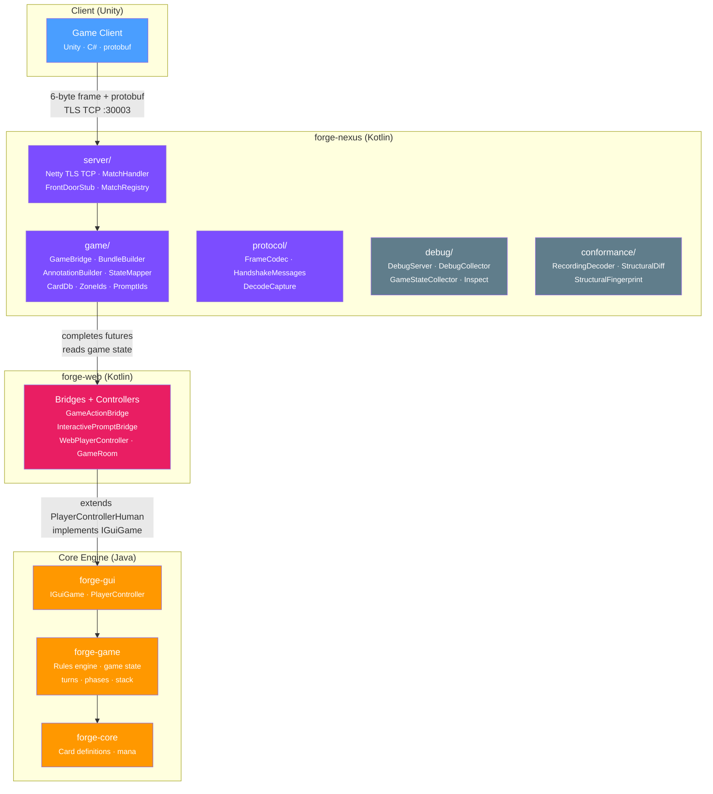
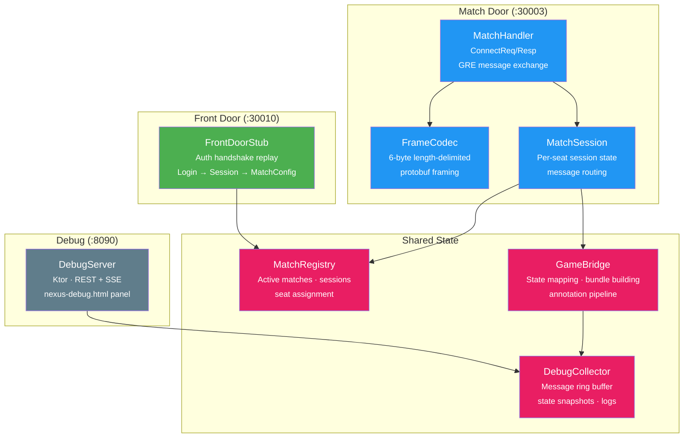
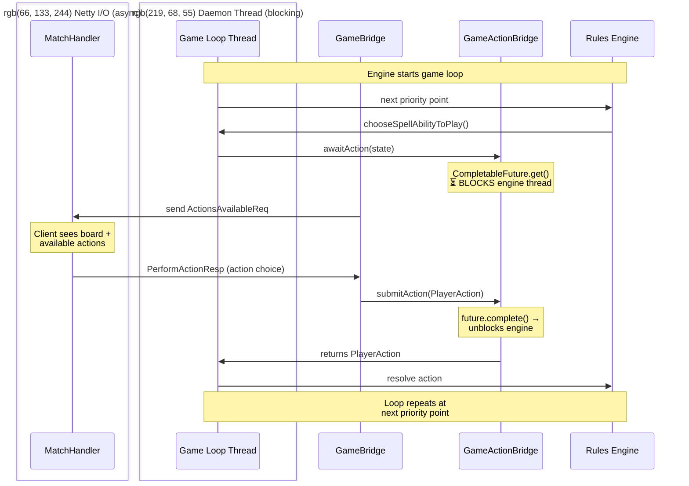
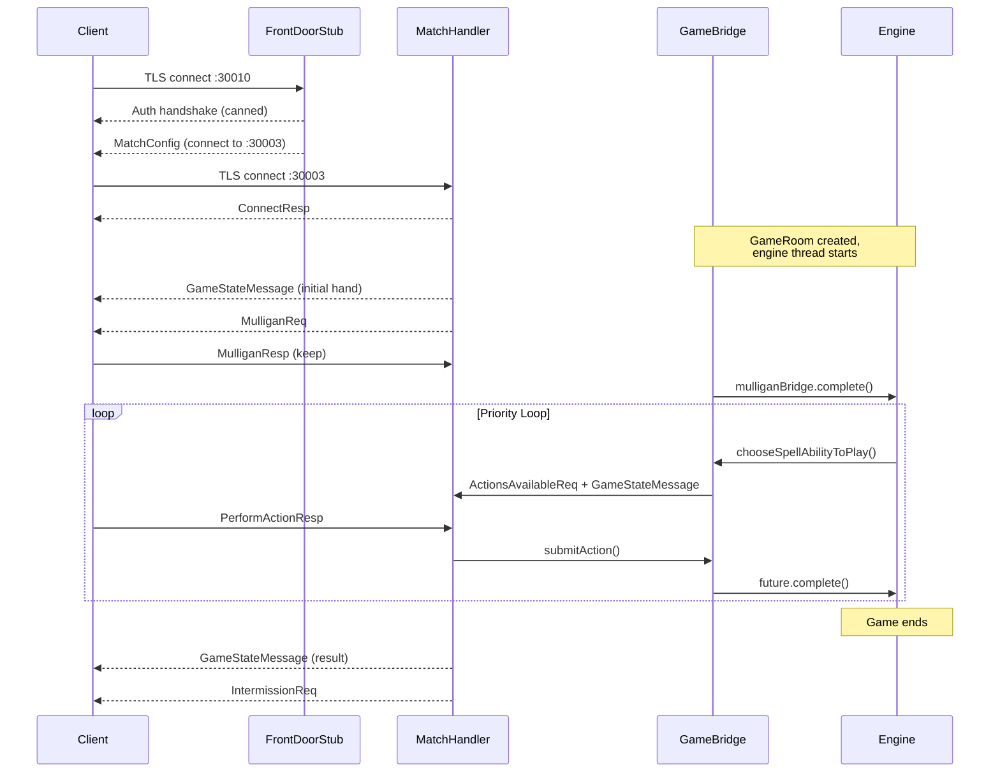

# Nexus — Architecture

Mermaid diagrams: package wiring, server layout, wire protocol, bridge threading, match lifecycle.

---

## 1. Package Wiring

How `forge-nexus` relates to the core engine and the web port.



**Key point:** `forge-nexus` never touches the rules engine directly. It goes through `forge-web`'s bridges (`GameActionBridge`, `InteractivePromptBridge`) — the same `CompletableFuture` pattern the web UI uses. The bridge doesn't know or care whether the thing completing it is a WebSocket JSON handler or a protobuf handler.

---

## 2. Server Layout

Two Netty TCP servers, one debug HTTP server.



**Front Door** replays a canned auth handshake — just enough to make the client believe it authenticated and got assigned a match. **Match Door** handles actual gameplay via protobuf. **Debug server** exposes introspection APIs and an SSE event stream.

---

## 3. Wire Protocol

Client ↔ server message framing and protobuf schema.

```
┌─────────────────────────────────────────┐
│  Arena Wire Frame (6 bytes + payload)   │
├──────┬──────┬───────────────────────────┤
│ 0x04 │ 0x11 │ payload_length (4 LE)     │
│ type │ flag │                           │
├──────┴──────┴───────────────────────────┤
│  protobuf payload (variable length)     │
│  MatchServiceToClientMessage   (S→C)    │
│  MatchClientToServerMessage    (C→S)    │
└─────────────────────────────────────────┘
```

**Inbound (C→S):** `ClientToGREMessage` containing `PerformActionResp`, `ConnectReq`, `SetSettingsReq`, etc. Decoded by `FrameCodec`, dispatched by `MatchHandler`.

**Outbound (S→C):** `GREToClientMessage` wrapped in `MatchServiceToClientMessage`. Built by `BundleBuilder` (game state, annotations, actions) and `MatchHandler` (connect/timer responses).

---

## 4. Bridge Threading

The blocking-bridge pattern connecting the protobuf handler to the synchronous Java engine thread.



**Same bridges as the web port.** `GameActionBridge` blocks the engine thread until a player responds. `InteractivePromptBridge` handles engine-initiated choices (targeting, sacrifice, scry). `MulliganBridge` handles keep/mulligan. All three use `CompletableFuture` with timeouts that return safe defaults.

---

## 5. Match Lifecycle



---

## 6. State Mapping Pipeline

How Forge engine state becomes a protobuf `GameStateMessage`:

```
Game (forge-game)
  │
  ├── StateMapper.mapGameObjects()     → GameObjectMsg[]  (cards, permanents, abilities)
  ├── StateMapper.mapZones()           → ZoneMsg[]        (hand, library, battlefield, etc.)
  ├── StateMapper.mapPlayers()         → PlayerMsg[]      (life, mana, counters)
  ├── AnnotationBuilder.build()        → AnnotationMsg[]  (zone transfers, combat, abilities)
  │     ├── detectAndApplyZoneTransfers()
  │     ├── annotationsForTransfer()
  │     └── combatAnnotations()
  └── BundleBuilder.bundle()           → GREToClientMessage
        ├── per-seat visibility filtering
        ├── diff vs. full state selection
        └── gsId chain management
```

**Per-seat filtering:** Each seat gets its own `GameStateMessage`. Private zones (opponent's hand, face-down library) are filtered. The same engine state produces different protobuf payloads per seat.

**gsId chain:** Each game state message gets a monotonic `gameStateId`. The client expects sequential delivery — gaps cause resync requests.
