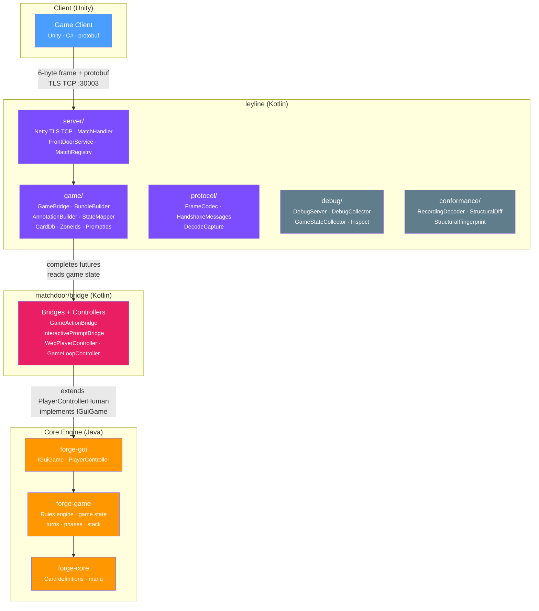
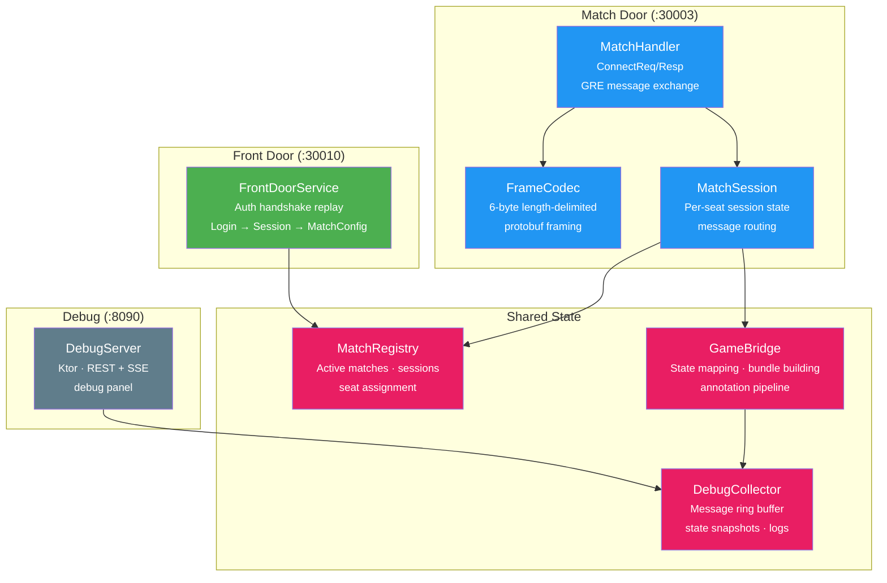
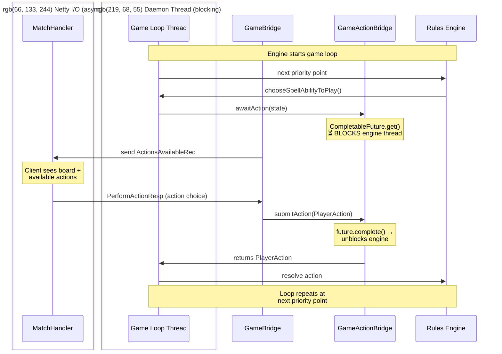

# Leyline — Architecture

Mermaid diagrams: package wiring, server layout, wire protocol, bridge threading, match lifecycle.

---

## 1. Package Wiring

How `leyline` relates to the core engine and the web port.



**Key point:** `leyline` never touches the rules engine directly. It goes through bridge classes (`GameActionBridge`, `InteractivePromptBridge`) in `matchdoor/bridge/` — the `CompletableFuture` pattern that decouples engine blocking from the protobuf transport layer. The bridge doesn't know or care whether the thing completing it is a WebSocket JSON handler or a protobuf handler.

---

## 2. Server Layout

Two Netty TCP servers, one debug HTTP server.



**Front Door** replays a canned auth handshake — just enough to make the client believe it authenticated and got assigned a match. **Match Door** handles actual gameplay via protobuf. **Debug server** exposes introspection APIs and an SSE event stream.

---

## 3. Wire Protocol

Client ↔ server message framing and protobuf schema.

```
┌─────────────────────────────────────────┐
│  Arena Wire Frame (6 bytes + payload)   │
├──────┬──────┬───────────────────────────┤
│ 0x04 │ 0x11 │ payload_length (4 LE)     │
│ type │ flag │                           │
├──────┴──────┴───────────────────────────┤
│  protobuf payload (variable length)     │
│  MatchServiceToClientMessage   (S→C)    │
│  MatchClientToServerMessage    (C→S)    │
└─────────────────────────────────────────┘
```

**Inbound (C→S):** `ClientToGREMessage` containing `PerformActionResp`, `ConnectReq`, `SetSettingsReq`, etc. Decoded by `FrameCodec`, dispatched by `MatchHandler`.

**Outbound (S→C):** `GREToClientMessage` wrapped in `MatchServiceToClientMessage`. Built by `BundleBuilder` (game state, annotations, actions) and `MatchHandler` (connect/timer responses).

---

## 4. Bridge Threading

The blocking-bridge pattern connecting the protobuf handler to the synchronous Java engine thread.



**Bridge classes live in `matchdoor/bridge/`.** `GameActionBridge` blocks the engine thread until a player responds. `InteractivePromptBridge` handles engine-initiated choices (targeting, sacrifice, scry). `MulliganBridge` handles keep/mulligan. All three use `CompletableFuture` with timeouts that return safe defaults.

---

## 5. Match Lifecycle


---

## 6. State Mapping Pipeline

How Forge engine state becomes a protobuf `GameStateMessage`:

```
Game (forge-game)
  │
  ├── StateMapper.mapGameObjects()     → GameObjectMsg[]  (cards, permanents, abilities)
  ├── StateMapper.mapZones()           → ZoneMsg[]        (hand, library, battlefield, etc.)
  ├── StateMapper.mapPlayers()         → PlayerMsg[]      (life, mana, counters)
  ├── AnnotationBuilder.build()        → AnnotationMsg[]  (zone transfers, combat, abilities)
  │     ├── detectZoneTransfers() → TransferResult
  │     ├── annotationsForTransfer()
  │     └── combatAnnotations()
  └── BundleBuilder.bundle()           → GREToClientMessage
        ├── per-seat visibility filtering
        ├── diff vs. full state selection
        └── gsId chain management
```

**Per-seat filtering:** Each seat gets its own `GameStateMessage`. Private zones (opponent's hand, face-down library) are filtered. The same engine state produces different protobuf payloads per seat.

**gsId chain:** Each game state message gets a monotonic `gameStateId`. The client expects sequential delivery — gaps cause resync requests.

---

## 7. Bridge Layer

The bridge classes live directly in `matchdoor/src/main/kotlin/leyline/bridge/`. There is no separate forge-web module — these classes were written for leyline and are not shared with an upstream web UI.

### Bridge classes (transport-agnostic game orchestration)

```
matchdoor/src/main/kotlin/leyline/bridge/
  ├── GameActionBridge.kt        ← CompletableFuture: block engine at priority, unblock on player action
  ├── InteractivePromptBridge.kt ← CompletableFuture: block engine on choices (targeting, sacrifice, scry)
  ├── MulliganBridge.kt          ← CompletableFuture: block engine on keep/mulligan/tuck
  ├── WebPlayerController.kt     ← PlayerControllerHuman override routing to bridges
  ├── WebGuiGame.kt              ← IGuiGame adapter routing to bridges
  ├── GameLoopController.kt      ← Daemon thread lifecycle management
  ├── GameBootstrap.kt           ← Game factory + card DB initialization
  ├── PhaseStopProfile.kt        ← Per-player phase-stop configuration
  ├── PlayerAction.kt            ← Sealed class: the shared action vocabulary
  ├── CardLookup.kt              ← chooseCastAbility(), ability queries
  └── BridgeTimeoutDiagnostic.kt ← Structured timeout diagnostics
```

### How GameBridge Consumes the Bridge Layer

```
GameBridge.kt (matchdoor)
  ├── GameBootstrap.createConstructedGame(deck1, deck2)
  ├── GameLoopController(game).start()
  ├── GameActionBridge()
  │     ├── getPending() → read engine state at priority stop
  │     └── submitAction(PlayerAction) → unblock engine
  ├── InteractivePromptBridge()
  │     ├── getPendingPrompt() → read engine prompt
  │     ├── submitResponse(indices) → unblock engine
  │     └── drainReveals() → annotation pipeline
  ├── MulliganBridge()
  │     ├── submitKeep() / submitMull()
  │     └── pendingPhase → read mulligan state
  ├── WebPlayerController(game, player, bridges)
  └── PhaseStopProfile.createDefaults()
```

### Design Principle

The bridge layer is intentionally transport-agnostic. The `CompletableFuture` pattern doesn't know or care whether the completion comes from a protobuf handler, a test harness, or any other consumer. This clean separation is what makes the engine integration layer independently testable.

---

## 8. Package Structure & Scale

```
leyline/src/main/kotlin/leyline/              65 files, ~14.5K LOC
  ├── LeylineMain.kt                          ← Entry point
  ├── game/           (25 files, ~5.5K LOC)   ← Core: StateMapper, BundleBuilder, AnnotationBuilder,
  │                                              GameBridge, ZoneTransferDetector, TransferAnnotations,
  │                                              CombatAnnotations, MechanicAnnotations, GameEventCollector,
  │                                              GamePlayback, ObjectMapper, ZoneMapper, CardDb
  ├── server/         (12 files, ~2.5K LOC)   ← Transport: MatchHandler, MatchSession, AutoPassEngine,
  │                                              CombatHandler, TargetingHandler, FrontDoorService,
  │                                              MatchRegistry, MessageSink
  ├── protocol/       (4 files, ~600 LOC)     ← Wire: FrameCodec, HandshakeMessages, DecodeCapture
  ├── debug/          (11 files, ~2.5K LOC)   ← Debug panel: DebugServer, DebugCollector, GameStateCollector
  ├── conformance/    (8 files, ~2K LOC)      ← Recording tools: StructuralFingerprint, RecordingDecoder,
  │                                              GameFlowAnalyzer, StructuralDiff
  ├── config/         (2 files, ~200 LOC)     ← TOML config, deck validation
  └── analysis/       (4 files, ~1K LOC)      ← Session analysis, invariant checking

leyline/src/test/kotlin/                       63 files, ~13.4K LOC
  ├── game/           (14 files)              ← Unit + integration: AnnotationBuilder, StateMapper,
  │                                              CategoryFromEvents, MatchFlowHarness tests
  ├── conformance/    (48 files)              ← Golden conformance, flow tests, field tests,
  │                                              MatchFlowHarness (integration test infra)
  └── protocol/       (1 file)               ← FrameCodec tests
```

### Largest Files

| File | LOC | Concern |
|------|-----|---------|
| `StateMapper.kt` | ~869 | Forge→proto mapping + annotation wiring + diff assembly |
| `MatchSession.kt` | ~450 | Per-seat session: message routing + action dispatch |
| `BundleBuilder.kt` | ~400 | GRE message assembly (multiple bundle types) |
| `AnnotationBuilder.kt` | ~350 | Proto annotation factories (20 types) |

---

## 9. Architectural Assessment

### Strengths

**Transport-head pattern.** The `CompletableFuture` bridge design means the entire engine integration layer (157 `PlayerControllerHuman` overrides, game lifecycle, bridge threading) is transport-agnostic. The bridge doesn't know or care whether the thing completing the future is a protobuf handler or a test harness.

**Three-stage diff pipeline.** `detectZoneTransfers → annotationsForTransfer → combatAnnotations` is a pure, composable pipeline. Each stage's output is deterministic from its inputs. Easy to test in isolation, easy to extend.

**Event-driven annotations.** The `GameEventCollector → GameEvent → AnnotationBuilder.categoryFromEvents()` chain decouples Forge's Guava EventBus from proto construction. Adding a new annotation type is a 5-step cookbook recipe touching known files.

**Conformance infrastructure.** `StructuralFingerprint` / `StructuralDiff` / golden files / `ValidatingMessageSink` / `MatchFlowHarness` — the testing infra is more sophisticated than most game servers. The `recording` group tests against real Arena traffic are the gold standard.

**Observability.** Debug server on :8090 with SSE, state timeline, instance history, priority trace, recording introspection. This is production-grade observability for a dev project.

### Weaknesses

**StateMapper is a God Object.** At 869 LOC, it owns: zone mapping, object mapping, annotation wiring, diff computation, snapshot management, request building (combat, targeting, selectN), and updateType resolution. Sub-mappers were extracted (ObjectMapper, ZoneMapper) but the orchestration and request builders still live here.

**Two-timeline snapshot divergence.** `prevSnapshot` (diff computation) vs `lastSentTurnInfo` (client awareness) — the learnings doc devotes 3 sections to bugs from confusing these. The abstraction leak is that `DiffSnapshotter` serves two masters (correct diffs and correct annotations) with different timing requirements.

**Counter synchronization.** `gsIdCounter` and `msgIdCounter` live in two places (`SessionOps` and `GamePlayback`) with `max()` semantics. Learnings §4 documents the trap. This is a structural concurrency problem that `max()` patches but doesn't solve.

**74 missing annotation types.** Rosetta shows 20/94 implemented. Many are cosmetic (client degrades gracefully), but attachment (11/12/18/19/20/70), P/T modification (5/6), and targeting (26/92/93) affect gameplay correctness for the respective card categories.

**CardDb global singleton.** Mutable global with `volatile testMode` flag. Not injected. Makes parallel test execution fragile and prevents multiple concurrent configurations.

### Risks

**Bridge scope creep.** The bridge classes in `matchdoor/bridge/` are intentionally transport-agnostic. If web-specific behavior (WS keepalive, session affinity, serialization annotations) is added directly to bridge classes, the transport abstraction erodes. Keep bridge classes free of transport-specific concerns.

**Engine-thread mutations.** `GameEventCollector` subscribes synchronously on the engine thread and mutates a `ConcurrentLinkedQueue`. `GamePlayback` sleeps the engine thread. Both are correct today but any new subscriber that does I/O or acquires locks on the engine thread path creates deadlock risk.
