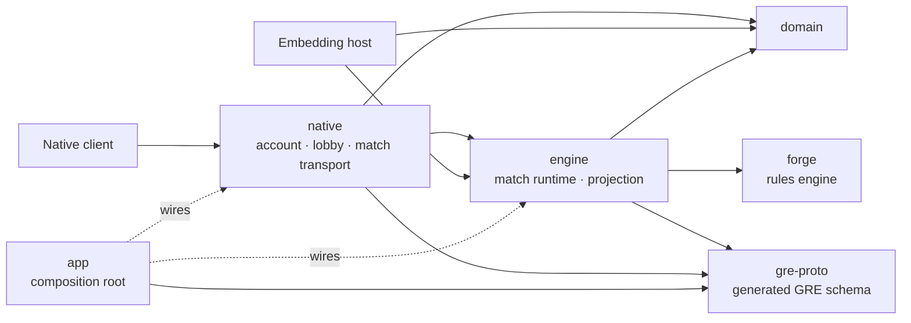
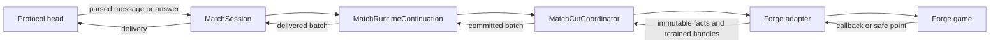
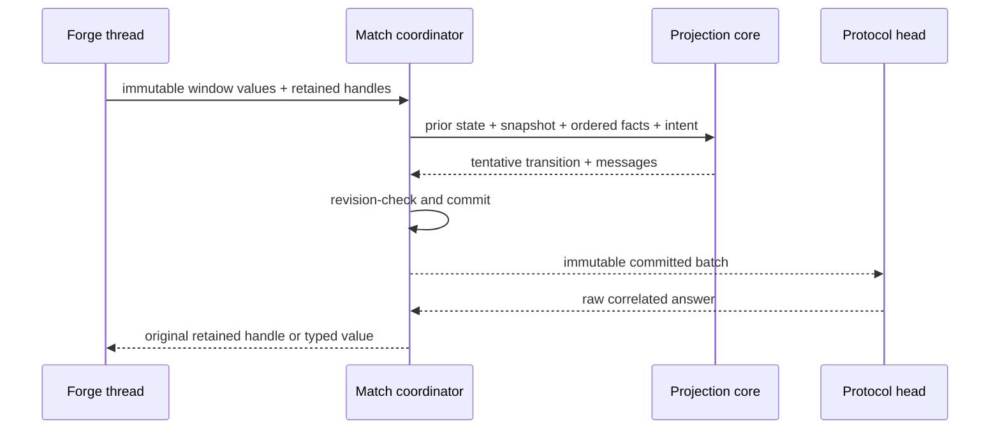
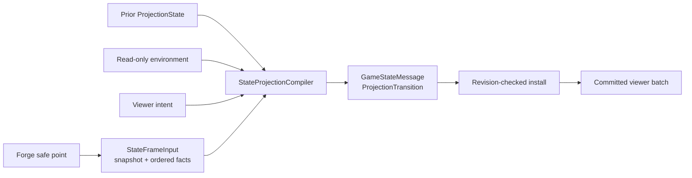

# Leyline Architecture

Leyline is one stateful game backbone with a native protocol head and an
in-process match-runtime interface for embedding hosts. This document
owns the system shape and module boundaries. Durable rationale lives in
[`docs/decisions/`](decisions/); cross-thread constraints live in
[`bridge-threading.md`](bridge-threading.md).

## Snapshot consultation

Snapshot consultation is a fresh, one-shot advisory path. One serialized game
state is imported into one disposable Forge place, consulted, and torn down.
A persistent twin of a running match is not part of the architecture.

The import is one atomic mutation boundary inside Forge puzzle application.
Base objects, zones, identities, visible types, relationships, counters,
recognized survival grants, current characteristics, tap state, marked damage,
combat, and phase are established before Forge performs one final settled-state
check. Triggers, autonomous runtime, and advisors cannot observe the place
between those mutations.

`PromptDecisionAdvisor` owns the desired prompt decision for both active and
reconstructed games. Copilot owns incremental native realization and response
encoding. Simclient owns whole-decision submission, retry and fallback policy,
and telemetry. Snapshot fidelity reports delivery validity separately from
strategy confidence so only findings relevant to the pending prompt can prevent
a response. A cast offer whose permission cannot be reconstructed from card
identity is an explicit prompt-scoped missing feature, so strategic consultation
falls back to the host instead of choosing around that offer.

## System shape

```mermaid
flowchart LR
    NC["Native client"] --> N["native<br/>account · lobby · match transport"]
    N --> E["engine<br/>match runtime · projection"]
    H["Embedding host"] --> E
    N --> D["domain"]
    H --> D
    E --> D
    E --> F["forge<br/>rules engine"]
    E --> GP["gre-proto<br/>generated GRE schema"]
    N --> GP
    A["app<br/>composition root"] --> GP
    A -. "wires" .-> N
    A -. "wires" .-> E
```

The native head and embedding hosts submit through the same engine match
surface. Embedding hosts own their transport and application policy. `engine`
is the only Gradle module that depends on Forge. `gre-proto`
(mapped to `proto/`) owns the generated GRE wire schema.

## Modules

| Module | Owns | Depends on |
|---|---|---|
| root `app/` | `LeylineMain`, native service wiring, local control, management | domain, engine, gre-proto, native |
| `domain` | Shared values, services, repository ports | no application module |
| `gre-proto` | Generated GRE schema, protoc output | no application module |
| `engine` | Forge adapter, transport-neutral match runtime, interaction ownership, state projection | domain, gre-proto, Forge |
| `native` | Account, lobby, native match transport and framing | domain, engine, gre-proto |

Within `engine`, responsibilities follow the execution boundary:

| Package | Responsibility |
|---|---|
| `bridge/forge`, `bridge/interaction` | Forge callbacks and interaction policy |
| `bridge/handoff` | Immutable cross-domain values and narrow runtime interfaces |
| `bridge/coord` | Match-scoped publication, interaction windows, and terminal failure |
| `game/snapshot`, `game/event` | Immutable state observations and ordered facts |
| `game/mapping`, `game/annotations` | Projection and annotation construction |
| `game/state`, `game/bundle` | Committed projection shell and protocol materialization |
| `match` | Parsed-message dispatch, answer submission, batch delivery |

Module-local ownership and dependency rules live in the nearest `AGENTS.md`.

`CardRepository` is the card-metadata seam shared by projection and embedding
hosts. The native composition root uses `SqliteCardRepository` for native-client
identifiers. A Web embedding host can use `ForgeCardRepository`, whose generated
identifiers are scoped to its `catalogVersion`. The version covers the Forge card
definitions and identity scheme; persisted identifiers must be bound to that
exact version before use.

Combined Split and Room cards expose one parent identity with ordered face
identities. Specialize cards expose the base identity with five form identities.
Normal name lookup maps Split faces and Specialize forms back to the deck-legal
parent, while live objects use the selected face identity. Split casting
currently offers either half through the generic cast action; fused casting is
not exposed.

Run `./gradlew :engine:testForgeCatalog` for the Forge catalog classification,
identity, and gameplay checks. This isolated lane supplies an invalid card-database
path to verify that the adapter has no native card-database dependency.

## Match runtime

Forge is synchronous and mutable. One engine thread advances each game and
blocks in controller callbacks when a human answer is required. Native, host,
timer, and test entrants call the transport-neutral match surface. Interactive
session entry is serialized separately from publication and projection commit.

```mermaid
flowchart LR
    H["Protocol head"] -->|"parsed message or answer"| S["MatchSession"]
    S --> R["MatchRuntimeContinuation"]
    R --> C["MatchCutCoordinator"]
    C --> A["Forge adapter"]
    A --> F["Forge game"]
    F -->|"callback or safe point"| A
    A -->|"immutable facts and retained handles"| C
    C -->|"committed batch"| R
    R -->|"delivered batch"| S
    S -->|"delivery"| H
```

`GameBridge` is the engine shell's composition root. `MatchCutCoordinator` owns
committed viewer feeds, interaction windows, cut installation, and terminal
failure. Family runtimes retain exact Forge handles while sessions submit only
immutable client-domain values. `PriorityPolicyRuntime` owns accumulated client
settings and priority presentation policy. `ProjectionState` is the committed
client-facing history.

The engine progression path materializes one immutable terminal outcome and
the coordinator retains it with the committed game-over cut. Player, Familiar,
and spectator sessions only drain and deliver that value. Raw transport
completion remains connection-local and follows the terminal drain.

ADR 0015 defines the active runtime boundary. ADR 0014 is retained only for its
Forge-confinement and value-boundary rationale.

[`bridge-threading.md`](bridge-threading.md) is authoritative for execution
domains, mutable-state ownership, lock order, delivery limits, teardown, and the
bounded initial-publication replay used by reconnect.

## Interaction cuts

A blocking interaction follows one generic lifecycle:

```mermaid
sequenceDiagram
    participant F as Forge thread
    participant C as Match coordinator
    participant P as Projection core
    participant H as Protocol head

    F->>C: immutable window values + retained handles
    C->>P: prior state + snapshot + ordered facts + intent
    P-->>C: tentative transition + messages
    C->>C: revision-check and commit
    C-->>H: immutable committed batch
    H-->>C: raw correlated answer
    C-->>F: original retained handle or typed value
```

The invariant is publication before wake-up: a visible prompt or action window
is committed and drainable before the waiting observer is signalled. A response
must match the exact request message and game-state identifiers. Timeout, supersession,
delivery failure, and teardown retire that same window; they cannot complete a
later one.

Prompt families keep their own value freezing and response parsing where
identity or completion rules differ. Shared runtime machinery owns publication,
correlation, timeout, and retirement.

## State projection

Projection combines two complementary inputs:

- `GsmSnapshot`: resulting Forge state at a declared safe point;
- ordered facts: cause, grouping, and intermediate operations not recoverable
  from the resulting state.

```mermaid
flowchart LR
    SP["Forge safe point"] --> I["StateFrameInput<br/>snapshot + ordered facts"]
    PS["Prior ProjectionState"] --> C["StateProjectionCompiler"]
    ENV["Read-only environment"] --> C
    VI["Viewer intent"] --> C
    I --> C
    C --> R["GameStateMessage<br/>ProjectionTransition"]
    R --> K["Revision-checked install"]
    K --> B["Committed viewer batch"]
```

Projection folds all viewer inputs over one private value and returns viewer
messages plus one tentative transition. Client identities, visibility
baselines, annotation lifecycles, prompt facts, and logical output advance only
when that transition installs. The projection core receives immutable inputs;
it does not query the live Forge graph.

A viewer cut installs one transition and output ordinal across its feeds. A
stale or failed pre-install attempt publishes nothing and consumes no logical
identifier.

## Output and delivery

Projection commit and transport delivery are different boundaries. A committed
viewer baseline records the latest installed projection, not client
acknowledgement. Delivery cannot repair, reorder, or recompile a committed
batch. When code needs delivery awareness, it tracks that fact explicitly.

Direct `GameBridge` identity, cursor, and zone edits are engine-shell projection
state changes. They allocate no logical sequence or output and are not
publication. Detailed ordering is documented in
[`bridge-threading.md`](bridge-threading.md).

### Spectator perspectives

AI-vs-AI sessions use a seat observer: private cards are visible only for the
chosen seat, while the other hand retains membership without card identities.
Seat observers receive no player decision prompts or legal-action windows.
The public observer role continues to redact both seats’ private objects.
