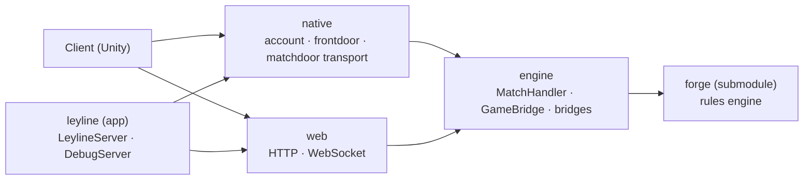
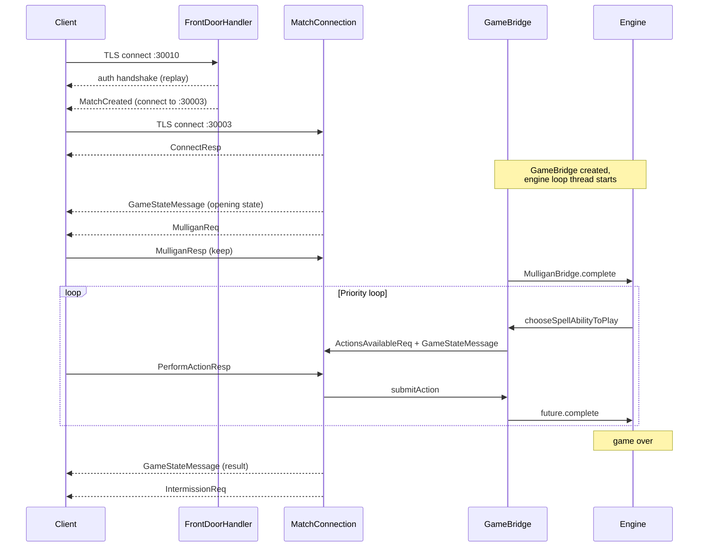

# Leyline — Architecture

System shape: modules, services, wire, and the end-to-end flow from client connect to engine action.

This document describes the current implementation. For the accepted runtime
destination, see [`architecture-direction.md`](architecture-direction.md). Until
a seam migrates, the current threading invariants in
[`bridge-threading.md`](bridge-threading.md) remain authoritative.

---

## 1. Modules

Gradle multi-project layout. All Kotlin.

- **`leyline`** — root project, sources in `app/`. Application entrypoint (`LeylineMain`), server wiring (`LeylineServer`), debug HTTP server, management.
- **`domain`** — domain model, services, and repository ports.
- **`engine`** — Forge bridge and GRE match-session engine.
  - `bridge/` — engine integration. Blocking-bridge classes and the `PlayerController` override surface.
  - `game/` — state mapping, annotations, diffing, counters. Ordered Forge zone moves flow through `FrameEventLog` and `ZoneMoveLedger`; snapshots supply final projected state. `game/mapper/` holds per-slice mappers (objects, zones, players, actions).
  - `match/` — session state machine: `MatchSession` + per-concern handlers (combat, targeting, optional-actions, mulligan, auto-pass).
- **`native`** — native-client head; packages account, frontdoor, and matchdoor transport.
- **`web`** — browser-facing HTTP/WebSocket head.
- **`forge/`** — Card-Forge upstream as a git submodule (the Java rules engine).


```mermaid
graph LR
    CLIENT["Client (Unity)"]
    NATIVE["native<br/>account · frontdoor · matchdoor transport"]
    WEB["web<br/>HTTP · WebSocket"]
    ENGINE["engine<br/>MatchHandler · GameBridge · bridges"]
    APP["leyline (app)<br/>LeylineServer · DebugServer"]
    FORGE["forge (submodule)<br/>rules engine"]

    CLIENT --> NATIVE
    CLIENT --> WEB
    APP --> NATIVE
    APP --> WEB
    NATIVE --> ENGINE
    WEB --> ENGINE
    ENGINE --> FORGE
```

`engine` is the only module that depends on `forge`; the bridge classes are the single narrow waist between Kotlin and the Java engine.

---

## 2. Runtime Services

`LeylineMain` is the composition root: it constructs each service, wires shared state (card repository, match coordinator, runtime puzzle holder), and starts them together. `LeylineServer` owns the two client-facing Netty TCP doors; the local-control, account, and management servers are separate objects started alongside.

| Service | Default port | Protocol | Implementation |
|---|---|---|---|
| Native lobby | 30010 | TLS + 6-byte-framed JSON | `native/frontdoor/FrontDoorHandler` |
| Native match | 30003 | TLS + 6-byte-framed protobuf | `native/matchdoor/NativeMatchDoorBootstrap` -> `engine/match/MatchConnection` |
| Local control | 8090 | HTTP (JDK `HttpServer`) | `app/.../debug/DebugServer` |
| Account | 9443 | HTTPS (Ktor) | `native/account/AccountServer` |
| Management | 8091 | HTTP | `app/.../infra/ManagementServer` |

Ports are configured via `leyline.toml` or CLI flags (`--fd-port`, `--md-port`, `--debug-port`, …); the values above are defaults.

The local-control server exposes puzzle control, best-play, and full-state injection endpoints. It binds loopback-only by default; set `LEYLINE_DEBUG_BIND=0.0.0.0` only when another local device must reach it.

---

## 3. Wire Frame (Match Door)

```
┌─────────────────────────────────────────┐
│  Match Door frame (6-byte header)       │
├──────┬──────┬───────────────────────────┤
│ 0x04 │ 0x11 │ payload_length (4 LE)     │
│ type │ flag │                           │
├──────┴──────┴───────────────────────────┤
│  protobuf payload                       │
│  ClientToMatchServiceMessage   (C→S)    │
│  MatchServiceToClientMessage   (S→C)    │
└─────────────────────────────────────────┘
```

**Inbound (C→S).** `ClientToGREMessage` carrying `PerformActionResp`, `ConnectReq`, `SetSettingsReq`, etc. Decoded by `FrameCodec`, then passed to the transport-neutral `MatchConnection`.

**Outbound (S→C).** `GREToClientMessage` wrapped in `MatchServiceToClientMessage`. Assembled by `BundleBuilder` for gameplay and by `MatchHandler` for connect / timer responses.

---

## 4. Bridge Pattern

The gameplay path bridges an asynchronous, protobuf-driven client to a synchronous, single-threaded Java engine. When the engine reaches a priority stop or interactive prompt, a bridge class blocks the engine thread on a `CompletableFuture` until the client's response arrives; the session thread builds and sends the outbound message in the meantime, then completes the future to unblock the engine.

Three bridges cover the engine callback surface: `GameActionBridge` for priority stops, `InteractivePromptBridge` for engine-initiated choices (targeting, sacrifice, scry, modal), and `MulliganBridge` for the mulligan loop.

A fourth family covers prompts that fire mid-override rather than at a priority stop or bridge-initiated choice — `confirmTrigger`, `chooseNumber`, `assignCombatDamage`, and similar sites where the engine is already inside a specific `PlayerController` method and can't route through `GameActionBridge`'s priority-loop future. Small gates — `OptionalActionGate`, `NumericInputGate`, `DamageAssignmentGate` — each own a single-use `CompletableFuture` for the override cluster they serve, built on a shared `PendingGate` core (publish the prompt, signal, await with timeout, clear on completion). The pending future lives as a field on `PlayerController` itself rather than on a bridge object; `GameBridge.hasPendingInteraction()` polls those fields alongside the three bridges above to detect a live interaction.

The bridges are transport-agnostic by design: the same classes are driven by `MatchHandler` in production and by `MatchFlowHarness` in tests. See [`bridge-threading.md`](bridge-threading.md) for the threading invariants that keep engine and wire coherent.

---

## 5. Match Lifecycle


```mermaid
sequenceDiagram
    participant C as Client
    participant FD as FrontDoorHandler
    participant MC as MatchConnection
    participant GB as GameBridge
    participant ENG as Engine

    C->>FD: TLS connect :30010
    FD-->>C: auth handshake (replay)
    FD-->>C: MatchCreated (connect to :30003)

    C->>MC: TLS connect :30003
    MC-->>C: ConnectResp

    Note over GB,ENG: GameBridge created,<br/>engine loop thread starts

    MC-->>C: GameStateMessage (opening state)
    MC-->>C: MulliganReq

    C->>MC: MulliganResp (keep)
    GB->>ENG: MulliganBridge.complete

    loop Priority loop
        ENG->>GB: chooseSpellAbilityToPlay
        GB->>MC: ActionsAvailableReq + GameStateMessage
        C->>MC: PerformActionResp
        MC->>GB: submitAction
        GB->>ENG: future.complete
    end

    Note over ENG: game over
    MC-->>C: GameStateMessage (result)
    MC-->>C: IntermissionReq
```

---

## 6. State Mapping

Engine state becomes wire state through a two-stage pipeline in `engine.game`.

**Stage 1 — snapshot.** `GsmSnapshot` materialization reads `forge-game` state into an immutable value: seats, zones, objects, phase, and stack. Projection-owned identity observations remain tentative until the surrounding transition installs.

**Stage 2 — compile one viewer.** `StateProjectionCompiler` takes the snapshot,
cut-scoped typed facts, stable reference data, prior projection state, and a
typed viewer intent, then returns one finalized tentative result:

```
StateFrameInput(snapshot, prev, events, typed facts)
  + StateProjectionEnvironment + prior ProjectionState + ViewerProjectionIntent
    └── StateProjectionCompiler.compileOneViewer
        ├── StateMapper          → bridge-free base state draft
        ├── ObjectMapper         → GameObjectInfo[]  (cards, permanents, abilities)
        ├── ZoneMapper           → ZoneInfo[]        (hand, library, battlefield, stack, …)
        ├── PlayerMapper         → PlayerInfo[]      (life, mana pool, counters)
        ├── ZoneTransferDetector → TransferResult    (id reallocation plans, zone deltas)
        ├── CombatAnnotations / MechanicAnnotations → AnnotationMsg[]
        └── PersistentAnnotationStore.computeBatch  → retained-effect batch
  →
  StateProjectionCompiler.Result
    ├── gsm:       GameStateMessage    (the proto to send)
    ├── output: ProjectionOutput       (assembly metadata)
    └── transition: ProjectionTransition (complete next projection state)
```

**Transactional isolation of state projection.** `compileOneViewer` creates one
private projection editor, maps the base state, applies typed supplements and
order-prompt synthetic state, finalizes transient annotations once, advances
the viewer baseline, then freezes once. It has no `GameBridge` dependency or
ambient projection editor. A discarded or stale attempt installs nothing.
`StateProjectionCompilerTest` and `StateMapperValueBoundaryTest` supply only
immutable snapshots, facts, environment, intent, and prior state.

Stable card metadata and match configuration enter through the read-only
`StateProjectionEnvironment`. Projection history—including identities, effect
lifecycle, prompt facts, reveal proxies, and annotation correlation—lives in
`ProjectionState` or typed frame facts. This is a finalized, bridge-free
single-view state compiler. Snapshot/fact and intent materialization, action and
request mapping, lifecycle envelopes, transition installation, and multi-view
atomicity remain shell stages. Full-state action projection may still extend
the tentative state through its explicit shell editor; it cannot append
state-frame annotations.

**BundleBuilder.bundle** assembles outbound messages:

```
  per-seat intent materialization · state compiler invocation · projection commit · path-specific assembly
```

`BundleBuilder` installs the compiler's one `ProjectionTransition`. Its next
state includes identity history, annotation history, and the viewer's snap-vs-snap
diff baseline. A match-scoped shell lock
preserves frame-cut order across builders while the transition install remains
a revision-checked compare-and-set.

**Per-seat filtering.** Each seat receives its own `GameStateMessage`. Private zones (opponent's hand, face-down library) are stripped before send — the same engine state produces different protobuf payloads per seat.

**Counter sequencing.** The `MessageCounter` guarantees strictly increasing gsIds across the interleaved `GameStateMessage` stream and keeps msgIds on the same shared atomic path for local ordering and response bookkeeping. Thread-ownership rules live in [`bridge-threading.md`](bridge-threading.md#4-one-shared-counter-not-two).
