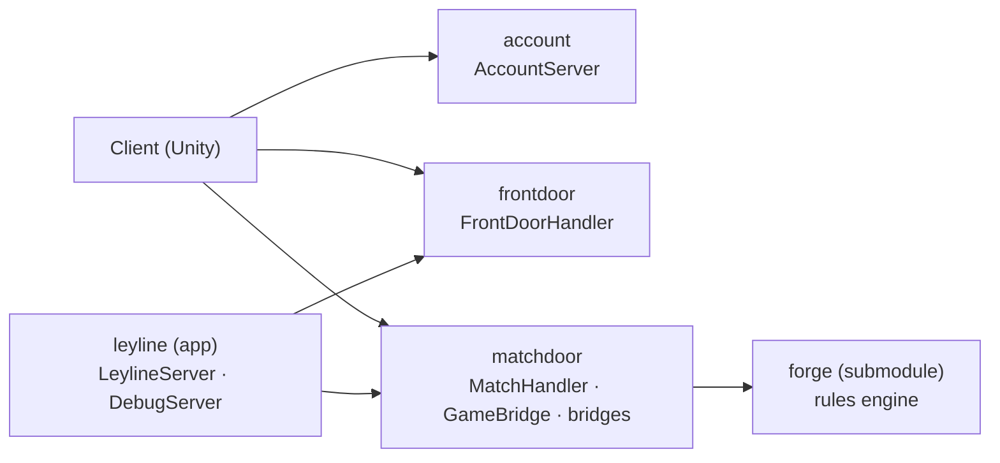
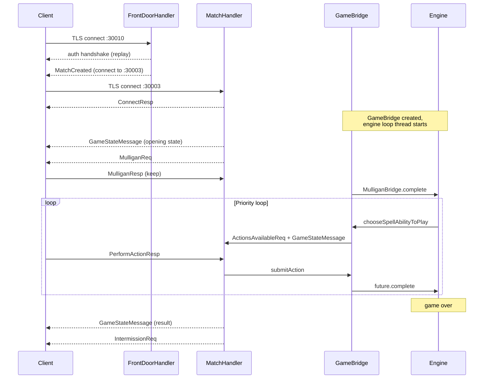

# Leyline — Architecture

System shape: modules, services, wire, and the end-to-end flow from client connect to engine action. For threading invariants (ownership, snapshot timing, counters), see [`bridge-threading.md`](bridge-threading.md).

---

## 1. Modules

Gradle multi-project layout. All Kotlin.

- **`leyline`** — root project, sources in `app/`. Application entrypoint (`LeylineMain`), server wiring (`LeylineServer`), debug HTTP server, management.
- **`account`** — HTTPS authentication backend (`AccountServer`, `TokenService`, `AccountStore`).
- **`frontdoor`** — pre-game surface: lobby, deck, draft, matchmaking. `FrontDoorHandler` dispatches to services in `frontdoor/service/`; replies encoded by `frontdoor/wire/`.
- **`matchdoor`** — gameplay. Four core sub-packages:
  - `bridge/` — engine integration. Blocking-bridge classes and the `PlayerController` override surface.
  - `game/` — state mapping, annotations, diffing, counters. `game/mapper/` holds per-slice mappers (objects, zones, players, actions).
  - `match/` — session state machine: `MatchSession` + per-concern handlers (combat, targeting, optional-actions, mulligan, auto-pass).
  - `protocol/` — 6-byte wire framing and handshake.
- **`forge/`** — Card-Forge upstream as a git submodule (the Java rules engine).


```mermaid
graph LR
    CLIENT["Client (Unity)"]
    ACCOUNT["account<br/>AccountServer"]
    FRONTDOOR["frontdoor<br/>FrontDoorHandler"]
    MATCHDOOR["matchdoor<br/>MatchHandler · GameBridge · bridges"]
    APP["leyline (app)<br/>LeylineServer · DebugServer"]
    FORGE["forge (submodule)<br/>rules engine"]

    CLIENT --> ACCOUNT
    CLIENT --> FRONTDOOR
    CLIENT --> MATCHDOOR
    APP --> FRONTDOOR
    APP --> MATCHDOOR
    MATCHDOOR --> FORGE
```

`matchdoor` is the only module that depends on `forge`; the bridge classes are the single narrow waist between Kotlin and the Java engine.

---

## 2. Runtime Services

`LeylineMain` is the composition root: it constructs each service, wires the shared state they need (card repository, match coordinator, debug collector), and starts them together. `LeylineServer` owns the two client-facing Netty TCP doors; the debug, account, and management servers are each their own object started alongside.

| Service | Default port | Protocol | Implementation |
|---|---|---|---|
| Front Door | 30010 | TLS + 6-byte-framed JSON | `frontdoor/FrontDoorHandler` |
| Match Door | 30003 | TLS + 6-byte-framed protobuf | `matchdoor/.../match/MatchHandler` |
| Debug | 8090 | HTTP + SSE (JDK `HttpServer`) | `app/.../debug/DebugServer` |
| Account | 9443 | HTTPS (Ktor) | `account/.../AccountServer` |
| Management | 8091 | HTTP | `app/.../infra/ManagementServer` |

Ports are configured via `leyline.toml` or CLI flags (`--fd-port`, `--md-port`, `--debug-port`, …); the values above are defaults.

---

## 3. Wire Frame (Match Door)

```
┌─────────────────────────────────────────┐
│  Match Door frame (6-byte header)       │
├──────┬──────┬───────────────────────────┤
│ 0x04 │ 0x11 │ payload_length (4 LE)     │
│ type │ flag │                           │
├──────┴──────┴───────────────────────────┤
│  protobuf payload                       │
│  ClientToMatchServiceMessage   (C→S)    │
│  MatchServiceToClientMessage   (S→C)    │
└─────────────────────────────────────────┘
```

**Inbound (C→S).** `ClientToGREMessage` carrying `PerformActionResp`, `ConnectReq`, `SetSettingsReq`, etc. Decoded by `FrameCodec`, dispatched by `MatchHandler`.

**Outbound (S→C).** `GREToClientMessage` wrapped in `MatchServiceToClientMessage`. Assembled by `BundleBuilder` for gameplay and by `MatchHandler` for connect / timer responses.

---

## 4. Bridge Pattern

The gameplay path bridges an asynchronous, protobuf-driven client to a synchronous, single-threaded Java engine. When the engine reaches a priority stop or interactive prompt, a bridge class blocks the engine thread on a `CompletableFuture` until the client's response arrives; the session thread builds and sends the outbound message in the meantime, then completes the future to unblock the engine.

Three bridges cover the engine callback surface: `GameActionBridge` for priority stops, `InteractivePromptBridge` for engine-initiated choices (targeting, sacrifice, scry, modal), and `MulliganBridge` for the mulligan loop.

The bridges are transport-agnostic by design: the same classes are driven by `MatchHandler` in production and by `MatchFlowHarness` in tests. See [`bridge-threading.md`](bridge-threading.md) for the threading invariants that keep engine and wire coherent.

---

## 5. Match Lifecycle


```mermaid
sequenceDiagram
    participant C as Client
    participant FD as FrontDoorHandler
    participant MH as MatchHandler
    participant GB as GameBridge
    participant ENG as Engine

    C->>FD: TLS connect :30010
    FD-->>C: auth handshake (replay)
    FD-->>C: MatchCreated (connect to :30003)

    C->>MH: TLS connect :30003
    MH-->>C: ConnectResp

    Note over GB,ENG: GameBridge created,<br/>engine loop thread starts

    MH-->>C: GameStateMessage (opening state)
    MH-->>C: MulliganReq

    C->>MH: MulliganResp (keep)
    GB->>ENG: MulliganBridge.complete

    loop Priority loop
        ENG->>GB: chooseSpellAbilityToPlay
        GB->>MH: ActionsAvailableReq + GameStateMessage
        C->>MH: PerformActionResp
        MH->>GB: submitAction
        GB->>ENG: future.complete
    end

    Note over ENG: game over
    MH-->>C: GameStateMessage (result)
    MH-->>C: IntermissionReq
```

---

## 6. State Mapping

Engine state becomes wire state through a two-stage pipeline in `matchdoor.game`.

**Stage 1 — capture.** `GsmSnapshot.capture(game, bridge, …)` reads `forge-game` state into an immutable value: seats, zones, objects, phase, stack, persistent annotation baseline. The only place `forge.game.Game` is read directly (alongside `BundleBuilder`'s capture call).

**Stage 2 — map.** `StateMapper` takes the snapshot plus a caller-owned event list and returns a pure `BuildResult`:

```
GsmSnapshot + prev: GsmSnapshot? + events: List<GameEvent>
  └── StateMapper.buildDiff / buildFromSnapshot
        ├── ObjectMapper         → GameObjectInfo[]  (cards, permanents, abilities)
        ├── ZoneMapper           → ZoneInfo[]        (hand, library, battlefield, stack, …)
        ├── PlayerMapper         → PlayerInfo[]      (life, mana pool, counters)
        ├── ZoneTransferDetector → TransferResult    (id reallocation plans, zone deltas)
        ├── CombatAnnotations / MechanicAnnotations → AnnotationMsg[]
        └── PersistentAnnotationStore.computeBatch  → retained-effect batch
  →
  BuildResult
    ├── gsm:       GameStateMessage    (the proto to send)
    ├── hasCastSpell: Boolean          (QueuedGSM-split hint)
    └── mutations: BridgeMutations     (ordering-sensitive writes, deferred)
```

**Purity of the compute phase.** `buildDiff` does not commit `BridgeMutations` — id reallocations, limbo retires, zone recordings, the persistent-annotation batch, and the `nextAnnotationId` counter all travel back as data. The caller applies them via `bridge.applyMutations(result.mutations)` between compute and send, in a fixed order. This split is the acceptance forcing function for `PureDiffReplayTest`: replay a captured `(snap, events, diff)` sequence on a fresh bridge and assert byte-equal Diff GSMs.

Residuals — a small, enumerated set of bridge reads/writes (card-DB lookups, layered-effect tracker, prompt journal, crew state, steal lifecycle, reveal proxies, the monotonic id counter itself) stay in-stage. The class KDoc on `StateMapper` carries the current list; `PureDiffReplayTest` is the contract, the enumeration is the catalog.

**BundleBuilder.bundle** assembles outbound messages:

```
  per-seat visibility filter · full vs. diff selection · applyMutations commit · cursor advance · gsId / msgId sequencing
```

After compute, `BundleBuilder` calls `bridge.applyMutations(result.mutations)`, embeds any `ActionsAvailableReq`, emits the GRE bundle, and advances `cursor.lastSent = snap`. The cursor (`BundleCursor`) is the snap-vs-snap diff baseline for the next bundle.

**Per-seat filtering.** Each seat receives its own `GameStateMessage`. Private zones (opponent's hand, face-down library) are stripped before send — the same engine state produces different protobuf payloads per seat.

**gsId / msgId monotonicity.** The `MessageCounter` guarantees strictly increasing IDs across the interleaved message stream; any gap or duplicate forces a client resync. Thread-ownership rules live in [`bridge-threading.md`](bridge-threading.md#4-one-shared-counter-not-two).
