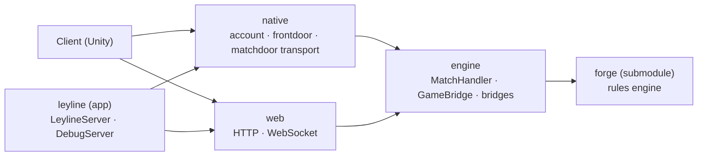
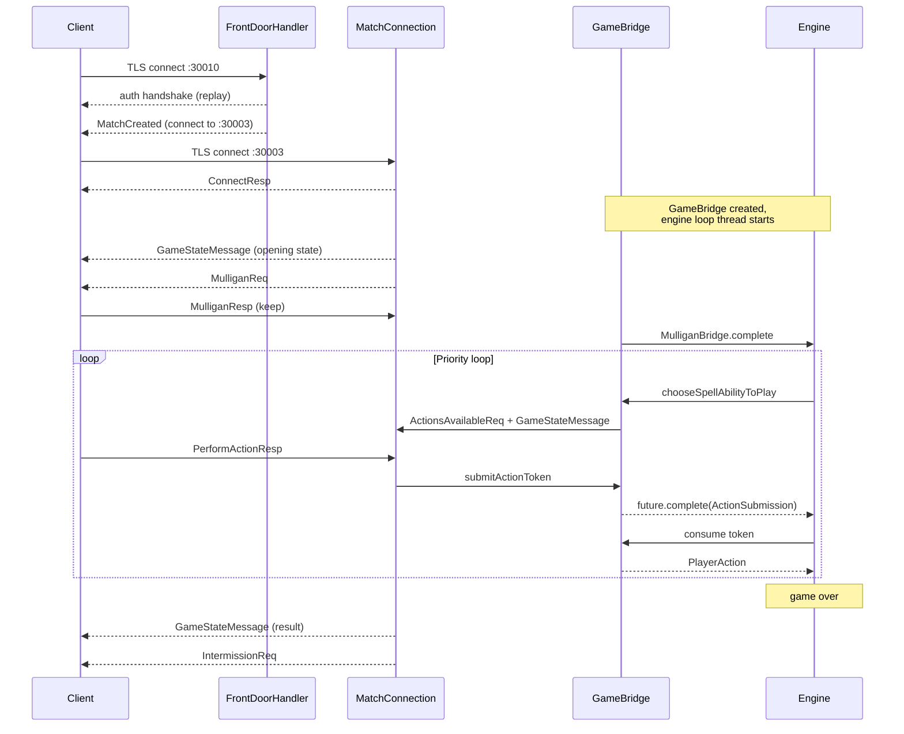

# Leyline — Architecture

System shape: modules, services, wire, and the end-to-end flow from client connect to engine action.

This document describes the current implementation. For the accepted runtime
destination, see [`architecture-direction.md`](architecture-direction.md). Until
a seam migrates, the current threading invariants in
[`bridge-threading.md`](bridge-threading.md) remain authoritative.

---

## 1. Modules

Gradle multi-project layout. All Kotlin.

- **`leyline`** — root project, sources in `app/`. Application entrypoint (`LeylineMain`), server wiring (`LeylineServer`), debug HTTP server, management.
- **`domain`** — domain model, services, and repository ports.
- **`engine`** — Forge bridge and GRE match-session engine.
  - `bridge/` — engine integration. Blocking-bridge classes and the `PlayerController` override surface.
  - `game/` — state mapping, annotations, diffing, counters. Ordered Forge zone moves flow through `FrameEventLog` and `ZoneMoveLedger`; snapshots supply final projected state. `game/mapper/` holds per-slice mappers (objects, zones, players, actions).
  - `match/` — session state machine: `MatchSession` + per-concern handlers (combat, targeting, optional-actions, mulligan, auto-pass).
- **`native`** — native-client head; packages account, frontdoor, and matchdoor transport.
- **`web`** — browser-facing HTTP/WebSocket head.
- **`forge/`** — Card-Forge upstream as a git submodule (the Java rules engine).


```mermaid
graph LR
    CLIENT["Client (Unity)"]
    NATIVE["native<br/>account · frontdoor · matchdoor transport"]
    WEB["web<br/>HTTP · WebSocket"]
    ENGINE["engine<br/>MatchHandler · GameBridge · bridges"]
    APP["leyline (app)<br/>LeylineServer · DebugServer"]
    FORGE["forge (submodule)<br/>rules engine"]

    CLIENT --> NATIVE
    CLIENT --> WEB
    APP --> NATIVE
    APP --> WEB
    NATIVE --> ENGINE
    WEB --> ENGINE
    ENGINE --> FORGE
```

`engine` is the only module that depends on `forge`; the bridge classes are the single narrow waist between Kotlin and the Java engine.

---

## 2. Runtime Services

`LeylineMain` is the composition root: it constructs each service, wires shared state (card repository, match coordinator, runtime puzzle holder), and starts them together. `LeylineServer` owns the two client-facing Netty TCP doors; the local-control, account, and management servers are separate objects started alongside.

| Service | Default port | Protocol | Implementation |
|---|---|---|---|
| Native lobby | 30010 | TLS + 6-byte-framed JSON | `native/frontdoor/FrontDoorHandler` |
| Native match | 30003 | TLS + 6-byte-framed protobuf | `native/matchdoor/NativeMatchDoorBootstrap` -> `engine/match/MatchConnection` |
| Local control | 8090 | HTTP (JDK `HttpServer`) | `app/.../debug/DebugServer` |
| Account | 9443 | HTTPS (Ktor) | `native/account/AccountServer` |
| Management | 8091 | HTTP | `app/.../infra/ManagementServer` |

Ports are configured via `leyline.toml` or CLI flags (`--fd-port`, `--md-port`, `--debug-port`, …); the values above are defaults.

The local-control server exposes puzzle control, best-play, and full-state injection endpoints. It binds loopback-only by default; set `LEYLINE_DEBUG_BIND=0.0.0.0` only when another local device must reach it.

---

## 3. Wire Frame (Match Door)

```
┌─────────────────────────────────────────┐
│  Match Door frame (6-byte header)       │
├──────┬──────┬───────────────────────────┤
│ 0x04 │ 0x11 │ payload_length (4 LE)     │
│ type │ flag │                           │
├──────┴──────┴───────────────────────────┤
│  protobuf payload                       │
│  ClientToMatchServiceMessage   (C→S)    │
│  MatchServiceToClientMessage   (S→C)    │
└─────────────────────────────────────────┘
```

**Inbound (C→S).** `ClientToGREMessage` carrying `PerformActionResp`, `ConnectReq`, `SetSettingsReq`, etc. Decoded by `FrameCodec`, then passed to the transport-neutral `MatchConnection`.

**Outbound (S→C).** `GREToClientMessage` wrapped in `MatchServiceToClientMessage`. Assembled by `BundleBuilder` for gameplay and by `MatchHandler` for connect / timer responses.

---

## 4. Bridge Pattern

The gameplay path bridges an asynchronous, protobuf-driven client to a synchronous, single-threaded Java engine. When the engine reaches a priority stop or interactive prompt, a bridge class blocks the engine thread on a `CompletableFuture` until the client's response arrives; the session thread builds and sends the outbound message in the meantime, then completes the future to unblock the engine.

Three bridges cover the engine callback surface: `GameActionBridge` for priority stops, `InteractivePromptBridge` for engine-initiated choices (targeting, sacrifice, scry, modal), and `MulliganBridge` for the mulligan loop.

Priority actions use an opaque-token handoff. `ActionMapper` registers the exact
`PlayerAction` with `GameActionBridge` in the same branch that projects its
protocol action. The pending catalog exposes only the token and immutable
selector facts. `PerformActionResp` resolves that token through the catalog,
then completes the engine future with the token and any scalar selections. The
engine thread consumes the retained command after it wakes. Completion,
replacement, cancellation, and failure clear the per-window command table.
One bridge lifecycle monitor serializes window publication, command
registration, catalog replacement, submission, cancellation, timeout, and
engine consumption. Each catalog publication is one immutable game-state-id
and offer-map value, so a response cannot combine selectors from different
prompt generations.

A fourth family covers prompts that fire mid-override rather than at a priority stop or bridge-initiated choice — `confirmTrigger`, `chooseNumber`, `assignCombatDamage`, and similar sites where the engine is already inside a specific `PlayerController` method and can't route through `GameActionBridge`'s priority-loop future. Small gates — `OptionalActionGate`, `NumericInputGate`, `DamageAssignmentGate` — each own a single-use `CompletableFuture` for the override cluster they serve, built on a shared `PendingGate` core (publish the prompt, signal, await with timeout, clear on completion). The pending future lives as a field on `PlayerController` itself rather than on a bridge object; `GameBridge.hasPendingInteraction()` polls those fields alongside the three bridges above to detect a live interaction.

The bridges are transport-agnostic by design: the same classes are driven by `MatchHandler` in production and by `MatchFlowHarness` in tests. See [`bridge-threading.md`](bridge-threading.md) for the threading invariants that keep engine and wire coherent.

---

## 5. Match Lifecycle


```mermaid
sequenceDiagram
    participant C as Client
    participant FD as FrontDoorHandler
    participant MC as MatchConnection
    participant GB as GameBridge
    participant ENG as Engine

    C->>FD: TLS connect :30010
    FD-->>C: auth handshake (replay)
    FD-->>C: MatchCreated (connect to :30003)

    C->>MC: TLS connect :30003
    MC-->>C: ConnectResp

    Note over GB,ENG: GameBridge created,<br/>engine loop thread starts

    MC-->>C: GameStateMessage (opening state)
    MC-->>C: MulliganReq

    C->>MC: MulliganResp (keep)
    GB->>ENG: MulliganBridge.complete

    loop Priority loop
        ENG->>GB: chooseSpellAbilityToPlay
        GB->>MC: ActionsAvailableReq + GameStateMessage
        C->>MC: PerformActionResp
        MC->>GB: submitActionToken
        GB-->>ENG: future.complete(ActionSubmission)
        ENG->>GB: consume token
        GB-->>ENG: PlayerAction
    end

    Note over ENG: game over
    MC-->>C: GameStateMessage (result)
    MC-->>C: IntermissionReq
```

---

## 6. State Mapping

Engine state becomes wire state through a two-stage pipeline in `engine.game`.

**Stage 1 — capture.** `GsmSnapshot.capture(game, bridge, …)` reads `forge-game` state into an immutable value: seats, zones, objects, phase, stack, persistent annotation baseline. The only place `forge.game.Game` is read directly (alongside `BundleBuilder`'s capture call).

**Stage 2 — map.** `StateMapper` takes the snapshot plus a caller-owned event list and returns a pure `BuildResult`:

```
GsmSnapshot + prev: GsmSnapshot? + events: List<GameEvent>
  └── StateMapper.buildDiff / buildFromSnapshot
        ├── ObjectMapper         → GameObjectInfo[]  (cards, permanents, abilities)
        ├── ZoneMapper           → ZoneInfo[]        (hand, library, battlefield, stack, …)
        ├── PlayerMapper         → PlayerInfo[]      (life, mana pool, counters)
        ├── ZoneTransferDetector → TransferResult    (id reallocation plans, zone deltas)
        ├── CombatAnnotations / MechanicAnnotations → AnnotationMsg[]
        └── PersistentAnnotationStore.computeBatch  → retained-effect batch
  →
  BuildResult
    ├── gsm:       GameStateMessage    (the proto to send)
    ├── hasCastSpell: Boolean          (QueuedGSM-split hint)
    └── mutations: BridgeMutations     (ordering-sensitive writes, deferred)
```

**Purity of the compute phase.** `buildDiff` does not commit `BridgeMutations` — id reallocations, limbo retires, zone recordings, the persistent-annotation batch, and the `nextAnnotationId` counter all travel back as data. The caller applies them via `bridge.applyMutations(result.mutations)` between compute and send, in a fixed order. This split is the acceptance forcing function for `PureDiffReplayTest`: replay a captured `(snap, events, diff)` sequence on a fresh bridge and assert byte-equal Diff GSMs.

Residuals — a small, enumerated set of bridge reads/writes (card-DB lookups, layered-effect tracker, prompt journal, crew state, steal lifecycle, reveal proxies, the monotonic id counter itself) stay in-stage. The class KDoc on `StateMapper` carries the current list; `PureDiffReplayTest` is the contract, the enumeration is the catalog.

**BundleBuilder** compiles outbound messages:

```
  per-seat visibility filter · full vs. diff selection · frame finalization · path-specific assembly · FramePlan
```

After compute, `BundleBuilder` finalizes the frame and assembles actions or
requests through the frame-local ID resolver. The resulting immutable
`FramePlan` carries messages, action offers, deferred `BridgeMutations`, the
next `BundleCursor` baseline, the planned counter position, and a reservation
for the immutable event/reveal prefix used by the build. One commit operation
applies that payload and then consumes exactly the reserved prefix before the
bundle becomes visible. Failed compilation or commit leaves the input queued
for retry; input appended after the reservation belongs to the next frame. The
cursor remains the snap-vs-snap diff baseline for the next bundle.

**Per-seat filtering.** Each seat receives its own `GameStateMessage`. Private zones (opponent's hand, face-down library) are stripped before send — the same engine state produces different protobuf payloads per seat.

**Counter sequencing.** A frame compiler allocates gsIds and msgIds against a
fork of the shared `MessageCounter`; commit advances the shared position only
after the complete plan exists. The shared allocation lock covers each public
compile-and-commit path, so standalone allocations cannot invalidate a plan
between its fork and commit. The counter still guarantees strictly increasing
IDs across interleaved output. Thread-ownership rules live in
[`bridge-threading.md`](bridge-threading.md#4-one-shared-counter-not-two).
