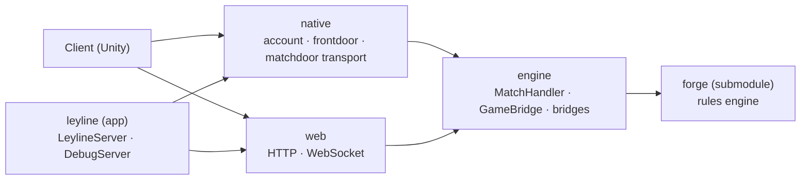
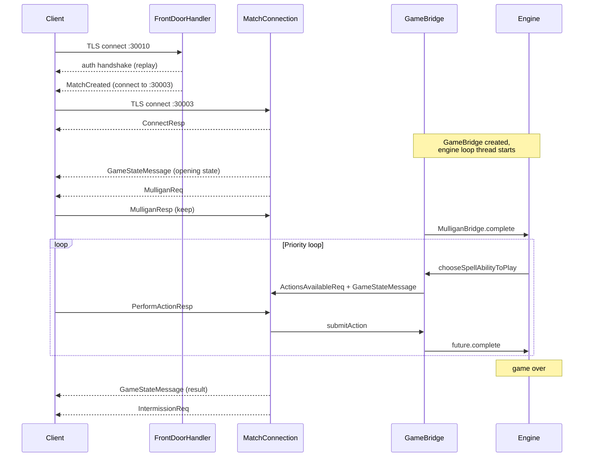

# Leyline — Architecture

System shape: modules, services, wire, and the end-to-end flow from client connect to engine action.

This document describes the current implementation. For the accepted runtime
destination, see [`architecture-direction.md`](architecture-direction.md). Until
a seam migrates, the current threading invariants in
[`bridge-threading.md`](bridge-threading.md) remain authoritative.

---

## 1. Modules

Gradle multi-project layout. All Kotlin.

- **`leyline`** — root project, sources in `app/`. Application entrypoint (`LeylineMain`), server wiring (`LeylineServer`), debug HTTP server, management.
- **`domain`** — domain model, services, and repository ports.
- **`engine`** — Forge bridge and GRE match-session engine.
  - `bridge/` — engine integration. Blocking-bridge classes and the `PlayerController` override surface.
  - `game/` — state mapping, annotations, diffing, counters. Ordered Forge zone moves flow through `FrameEventLog` and `ZoneMoveLedger`; snapshots supply final projected state. `game/mapper/` holds per-slice mappers (objects, zones, players, actions).
  - `match/` — session state machine: `MatchSession` + per-concern handlers (combat, targeting, optional-actions, mulligan, auto-pass).
- **`native`** — native-client head; packages account, frontdoor, and matchdoor transport.
- **`web`** — browser-facing HTTP/WebSocket head.
- **`forge/`** — Card-Forge upstream as a git submodule (the Java rules engine).


```mermaid
graph LR
    CLIENT["Client (Unity)"]
    NATIVE["native<br/>account · frontdoor · matchdoor transport"]
    WEB["web<br/>HTTP · WebSocket"]
    ENGINE["engine<br/>MatchHandler · GameBridge · bridges"]
    APP["leyline (app)<br/>LeylineServer · DebugServer"]
    FORGE["forge (submodule)<br/>rules engine"]

    CLIENT --> NATIVE
    CLIENT --> WEB
    APP --> NATIVE
    APP --> WEB
    NATIVE --> ENGINE
    WEB --> ENGINE
    ENGINE --> FORGE
```

`engine` is the only module that depends on `forge`; the bridge classes are the single narrow waist between Kotlin and the Java engine.

---

## 2. Runtime Services

`LeylineMain` is the composition root: it constructs each service, wires shared state (card repository, match coordinator, runtime puzzle holder), and starts them together. `LeylineServer` owns the two client-facing Netty TCP doors; the local-control, account, and management servers are separate objects started alongside.

| Service | Default port | Protocol | Implementation |
|---|---|---|---|
| Native lobby | 30010 | TLS + 6-byte-framed JSON | `native/frontdoor/FrontDoorHandler` |
| Native match | 30003 | TLS + 6-byte-framed protobuf | `native/matchdoor/NativeMatchDoorBootstrap` -> `engine/match/MatchConnection` |
| Local control | 8090 | HTTP (JDK `HttpServer`) | `app/.../debug/DebugServer` |
| Account | 9443 | HTTPS (Ktor) | `native/account/AccountServer` |
| Management | 8091 | HTTP | `app/.../infra/ManagementServer` |

Ports are configured via `leyline.toml` or CLI flags (`--fd-port`, `--md-port`, `--debug-port`, …); the values above are defaults.

The local-control server exposes puzzle control, best-play, and full-state injection endpoints. It binds loopback-only by default; set `LEYLINE_DEBUG_BIND=0.0.0.0` only when another local device must reach it.

---

## 3. Wire Frame (Match Door)

```
┌─────────────────────────────────────────┐
│  Match Door frame (6-byte header)       │
├──────┬──────┬───────────────────────────┤
│ 0x04 │ 0x11 │ payload_length (4 LE)     │
│ type │ flag │                           │
├──────┴──────┴───────────────────────────┤
│  protobuf payload                       │
│  ClientToMatchServiceMessage   (C→S)    │
│  MatchServiceToClientMessage   (S→C)    │
└─────────────────────────────────────────┘
```

**Inbound (C→S).** `ClientToGREMessage` carrying `PerformActionResp`, `ConnectReq`, `SetSettingsReq`, etc. Decoded by `FrameCodec`, then passed to the transport-neutral `MatchConnection`.

**Outbound (S→C).** `GREToClientMessage` wrapped in `MatchServiceToClientMessage`. Assembled by `BundleBuilder` for gameplay and by `MatchHandler` for connect / timer responses.

---

## 4. Bridge Pattern

The gameplay path bridges an asynchronous, protobuf-driven client to a synchronous, single-threaded Java engine. `MatchCutCoordinator` is the match-scoped imperative owner for ordinary and combat playback cuts, priority/action windows, Targeting, Search, ordered-card and Scry/Surveil Grouping windows, card-backed, static-enum, and reveal-backed SelectN windows, all PayCosts windows, and the Optional, Numeric, and Damage blocking interactions. It closes the frame journal, retains the exact cut, compiles and commits projection state, publishes a monotonic viewer feed, and only then signals the waiting session domain.

`GameActionBridge` blocks the engine at attacker and blocker windows and at client-visible priority windows. Priority policy evaluates one frozen candidate set and chooses one of three shapes: a Visible window commits an action catalog and bounded executable handles; a SyncOnly stop commits a state-only cut and freezes whether the next engine decision should reevaluate normally, require Visible, or allow SyncOnly; a safe Skip resumes directly without closing a journal or allocating protocol state. Completing SyncOnly releases only that exact wait. The engine arms the frozen continuation after the wait returns successfully, so timeout, stale completion, and delivery failure cannot affect a later priority point. Manual flow requires Visible while explicit auto-resolve may allow another pass-only SyncOnly stop; meaningful candidates remain Visible. A drain releases at most the exact SyncOnly stop observed at entry, awaits once, publishes the resulting horizon, and returns. Auto-pass owns explicit repetition; action handlers stop at one semantic horizon. Sessions submit correlated value responses for Visible windows and never re-enumerate live actions. Forge's target-selection producer binds `TargetSelection`, and `InteractivePromptBridge` delegates that route to the coordinator without inspecting a live ability. Search similarly freezes its library, candidate, source, and picker-shape values on the engine thread; one state-and-request cut becomes visible before the engine blocks, and a correlated instance-id response invalidates the reveal baseline before releasing it. Top- and bottom-library ordering freezes the exact card handles and optional pending move; one state-and-`OrderReq` cut becomes visible before the engine blocks, and a full correlated permutation resolves through that retained table. Scry and Surveil freeze the source, private candidates, and exact card handles; one private state-and-`GroupReq` cut becomes visible before the engine blocks. The correlated partition resolves through the retained table, and its arrangement fact records the final top order only after an optional ordered-card interaction completes. Legend Rule, library putback, Manifest Dread, discard, resolution sacrifice, Suspect, and Mutate top/bottom choices bind `CardSelect`; their exact card handles and envelope facts are frozen before one state-and-`SelectNReq` cut is committed. Manifest Dread includes chooser-private library candidate objects in that cut. Library putback returns the selected exact hand handles before Forge can enter its separate Top/Bottom Order callback. Legend Rule, library putback, and Manifest Dread accept only `SelectNResp`; Legend Rule records every unchosen exact handle before state-based actions continue. Color, subtype, and parity choices bind `StaticChoice`; their protocol enum values and bounds are frozen before the same atomic state-and-request publication. Candidate-backed `Generic` prompts remain explicitly `UnclassifiedCandidate` on the residual bridge/session path until their response family is named. Modal, dynamic residual SelectN, and automatic routes retain their named owners. `MulliganBridge` remains the mulligan-loop owner.

Reveal-backed choices bind `RevealChoice`. The exact journal version, full revealed set, selectable subset, source, and card handles are frozen before one state-and-`SelectNReq` cut marks that reveal pending. Completion stages any source-linked exile and clears only the claimed reveal version before the engine resumes. These windows accept only `SelectNResp`.

`OptionalActionGate`, `NumericInputGate`, and `DamageAssignmentGate` are thin engine-thread adapters. They publish immutable `BlockingInteraction` values to the coordinator, which commits the complete prompt batch before signalling, retains live engine handles in a bounded runtime table, and resolves answer values only after the engine wakes. Explicit Targeting, Search, ordered-card, Scry/Surveil Grouping, card-backed, static-enum, and reveal-backed SelectN, iterative mana-source payment, and the seven one-shot PayCosts routes follow the same pre-block publication rule through value-only materializers. PayCosts runtimes retain exact option-to-card handles; iterative payment commits every replacement request before delivery acknowledgement, while one-shot payment returns the exact original handles after a correlated immutable response. Their configured choice timeouts atomically retire the window and return the configured fallback without terminalizing the match, while materialization, commit, and delivery failures are terminal. Unclassified candidate prompts, dynamic residual SelectN prompts, mulligan, lifecycle wire construction, and multi-view compilation remain explicit owners rather than hidden coordinator fallbacks.

The bridges are transport-agnostic by design: the same classes are driven by `MatchHandler` in production and by `MatchFlowHarness` in tests. See [`bridge-threading.md`](bridge-threading.md) for the threading invariants that keep engine and wire coherent.

---

## 5. Match Lifecycle


```mermaid
sequenceDiagram
    participant C as Client
    participant FD as FrontDoorHandler
    participant MC as MatchConnection
    participant GB as GameBridge
    participant ENG as Engine

    C->>FD: TLS connect :30010
    FD-->>C: auth handshake (replay)
    FD-->>C: MatchCreated (connect to :30003)

    C->>MC: TLS connect :30003
    MC-->>C: ConnectResp

    Note over GB,ENG: GameBridge created,<br/>engine loop thread starts

    MC-->>C: GameStateMessage (opening state)
    MC-->>C: MulliganReq

    C->>MC: MulliganResp (keep)
    GB->>ENG: MulliganBridge.complete

    loop Priority loop
        ENG->>GB: chooseSpellAbilityToPlay
        GB->>MC: ActionsAvailableReq + GameStateMessage
        C->>MC: PerformActionResp
        MC->>GB: submitAction
        GB->>ENG: future.complete
    end

    Note over ENG: game over
    MC-->>C: GameStateMessage (result)
    MC-->>C: IntermissionReq
```

---

## 6. State Mapping

Engine state becomes wire state through a two-stage pipeline in `engine.game`.

**Stage 1 — snapshot.** `GsmSnapshot` materialization reads `forge-game` state into an immutable value: seats, zones, objects, phase, and stack. Projection-owned identity observations remain tentative until the surrounding transition installs.

**Stage 2 — compile one viewer.** `StateProjectionCompiler` takes the snapshot,
cut-scoped typed facts, stable reference data, prior projection state, and a
typed viewer intent, then returns one finalized tentative result:

```
StateFrameInput(snapshot, prev, events, typed facts)
  + StateProjectionEnvironment + prior ProjectionState + ViewerProjectionIntent
    └── StateProjectionCompiler.compileOneViewer
        ├── StateMapper          → bridge-free base state draft
        ├── ObjectMapper         → GameObjectInfo[]  (cards, permanents, abilities)
        ├── ZoneMapper           → ZoneInfo[]        (hand, library, battlefield, stack, …)
        ├── PlayerMapper         → PlayerInfo[]      (life, mana pool, counters)
        ├── ZoneTransferDetector → TransferResult    (id reallocation plans, zone deltas)
        ├── CombatAnnotations / MechanicAnnotations → AnnotationMsg[]
        └── PersistentAnnotationStore.computeBatch  → retained-effect batch
  →
  StateProjectionCompiler.Result
    ├── gsm:       GameStateMessage    (the proto to send)
    ├── output: ProjectionOutput       (assembly metadata)
    └── transition: ProjectionTransition (complete next projection state)
```

**Transactional isolation of state projection.** `compileOneViewer` creates one
private projection editor, maps the base state, applies typed supplements and
order-prompt synthetic state, finalizes transient annotations once, advances
the viewer baseline, then freezes once. It has no `GameBridge` dependency or
ambient projection editor. A discarded or stale attempt installs nothing.
`StateProjectionCompilerTest` and `StateMapperValueBoundaryTest` supply only
immutable snapshots, facts, environment, intent, and prior state.

Stable card metadata and match configuration enter through the read-only
`StateProjectionEnvironment`. Projection history—including identities, effect
lifecycle, prompt facts, reveal proxies, and annotation correlation—lives in
`ProjectionState` or typed frame facts. This is a finalized, bridge-free
single-view state compiler. Snapshot/fact and intent materialization, action and
request mapping, lifecycle envelopes, transition installation, and multi-view
atomicity remain shell stages. Full-state action projection may still extend
the tentative state through its explicit shell editor; it cannot append
state-frame annotations.

**BundleBuilder.bundle** assembles outbound messages:

```
  per-seat intent materialization · state compiler invocation · projection commit · path-specific assembly
```

`BundleBuilder` installs the compiler's one `ProjectionTransition`. Its next
state includes identity history, annotation history, and the viewer's snap-vs-snap
diff baseline. A match-scoped shell lock
preserves frame-cut order across builders while the transition install remains
a revision-checked compare-and-set.

The match-scoped `MatchCutCoordinator` closes and materializes migrated playback
only from Forge completion hooks. The
main-loop hook owns ordinary completed steps; narrower hooks own complete
attacker declarations, blocker declarations, and combat teardown. Event
subscribers only request those cuts. The coordinator retains an immutable
`PendingCut` containing the exact prior projection and every ordered frame plan
for the closed journal, including fixed logical ids. A combat-damage journal
may describe several frames, but they compile as one private fold and publish
with one transition install. A stale install cannot be rebased without changing
that exact cut, so it becomes terminal and retains the cut for diagnosis.
Failure after journal close is likewise terminal.

**Per-seat filtering.** Each seat receives its own `GameStateMessage`. Private zones (opponent's hand, face-down library) are stripped before send — the same engine state produces different protobuf payloads per seat.

**Counter sequencing.** The `MessageCounter` guarantees strictly increasing gsIds across the interleaved `GameStateMessage` stream and keeps msgIds on the same shared atomic path for local ordering and response bookkeeping. Thread-ownership rules live in [`bridge-threading.md`](bridge-threading.md#4-one-shared-counter-not-two).
