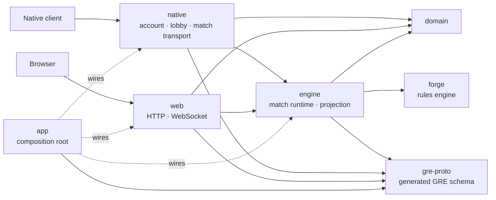
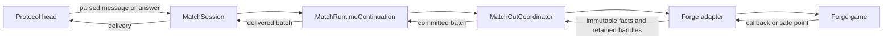
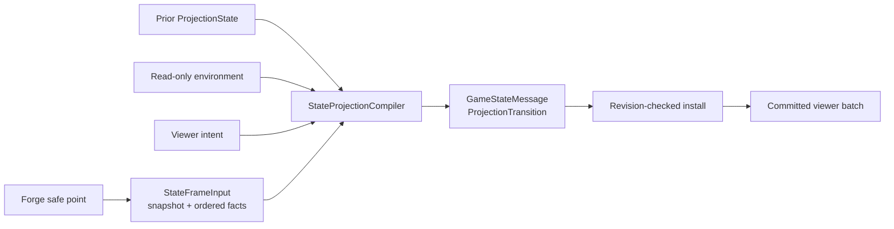

# Leyline Architecture

Leyline is one stateful game backbone with two protocol heads. This document
describes the current implementation. Durable architectural decisions live in
[`docs/decisions/`](decisions/); current cross-thread constraints live in
[`bridge-threading.md`](bridge-threading.md).

## System shape

```mermaid
flowchart LR
    NC["Native client"] --> N["native<br/>account · lobby · match transport"]
    B["Browser"] --> W["web<br/>HTTP · WebSocket"]
    N --> E["engine<br/>match runtime · projection"]
    W --> E
    N --> D["domain"]
    W --> D
    E --> D
    E --> F["forge<br/>rules engine"]
    E --> GP["gre-proto<br/>generated GRE schema"]
    N --> GP
    W --> GP
    A["app<br/>composition root"] --> GP
    A -. "wires" .-> N
    A -. "wires" .-> W
    A -. "wires" .-> E
```

The heads decode different transports but submit to the same engine match
surface. `engine` is the only Gradle module that depends on Forge. `gre-proto`
(mapped to `proto/`) owns the generated GRE wire schema: it synchronizes
`proto/src/main/proto/messages.proto` from the `proto/upstream` submodule
through `proto/rename-map.sed`, runs protoc, and ships the generated
`wotc.mtgo.gre.external.messaging` classes.

## Modules

| Module | Owns | Depends on |
|---|---|---|
| root `app/` | `LeylineMain`, service wiring, local control, management | domain, engine, gre-proto, native, web |
| `domain` | Shared values, services, repository ports | no application module |
| `gre-proto` | Generated GRE schema, protoc output | no application module |
| `engine` | Forge adapter, match runtime, interaction ownership, state projection | domain, gre-proto, Forge |
| `native` | Account, lobby, native match transport and framing | domain, engine, gre-proto |
| `web` | Browser routes, authentication, GRE relay | domain, engine, gre-proto |

Within `engine`, responsibilities follow the runtime boundary:

| Package | Responsibility |
|---|---|
| `bridge/forge` | Forge controller overrides and callbacks |
| `bridge/interaction` | Callback-specific prompt classification and policy |
| `bridge/handoff` | Immutable interaction values and narrow runtime interfaces |
| `bridge/coord` | Match-scoped cuts, windows, exact handles, commit, terminal failure |
| `game/snapshot` | Immutable Forge state observations |
| `game/event` | Ordered facts that a resulting-state snapshot cannot recover |
| `game/mapping`, `game/annotations` | Functional projection core |
| `game/state` | Committed projection history and the `GameBridge` shell |
| `game/bundle` | Interaction materializers and protocol envelopes |
| `match` | Parsed-message dispatch, answer submission, batch delivery |

Module-local ownership and dependency rules live in the nearest `AGENTS.md`.

## Runtime services

`LeylineMain` constructs shared repositories and match services, then starts the
protocol heads and local operator services.

| Service | Default port | Implementation |
|---|---:|---|
| Native lobby | 30010 | `native/frontdoor/FrontDoorHandler` |
| Native match | 30003 | `native/matchdoor/NativeMatchDoorBootstrap` |
| Local control | 8090 | `app/.../debug/DebugServer` |
| Account | 9443 | `native/account/AccountServer` |
| Management | 8091 | `app/.../infra/ManagementServer` |
| Web head | 8080 | `app/.../WebMain` (Ktor/Netty over `web/`) |

Both heads compose from one resolved configuration snapshot. Code defaults
define the normal profile; optional `leyline.toml` entries and mechanical
`LEYLINE_*` environment names provide overrides (precedence: typed default <
TOML < environment). Relative paths resolve against the application root, and
`LEYLINE_INSTANCE=<name>` starts an additional instance with isolated state and
artifact paths. Exact native transport framing belongs to
`native.protocol.FrameCodec`.

## Match runtime

Forge is synchronous and mutable. One engine thread advances each game and
blocks in controller callbacks when a human answer is required. Native, web,
timer, and test entrants call the transport-neutral match surface; the current
runtime serializes interactive session work while the match coordinator owns
committed cuts and interaction windows.

```mermaid
flowchart LR
    H["Protocol head"] -->|"parsed message or answer"| S["MatchSession"]
    S --> R["MatchRuntimeContinuation"]
    R --> C["MatchCutCoordinator"]
    C --> A["Forge adapter"]
    A --> F["Forge game"]
    F -->|"callback or safe point"| A
    A -->|"immutable facts and retained handles"| C
    C -->|"committed batch"| R
    R -->|"delivered batch"| S
    S -->|"delivery"| H
```

`GameBridge` is the engine shell's composition root.
`MatchCutCoordinator` owns journal close, immutable pending cuts, projection
installation, viewer feeds, prompt/action lifetimes, game-over lifecycle
publication, startup and mulligan lifecycle publication, puzzle replacement,
settings acknowledgements, illegal-response publication, declaration
confirmations, and terminal failure. `MatchPromptRuntimeSet` owns the match's
prompt-runtime inventory. Exact Forge objects remain behind bounded runtime
tables; client responses carry correlation values that resolve those retained
handles.

`GameBridge.priorityPolicy` owns priority presentation policy and client settings
state. Match sessions submit immutable `SettingsMessage` values to it. The
priority coordinator is the only source of Visible, SyncOnly, Skip, auto-pass,
stop, and full-control decisions. `MatchRuntimeContinuation` only waits for the
published horizon, drains committed batches, and releases exact sync barriers
after delivery.

Each live human `MatchConnection` owns one runtime delivery observer. The
observer waits for committed coordinator feed notifications and uses the same
session lock and continuation drain path for horizons that arise after an
inbound handler returns, including prompt timeouts, playback, and terminal
delivery. An inbound handler drains the horizon it released while holding the
session lock; the observer drains horizons published after that handler returns.
The lock serializes those delivery claims, while the observer's feed
notification remains its exclusive wake-up source. It never submits actions or
chooses progression policy, and its generation is invalidated on teardown or
puzzle replacement before a new observer is armed.

In-process harness code observes named client output after asynchronous
delivery when needed. It does not wait on an engine horizon or consume the
observer's feed notification.

Three owners sit beneath that boundary and are each the only implementation of
their contract. `CoordinatorCutInstaller` performs the single-batch cut
transaction — enqueue, projection commit, rollback of an uninstalled batch, and
playback acknowledgement — for every runtime family.
`MatchActionWindowRuntime` is the sole authority on action-window lifecycle;
`GameActionBridge` is the engine-thread wait adapter and keeps no competing
lifecycle state. The action runtime retains executable offers and the exact
combat identities published with each declaration window. Session handlers
submit immutable client-domain values; the runtime resolves and claims the
retained handles. Deferred cast-cost responses use the same action claim rather
than a session-owned lookup table. The deferred runtime also owns casting-time
prompt materialization and committed publication. `InteractiveCommandExchange`
owns the cross-thread command handshake that iterative targeting and mana-source
payment windows share.

`SpectatorSession` retains the independent `stateOnlyDiff` projection and raw
completion output. `FamiliarSession` only copies already-allocated human-seat
messages. [`bridge-threading.md`](bridge-threading.md) is authoritative for the
remaining exception and its lock order.

## Interaction cuts

A blocking interaction follows one generic lifecycle:

```mermaid
sequenceDiagram
    participant F as Forge thread
    participant C as Match coordinator
    participant P as Projection core
    participant H as Protocol head

    F->>C: immutable window values + retained handles
    C->>P: prior state + snapshot + ordered facts + intent
    P-->>C: tentative transition + messages
    C->>C: revision-check and commit
    C-->>H: immutable committed batch
    H-->>C: correlated answer
    C-->>F: original retained handle or typed value
```

The invariant is publication before wake-up: a visible prompt or action window
is committed and drainable before the waiting observer is signalled. A response
must match the exact interaction and state identifiers. Timeout, supersession,
delivery failure, and teardown retire that same window; they cannot complete a
later one.

Prompt families keep separate value-freezing and materialization code when their
identity or completion rules differ. Shared lifecycle machinery owns only the
common publication, correlation, timeout, and retirement contract.

## State projection

Projection combines two complementary inputs:

- `GsmSnapshot`: resulting Forge state at a declared safe point;
- ordered facts: cause, grouping, and intermediate operations not recoverable
  from the resulting state.

```mermaid
flowchart LR
    SP["Forge safe point"] --> I["StateFrameInput<br/>snapshot + ordered facts"]
    PS["Prior ProjectionState"] --> C["StateProjectionCompiler"]
    ENV["Read-only environment"] --> C
    VI["Viewer intent"] --> C
    I --> C
    C --> R["GameStateMessage<br/>ProjectionTransition"]
    R --> K["Revision-checked install"]
    K --> B["Committed viewer batch"]
```

`StateProjectionCompiler.compileOneViewer` edits a private projection value and
returns a tentative result. Client identities, visibility baselines, effect and
annotation lifecycles, and prompt facts advance only when the surrounding
transition installs. A stale or failed attempt publishes nothing from that
attempt and retains the exact pending cut for diagnosis or terminal handling.

`AnnotationFrameFinalizer` orders and numbers a complete transient annotation
frame once inside compilation. Persistent annotation state remains part of the
returned projection value. Per-family materializers may add explicit viewer
intent, but the projection core does not query live Forge state.

Current compilation is single-view. Atomic multi-view compilation and the
remaining lifecycle/output convergence stay within the direction established
by [ADR 0015](decisions/0015-functional-core-imperative-shell.md); this document
does not maintain a migration checklist.

## Output and delivery

Projection commit and transport delivery are different boundaries. A committed
viewer baseline records the latest installed projection, not client
acknowledgement. Delivery cannot repair, reorder, or recompile a committed
batch. When code needs delivery awareness, it tracks that fact explicitly.

Gameplay state identifiers and message identifiers come from the match's shared
`MessageCounter`. Allocation alone does not define delivery order: all producers
must join the coordinator/session ordering contract documented in
[`bridge-threading.md`](bridge-threading.md).

## Decision map

- [ADR 0006](decisions/0006-single-backbone-core-and-heads.md): one backbone,
  native and web heads.
- [ADR 0010](decisions/0010-bind-priority-actions-at-projection-source.md):
  executable actions bind beside their projected offers.
- [ADR 0012](decisions/0012-bind-prompt-routes-once.md): prompt routes resolve
  once and survive the whole interaction.
- [ADR 0013](decisions/0013-finalize-annotation-frames-once.md): transient
  annotation frames finalize once.
- [ADR 0015](decisions/0015-functional-core-imperative-shell.md): imperative
  Forge shell around a value-only projection core.
