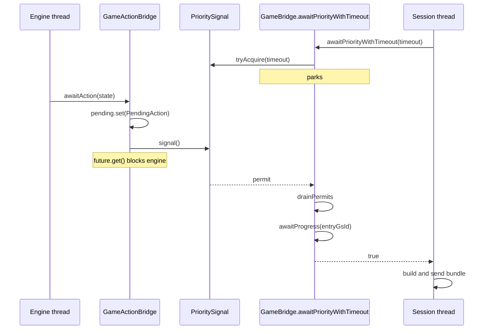

# Bridge Threading

The contract side of the Forge bridge: which thread owns which state, what must be true at each boundary, and the structural rules that keep the engine and the wire coherent. For the shape of the system (boxes, arrows, protocol frames), read [`architecture.md`](architecture.md) first.

---

## 1. Two threads, two owners

Every piece of bridge state is owned by exactly one of two threads.

| Thread | Name | Runs | Blocks on |
|---|---|---|---|
| **Engine** | `game-loop-<gameId>` (daemon, launched by `GameLoopController`) | Forge's `mainGameLoop`, rules engine, trigger resolution, EventBus dispatch | `CompletableFuture.get()` inside `GameActionBridge.awaitAction`, `InteractivePromptBridge.requestChoice`, `MulliganBridge.awaitKeepDecision` |
| **Session** | Netty I/O thread (prod) or test main (tests) | `MatchSession` dispatch, outbound message construction, wire send | `GameBridge.awaitPriorityWithTimeout` (semaphore) |

**Engine-owned.** The `Game` object graph (zones, stack, life totals, card counters, phase/priority), EventBus dispatch and subscriber mutations, Forge-internal state.

**Session-owned.** Protobuf construction, wire sends, `MatchRegistry` entries, client-facing state (deadlines, pause flag).

**Shared, atomic-safe.** `MessageCounter` (AtomicInteger), `BundleCursor.lastSent` (volatile via `GameBridge.bundleCursor`), `DiffSnapshotter.previousZones` (ConcurrentHashMap), `PrioritySignal` (Semaphore), the `AtomicReference<PendingAction>` / `AtomicReference<PendingPrompt>` inside bridges, `GamePlayback.queue` (ConcurrentLinkedQueue).

A read of shared state on one thread is a snapshot of a moving target. Decisions whose correctness depends on the value not changing between read and use must be made on the thread that owns the state.

```mermaid
graph LR
    subgraph Engine ["Engine thread (game-loop-id)"]
        LOOP["mainGameLoop"]
        CB["chooseSpellAbilityToPlay"]
        IPB["requestChoice, awaitAction, awaitKeepDecision"]
        EVT["EventBus + GamePlayback subscribers"]
        LOOP --> CB --> IPB
        LOOP --> EVT
    end

    subgraph Shared ["Shared (atomic or volatile)"]
        CTR["MessageCounter (AtomicInteger gsId, msgId)"]
        SIG["PrioritySignal (Semaphore)"]
        SNAP["DiffSnapshotter (volatile baseline)"]
        Q["GamePlayback.queue (ConcurrentLinkedQueue)"]
    end

    subgraph Session ["Session thread (Netty I/O)"]
        MS["MatchSession dispatch"]
        AP["AutoPassEngine"]
        HND["Session handlers"]
        WAIT["GameBridge.awaitPriorityWithTimeout"]
        SEND["sink.send to Netty write"]
        MS --> AP --> WAIT --> HND --> SEND
    end

    IPB -. signal .-> SIG
    EVT -. enqueue .-> Q
    EVT -. nextGsId, nextMsgId .-> CTR
    SEND -. nextGsId, nextMsgId .-> CTR
    HND -. cursor.lastSent = snap .-> SNAP
    WAIT -. awaitSignal .-> SIG
    SEND -. drainQueue .-> Q
```

---

## 2. Signaling at priority

The session thread needs to know when the engine has reached a priority stop, posted an interactive prompt, or ended the game. The mechanism is a semaphore — `PrioritySignal` — not polling.

Semaphore over other primitives because permits accumulate: a signal that arrives before the observer starts waiting is not lost, so there is no race between posting a pending item and observing it.



The signal means "a pending item was posted." It does not mean "the engine has finished writing to shared state." `awaitPriorityWithTimeout` therefore records `MessageCounter.currentGsId()` on entry and, after the wake, waits for the counter to advance past that watermark before returning. Without this second wait, a caller can drain an empty sink.

---

## 3. Diff baseline vs last-sent state

Two independent timelines exist. Treating one as a substitute for the other silently corrupts the wire — the server appears internally consistent while the client sees missing or stale objects — so they must be kept separate by construction.

| Timeline | Location | Advances on | Purpose |
|---|---|---|---|
| Diff baseline | `BundleCursor.lastSent: GsmSnapshot?` on `GameBridge.bundleCursor` | Every `cursor.lastSent = snap` write in `BundleBuilder`, after `buildDiff` + `applyMutations` | Input to `StateMapper.buildDiff` as `prev` so the next GSM carries only changed fields |
| Last-sent state | Implicit in the sink — defined by the actual `send` call | Every `sink.send(messages)` | Any decision whose correctness depends on what the client has seen |

Per-bundle operational order inside `BundleBuilder`: **capture → buildDiff → applyMutations → send → cursor advance**. `buildDiff` is pure on ordering-sensitive outputs; it returns `BridgeMutations` but does not commit them. `applyMutations` commits in a fixed order (id reallocations → limbo retires → zone recordings → persistent-annotation batch → `nextAnnotationId`). Only after a successful send does `cursor.lastSent` advance to the snapshot just sent.

**R1. Do not advance the cursor past state the client has not received.** Writing `cursor.lastSent = buildDiff(...).nextSnap` before the built GSM is sent means the next diff omits objects the client never received. The operational form is: build → apply → send → advance, in that order, exactly once per outbound GSM. `BundleBuilder` enforces this shape; bypass it at your peril.

**R2. Do not reuse the diff baseline as client-awareness state.** The cursor can be advanced by any engine-thread bundle (`GamePlayback` pacing, EventBus handlers) whose messages never reach the wire. If a decision depends on "did we send X to the client?", store that answer explicitly.

**R3. One cursor per bridge, shared across builders.** `MatchSession` and `GamePlayback` each construct their own `BundleBuilder`, but both receive the same `BundleCursor` instance via `bridge.bundleCursor` (the constructor default). Two cursors would diverge instantly — the engine-thread playback would advance its cursor with bundles the session-thread builder never sees as `prev`, and the next session-thread diff would reference a baseline the client never received. `PureDiffReplayTest` surfaces this as a step-0 replay drift.

---

## 4. One shared counter, not two

`gsId` and `msgId` are protocol-critical: the client rejects out-of-order or duplicated IDs and forces a resync. Both live on a single `MessageCounter` instance — shared by `MatchSession`, `GameBridge`, `GamePlayback`, and `BundleBuilder` at construction time. The session thread and the engine thread both call `nextGsId()` / `nextMsgId()` directly on the same `AtomicInteger`.

A partitioned design (a range of IDs per thread) cannot guarantee client-visible ordering without coordination on every send, which is the problem the shared atomic already solves. A predecessor design with two counters and a `max()`-merge at every bridge callback existed; the current shape removes the problem rather than patching it.

---

## 5. awaitPriority before sending

Detecting a phase on the session thread means the engine *entered* the phase, not that it is *blocked and waiting*. Engine state can still be mid-mutation (triggers firing, SBAs resolving, `GamePlayback` capturing) when phase transitions fire.

**Invariant.** Before any session-thread handler builds an outbound GRE message in response to a phase, it must call `bridge.awaitPriority()` (or `awaitPriorityWithTimeout` with a tighter budget).

The wait guarantees three things hold when it returns:

1. The engine has blocked in a bridge callback — a priority stop, an interactive prompt, or game over.
2. `MessageCounter` has advanced past its pre-wait watermark.
3. `BundleCursor.lastSent` has settled: any engine-thread bundle from the preceding action has already advanced the cursor.

A send that skips `awaitPriority` is a send built from a half-mutated engine state. The resulting GSM diff will be inconsistent with what the client should observe.

---

## 6. Mode choice before stack add

Forge's `PlaySpellAbility.playAbility` resolves charm / modal mode choice **before** the triggered ability is added to the stack:

```
CharmEffect.makeChoices(ability)        ← blocks in chooseModeForAbility
game.getStack().addAndUnfreeze(ability) ← runs only after mode choice returns
```

When `WebPlayerController.chooseModeForAbility` fires and the session sends `CastingTimeOptionsReq`, `game.getStack()` is empty — the trigger has not been added. The real client expects to see the triggered ability on the stack before the modal prompt. Forge's ordering cannot be changed, so `BundleBuilder.castingTimeOptionsBundle` synthesizes the ability game object into the outbound GSM: build the base GSM, inject a `GameObjectInfo` for the ability into the `Stack` zone, then write `cursor.lastSent` to the synthesized snapshot so the next diff sees the ability as already-sent. The cursor advance is load-bearing — without it, when the ability eventually resolves, the next diff has no record of the object to delete.

Spell-time modals (kicker, spell modals where the card itself is already on the stack) skip the synthesis; `sourceCardInstanceId` is null on that path.

**Generalization.** Any Forge callback where the engine blocks for input *before* the mutation the client expects to see has happened fits this pattern. When a prompt handler observes `game.getStack().isEmpty` or `battlefield.size == expected - 1` where a different state is expected, the cause is an engine blocked in a bridge callback upstream of the mutation. The `castingTimeOptionsBundle` approach — synthesize the missing object in the outbound GSM, then advance `cursor.lastSent` to the synthesized snapshot — is the template to copy.

---

## 7. Engine-thread event subscribers

`GamePlayback` subscribes to Forge's Guava EventBus. EventBus dispatch is synchronous on the engine thread: the `@Subscribe` method runs on `game-loop-<id>`, mid-way through whatever engine operation fired the event. Three rules follow.

**Only atomic-safe operations.** A subscriber may read engine state, increment `MessageCounter`, advance `BundleCursor.lastSent`, and enqueue bytes for the session thread to drain. It must not acquire locks, perform I/O, or do anything that could block on an external resource — any such operation risks a deadlock against the thread on the other end.

**Pausing the engine thread is how snapshotting is made safe.** `GamePlayback` deliberately `Thread.sleep`s at key events to pace remote turns for the human viewer. The sleep freezes engine progress: engine state cannot mutate while the subscriber is running, which is precisely the window in which a coherent snapshot can be taken.

**Combat declarations are captured unconditionally.** Unlike other events (captured only during remote turns), `GameEventAttackersDeclared` is captured on both seats. The engine runs through the entire combat step in one burst — `declareAttackers` → tap → blockers → damage → Main2 — before the next priority stop. On the human's own turn, without an in-combat capture, `AutoPassEngine` returns after combat is already over, `combat` is null, and the client never sees attackers tapped. The in-combat capture produces the first half of a combat double-diff; the subsequent `awaitPriority`-plus-send in the session's combat handler produces the second.

---

## See also

[`architecture.md`](architecture.md) — system shape (modules, ports, wire frame, match lifecycle).
