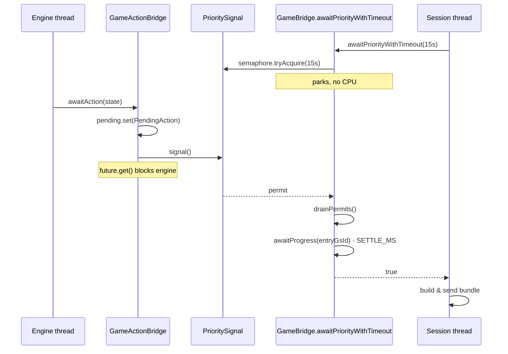

# Bridge Threading

How leyline bridges a blocking, single-threaded Java rules engine (Forge) to an async, message-driven protobuf transport — and the invariants that must hold for the two sides to stay coherent.

For the *shape* of the system (boxes, arrows, protocol frames), read [`architecture.md`](architecture.md) §4 first. This doc is the *contract*: which thread owns what, what must be true at which boundary, and the traps that have bitten us before.

---

## 1. Two threads, two owners

Every piece of bridge state is owned by exactly one of two threads. Confusing the owner is the source of roughly half our thread-safety bugs.

| Thread | Name | Runs | Blocks on |
|---|---|---|---|
| **Engine** | `game-loop-<gameId>` (daemon, from `GameLoopController.start`) | Forge's `mainGameLoop`, rules engine, trigger resolution, EventBus dispatch | `CompletableFuture.get()` inside `GameActionBridge.awaitAction` / `InteractivePromptBridge.requestChoice` / `MulliganBridge.awaitKeepDecision` |
| **Session** | Netty I/O thread (prod) or test main (tests) | `MatchSession` dispatch, `AutoPassEngine`, `CombatHandler`, `TargetingHandler`, `OptionalActionHandler`, `MulliganHandler`, message send | `GameBridge.awaitPriorityWithTimeout()` (semaphore) |

### State ownership rules

- **Engine thread owns:** the `Game` object graph (zones, stack, life totals, counters on cards, phase/priority), EventBus subscriber mutations (e.g. `GamePlayback`'s queue is *populated* here), and Forge-internal state.
- **Session thread owns:** protobuf message construction, wire sends, `MatchRegistry` lookups, client-facing state (deadlines, pause state).
- **Shared, atomic-safe:** `MessageCounter` (AtomicInteger), `DiffSnapshotter.diffBaselineState` (volatile), `PrioritySignal` (Semaphore), the `AtomicReference<PendingAction>` inside bridges, `GamePlayback.queue` (ConcurrentLinkedQueue).

Any read of shared state on one thread is a snapshot of a moving target. Don't make decisions that depend on "did this value change since last time I looked?" — it did, is doing, and will.

```mermaid
graph LR
    subgraph Engine["Engine thread · game-loop-{id}"]
        LOOP[mainGameLoop]
        CB[chooseSpellAbilityToPlay]
        IPB[requestChoice / awaitAction / awaitKeepDecision]
        EVT[EventBus · GamePlayback subscribers]
        LOOP --> CB --> IPB
        LOOP --> EVT
    end

    subgraph Shared["Shared · atomic/volatile"]
        CTR[MessageCounter<br/>AtomicInteger gsId · msgId]
        SIG[PrioritySignal<br/>Semaphore]
        SNAP[DiffSnapshotter<br/>@Volatile baseline]
        Q[GamePlayback.queue<br/>ConcurrentLinkedQueue]
    end

    subgraph Session["Session thread · Netty I/O"]
        MS[MatchSession dispatch]
        AP[AutoPassEngine]
        HND[CombatHandler · TargetingHandler · OptionalActionHandler]
        WAIT[GameBridge.awaitPriorityWithTimeout]
        SEND[sink.send → Netty write]
        MS --> AP --> WAIT --> HND --> SEND
    end

    IPB -.signal.-> SIG
    EVT -.enqueue.-> Q
    EVT -.nextGsId / nextMsgId.-> CTR
    SEND -.nextGsId / nextMsgId.-> CTR
    HND -.snapshotDiffBaseline.-> SNAP
    WAIT -.awaitSignal.-> SIG
    SEND -.drainQueue.-> Q
```

---

## 2. Signaling at priority — `PrioritySignal`

The session thread needs to know when the engine has reached a priority stop (or produced an interactive prompt, or ended). The naive solution is to poll. We don't poll — `PrioritySignal` is a semaphore:

- Bridges (`GameActionBridge`, `InteractivePromptBridge`, `GameLoopController.shutdown`) call `signal()` when they post a pending item or the game ends.
- `GameBridge.awaitPriorityWithTimeout` calls `awaitSignal(timeoutMs)` and drains extra permits on wake.
- Permits *accumulate*: if the bridge signals before the observer starts waiting, the wake-up is not lost.



**Why `drainPermits` after wake:** multiple bridges can signal between the wake and the next wait. Draining prevents a stale permit from short-circuiting the next call.

**Why `awaitProgress` after the wake:** the signal means "a pending item was posted," not "the engine has finished writing to shared state." `awaitPriorityWithTimeout` waits for `MessageCounter.currentGsId()` to advance past `entryGsId` and adds a small `SETTLE_MS` so the caller doesn't drain an empty sink.

**Legacy name:** `bridge.awaitPriority()` is the no-timeout convenience wrapper around `awaitPriorityWithTimeout(priorityWaitMs)`. "awaitPriority" is the verb to use in code comments and test helpers.

---

## 3. Diff baseline vs last-sent state

Two independent timelines exist, and confusing them has been the root cause of three separate bugs (see `leyline-o2q` and the ETB-modal family).

| Timeline | Owner | Advances on | Purpose |
|---|---|---|---|
| **Diff baseline** (`DiffSnapshotter.diffBaselineState`, volatile) | Whichever thread calls `snapshotDiffBaseline` last | Every `snapshotDiffBaseline(gsm)` — including engine-thread `GamePlayback` captures | Input to `StateMapper.buildDiffFromGame` so the next GSM carries only changed fields |
| **Last-sent state** | Session thread, by construction | Every `sink.send(messages)` | "Has the client seen X?" decisions |

### Rules

**R1. Don't snapshot what you haven't sent.**
Calling `snapshotDiffBaseline(buildFromGame(...))` before the built state is sent advances the baseline. The next diff will then *omit* objects the client has never received, and the client enters a state where the server believes it has told it about a card that was never on the wire.

Build → diff → send → *then* snapshot. The sequence in `castingTimeOptionsBundle` is the canonical example: build the synthesized GSM, include the injected ability game object, assemble the two GRE messages, and only then call `bridge.snapshotDiffBaseline(gs)`.

**R2. For client-awareness checks, use dedicated tracking fields.**
Do not reuse the diff baseline as "what the client knows." The baseline can be advanced by any engine-thread capture (`GamePlayback` pacing, EventBus handlers) that never left the server. If a decision depends on "did we send X to the client?", store that answer explicitly.

**R3. One baseline advance per sent message.**
Builders that emit a `GameStateMessage` must call `snapshotDiffBaseline` exactly once, after diffing and before returning the `BundleResult`. Never snapshot twice for the same message.

---

## 4. Counter monotonicity — `MessageCounter`

`gsId` and `msgId` are protocol-critical: the client rejects out-of-order or duplicated IDs and will force a resync. Both are shared atomics on a single `MessageCounter` instance passed into `MatchSession`, `GameBridge`, `GamePlayback`, and `BundleBuilder` at construction.

- `nextGsId()` / `nextMsgId()` use `AtomicInteger.incrementAndGet` — monotone by construction, one source of truth, no runtime reconciliation.
- `currentGsId()` / `currentMsgId()` are read-only snapshots, useful for establishing a "before" watermark (`awaitPriorityWithTimeout` uses this for `awaitProgress`). Treat the value as stale the moment you read it.
- `setGsId` / `setMsgId` are used *only* during handshake, before the counter is shared with the engine thread. Never call them after the game starts.

### Historical note

Earlier iterations stored counters in two places (`SessionOps` and `GamePlayback`) and reconciled on each bridge callback with `updateAndGet { maxOf(it, inbound) }`. The `max`-merge was a patch for a structural problem: two owners, one invariant. The current design eliminates the problem by having *one* owner (the atomic) that both threads increment directly. If you find yourself wanting to `setGsId` at runtime or reconcile two counters, you are reintroducing the old bug.

---

## 5. awaitPriority before sending prompts

Detecting a phase on the session thread means the engine *entered* that phase, not that it is *blocked and waiting*. The difference matters: engine state can still be mid-mutation (triggers firing, SBAs resolving, `GamePlayback` capturing) when phase transitions fire.

**Rule:** before any session-thread handler (`CombatHandler`, `TargetingHandler`, `AutoPassEngine`, `MulliganHandler`, `OptionalActionHandler`) builds an outbound GRE message in response to a phase, it must call `bridge.awaitPriority()` (or `awaitPriorityWithTimeout` with a tighter budget).

This guarantees:
1. The engine has actually blocked in a bridge callback (priority stop or interactive prompt).
2. `MessageCounter` has advanced past its pre-phase watermark.
3. `DiffSnapshotter.diffBaselineState` has settled — any engine-thread snapshot from the previous action is already in place.

Skipping `awaitPriority` before an outbound send is the classic cause of "the diff is missing a card that should be there": the session built a GSM from a half-mutated engine state.

---

## 6. Mode choice before stack add — trigger lifecycle

Forge's `PlaySpellAbility.playAbility` resolves charm/modal mode choice **before** adding the triggered ability to the stack:

```
CharmEffect.makeChoices(ability)        ← blocks in chooseModeForAbility
game.getStack().addAndUnfreeze(ability) ← runs only after mode choice returns
```

This means when the `WebPlayerController.chooseModeForAbility` override fires and the session sends `CastingTimeOptionsReq`, `game.getStack()` is empty — the trigger has not been added yet. `ZoneMapper.addStackAbilities` will not find it, and `buildDiffFromGame` will not include it.

Real Arena adds the trigger to the stack first, then prompts. We cannot change Forge's ordering, so `BundleBuilder.castingTimeOptionsBundle` **synthesizes** the ability game object into the outbound GSM when `sourceCardInstanceId` is set (triggered-ability path):

1. Build the base GSM via `StateMapper.buildDiffFromGame`.
2. Create a `GameObjectInfo` for the ability (instanceId / grpId / parentId from `CastingTimeOptionReq`, type `Ability`, zone `Stack`, visibility `Public`).
3. Add it to the `Stack` zone in the GSM (creating the zone entry if the diff omitted it).
4. Snapshot the *synthesized* GSM as the new diff baseline. When the ability eventually resolves, the next diff can emit `diffDeletedInstanceIds` for it.

Spell-time modals (kicker, spell modals where the card itself is already on the stack) skip the synthesis — `sourceCardInstanceId` is null.

### Generalization

This pattern applies to any Forge callback where the engine blocks for input *before* the mutation the client expects to see has happened. If you are writing a new prompt handler and see `game.getStack().isEmpty` or `battlefield.size == expected - 1` when you expect otherwise, check whether the engine is blocked in a bridge callback upstream of the mutation. The fix is almost always synthesis in the bundle, with a matching `snapshotDiffBaseline` so the subsequent diff stays coherent.

---

## 7. Engine-thread event replay — `GamePlayback`

AI (and, more generally, remote) actions do not go through the Netty client round-trip, so the client has no natural trigger to receive per-action state updates. `GamePlayback` fills the gap: it subscribes to Forge's Guava EventBus on the engine thread, captures a state diff at each interesting event (`GameEventSpellAbilityCast`, `GameEventSpellResolved`, `GameEventTurnPhase`, `GameEventAttackersDeclared`, etc.), and enqueues the resulting GRE messages for the session thread to drain.

**Engine-thread subscriber means engine-thread mutation.** The EventBus dispatches synchronously on the game thread. `GamePlayback`:

- Calls `counter.nextMsgId()` / `counter.nextGsId()` on the shared atomic — safe, because `MessageCounter` is shared-owner by design.
- Calls `snapshotDiffBaseline` — safe, because the field is volatile and the "no snapshot without a send" rule is enforced by enqueueing the corresponding messages in the same call.
- `Thread.sleep`s the engine thread deliberately, to pace remote turns for the human viewer. Freezing engine progress *is* the mechanism that makes it safe to snapshot: the state cannot change under you while you are asleep.

**Do not add I/O or lock acquisition to any engine-thread EventBus subscriber.** Doing so risks a deadlock against whatever is on the other end of the I/O or the lock. The only safe operations on this thread are: read engine state, increment the counter, snapshot the baseline, and enqueue protobuf bytes.

### Combat double-diff

Combat has two priority-visible moments per side (attackers declared, blockers declared) and the client needs a GSM diff at each. `GamePlayback.visit(GameEventAttackersDeclared)` captures unconditionally — not just for remote turns — because the human-seat `AutoPassEngine` otherwise auto-passes past the attackers-declared moment before producing a diff, and attackers never appear tapped on the client (`leyline-o2q`). The subsequent `awaitPriority`-plus-send in `CombatHandler` produces the second half of the double-diff.

---

## 8. Session-thread handlers

`MatchSession` is intentionally thin: it dispatches inbound frames to three (really four, counting mulligan) handler classes via the `SessionOps` seam. Each handler owns a slice of the session-thread state machine and is independently testable.

| Handler | Responsibility |
|---|---|
| `CombatHandler` | Declare-attackers / declare-blockers iteration; calls `bridge.awaitPriority()` before each outbound `DeclareAttackersReq` / `DeclareBlockersReq`. |
| `TargetingHandler` | Targeting, sacrifice, discard, and modal-choice drive loops; follows the `awaitPriority` + auto-pass pattern after each choice commits. |
| `OptionalActionHandler` | "You may" triggered-ability prompts; resolves against the interactive prompt bridge. |
| `MulliganHandler` | Keep / mull / London-tuck loop; uses `MulliganBridge` on the engine side. |

All four respect the `awaitPriority` rule from §5 and read `MessageCounter` through the shared atomic. None of them own long-lived state across frames — session state lives in `SessionContext` / `MatchSession`, and per-interaction state lives in the bridge's `PendingAction` / `PendingPrompt` atomics.

---

## 9. Traps

### `.ifEmpty { default }` on user input is a logic bomb

An empty list from an interactive prompt means *"the user chose nothing"* — a legal, semantic answer (e.g., decline a modal option, select zero targets for a "target up to N" spell). It does **not** mean "the user didn't provide a list."

Never `selection.ifEmpty { allLegalChoices }` on user-input lists. The fallback produces a different game state than the player's choice, and the divergence is silent.

### `ValidatingMessageSink` is the truth

`MatchFlowHarness` wraps its outbound `ListMessageSink` in a `ValidatingMessageSink` that runs `InvariantChecker` on every send: self-referential `gsId`, chain gaps, missing `instanceId`s, duplicate messages, etc. All integration and conformance tests should route through `MatchFlowHarness`.

When a test times out, **read `violations` before anything else.** The first entry is almost always the root cause; the timeout is a secondary symptom of a state machine that locked up after the invariant was broken.

### `ConformanceTestBase` needs manual seeding

Tests extending `ConformanceTestBase` construct `GameBridge` directly without going through `MatchSession`, which means any state that `MatchSession` normally initializes is absent unless the test seeds it. The base class seeds:

- `MessageCounter` at `(initialGsId = 20, initialMsgId = 0)` — a deterministic pre-game watermark.
- Deterministic shuffle seed (default `42L`).
- A single `bridge.snapshotFromGame(...)` call after `advanceToMain1` so the first diff has a baseline.

When adding a new form of client-tracking or session state, grep for `ConformanceTestBase.startGameAtMain1` and add the seeding there. Conformance tests that start behaving weirdly after an unrelated change are usually missing a seeding step.

---

## 10. Debugging order for test failures

When a bridge-threading test fails, run this list top-to-bottom before forming hypotheses:

1. **`ValidatingMessageSink.violations`** — first violation is the root cause.
2. **Thread** — which thread hit the failure? `Thread.currentThread().name` should be `game-loop-<id>` (engine) or a Netty / test name (session). An exception on the "wrong" thread is usually a missed `awaitPriority` or an engine-thread subscriber doing session-thread work.
3. **Phase / turn** — the game's `phaseHandler.phase` and `phaseHandler.turn` at failure time. Combat-phase bugs nearly always involve the double-diff rule from §7.
4. **Counter flow** — log `gsId` and `msgId` at each sync point. A frozen counter across an expected boundary means the engine never produced output.
5. **Snapshot timing** — did the builder `snapshotDiffBaseline` before or after the corresponding `sink.send`? Before is a bug (§3 R1).
6. **Pending interactions** — `bridge.hasPendingInteraction()` and the `PendingAction` / `PendingPrompt` snapshots. A "stuck" test is usually waiting for a prompt that was never posted, or posted on the wrong bridge.
7. **Re-run in isolation** — `just test-one <TestClass>` — confirm the failure is deterministic, not order-dependent. If it only fails in the suite, suspect `CardDb` singleton state or a shared static.

---

## References

- [`architecture.md`](architecture.md) §4 — Bridge threading overview diagram.
- `matchdoor/src/main/kotlin/leyline/bridge/` — `GameLoopController`, `GameActionBridge`, `InteractivePromptBridge`, `MulliganBridge`, `PrioritySignal`, `WebPlayerController`.
- `matchdoor/src/main/kotlin/leyline/game/` — `GameBridge`, `MessageCounter`, `DiffSnapshotter`, `StateMapper`, `BundleBuilder`, `GamePlayback`.
- `matchdoor/src/main/kotlin/leyline/match/` — `MatchSession`, `SessionOps`, `CombatHandler`, `TargetingHandler`, `OptionalActionHandler`, `MulliganHandler`, `AutoPassEngine`.
- `matchdoor/src/test/kotlin/leyline/conformance/` — `ConformanceTestBase`, `MatchFlowHarness`, `ValidatingMessageSink`, `InvariantChecker`.
