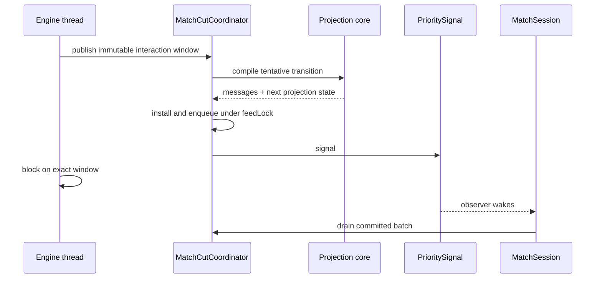

# Bridge Threading

This document owns cross-class constraints that the type system does not yet
express. It describes the current implementation, including transitional
session and delivery ownership. System shape lives in
[`architecture.md`](architecture.md); durable direction and rationale live in
[ADR 0015](decisions/0015-functional-core-imperative-shell.md).

## Execution domains

| Domain | Runs | Coordination |
|---|---|---|
| Engine thread | Forge loop, callbacks, event dispatch, safe-point cut commits | Sole owner of the live Forge graph |
| Interactive entrants | Native/web/in-process input, timers, auto-advance, tests | `ConnectionState.sessionLock` serializes `MatchSession` entry |
| Spectator pump | Drains its viewer feed and delivers committed output | Coordinator `feedLock` protects publication/drain |
| Sink caller | Assigns outbound bookkeeping and calls `MessageSink.send` | Runs on the initiating session or pump domain |

Engine confinement makes a live read physically stable only on the engine
thread. It does not make an event callback a safe projection boundary: callbacks
can run inside a larger mutation burst.

The coordinator owns committed feeds and the focused interaction runtimes under
that boundary. `ProjectionState` installs through a revision-checked transition;
pending windows use correlated values and bounded retained-handle tables. The
coordinator's game-over lifecycle cut also materializes any pending resolution
diff and the terminal sequence before one ordered feed installation; sessions
only drain that feed and deliver the raw room-state completion message.

`GameBridge.priorityPolicy` owns mutable client priority settings. Settings and
priority response metadata cross into it as immutable values; session code does
not classify, suppress, or independently store priority policy.

Action, combat declaration, and deferred cast-cost handlers parse protocol
messages into immutable values only. `MatchActionWindowRuntime` validates the
exact action and game-state correlation, resolves the retained executable or
combat handle, and atomically claims it. `MatchBlockingInteractionRuntime`
performs the equivalent client-instance lookup for damage assignments. Session
code does not rebuild these responses from the live Forge graph.

### Lock order

Frame producers that need all three monitors acquire them in this order:

```text
MessageCounter -> GameBridge.projectionBuildLock -> MatchCutCoordinator.feedLock
```

Drainers take only `feedLock`. Event subscribers requesting a future cut take
only `feedLock`. No drainer waits for the engine while holding `feedLock`.

Action-window visibility and prompt correlation are read without `feedLock`, off
volatile state the runtime writes while holding it. Threads polling for a
pending window must not block behind a publication in progress.

A queue type is not a transaction. The close/build/install/enqueue operation
must remain protected as one publication boundary.

### In-process completion

`MatchConnection.submitGREMessage` waits for deferred session work scheduled by
that input before returning. It submits a barrier to the session's single-thread
executor and repeats when completed work scheduled another task. The barrier is
never awaited while holding `sessionLock`.

This boundary means output caused by the submitted input is available to an
in-process caller. It does not mean a client acknowledged delivery, and it does
not include work started later by a timer or another entrant.

### Current exceptions

Mulligan still drives a pre-game engine interaction outside `sessionLock`.
Puzzle replacement can install fresh projection state from its own executor.
Residual output builders still share counters and sequencing with
coordinator-backed output. These are explicit migration seams, not patterns for
new entry points.

## Publication before signalling

When the engine blocks for a visible decision, the observer signal means the
complete interaction batch is already committed and drainable.



Every coordinator-backed interaction must preserve these rules:

1. Freeze projection values and exact executable handles on the engine thread.
2. Commit the complete state-and-request batch before signalling.
3. Correlate answers to the exact interaction and game-state identifiers.
4. Resolve original handles only within the owning runtime.
5. Retire response, timeout, supersession, and teardown through one winner.
6. Treat materialization, install, or delivery failure as terminal when Forge
   cannot safely continue past the unpublished boundary.

Some interactions accept an ordinary default on choice timeout. That is a
prompt policy, not permission to continue after failed publication.

A synchronous default path publishes no window and therefore emits no signal.
Priority `Skip` likewise closes no journal and allocates no protocol state.

## Projection commit and delivery

Projection and delivery have separate timelines:

| Timeline | Advances when | Meaning |
|---|---|---|
| Projection state and viewer cursor | A complete transition installs | Baseline for the next compile |
| Committed feed | The fixed batch is enqueued | Batch may be drained |
| Sink handoff | `MessageSink.send` is invoked successfully | Server delivery attempt, not client acknowledgement |

Never use a viewer cursor as client-awareness state. If behavior depends on
delivery, represent delivery explicitly.

One bridge owns one `ProjectionState` and one shared `MessageCounter` across its
builders. Failed publication may leave identifier gaps, but no producer rewinds
the sequence. Producers must still enter the same ordered publication/delivery
path; atomic allocation does not order independently delivered batches.

Interactive sends drain older committed playback before delivering a caller's
newer batch. A producer that bypasses that funnel can expose output out of order.

## Safe points and event subscribers

Forge EventBus subscribers execute synchronously on the engine thread, often in
the middle of the operation that raised the event. Ordinary subscribers append
immutable facts and request a cut. They must not:

- inspect Forge for projection after handing work to another thread;
- close the journal or compile a frame;
- allocate protocol identities;
- install, enqueue, deliver, sleep, or wait on external work.

`PhaseHandler` invokes the ordinary completion hook after a successful
`mainLoopStep` mutation burst. Narrow completion hooks own attacker declaration,
blocker declaration, and combat teardown cuts. A combat journal may yield
several ordered frames, but the pending cut compiles them as one private fold
and installs only the final combined transition.

A failed or stale install is not rebuilt from a newer live snapshot. It retains
the immutable cut and terminates the path because rebasing would change the
facts that were originally closed.

## Pre-mutation prompts

Forge can ask for input before performing a mutation that the client must
already present. Such prompts use explicit projection supplements: materialize the
intended state, commit it with the request, then reconcile it after Forge
resumes. The supplement is a value owned by the prompt runtime; it is not a
reason to mutate projection state outside compilation.

## Deletion condition

This document can disappear when all match entrants submit immutable signals to
one logical runtime owner, every gameplay and lifecycle producer commits through
one ordered path, and the session/projection/feed locks no longer form a
cross-class correctness contract. Until then, changes to any named lock,
publication boundary, or residual producer must update this document in the
same change.
