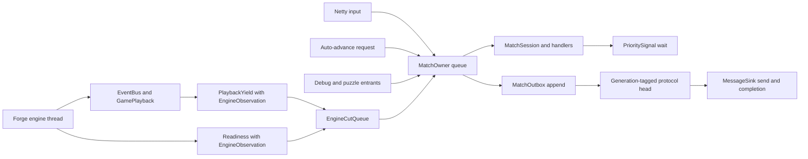
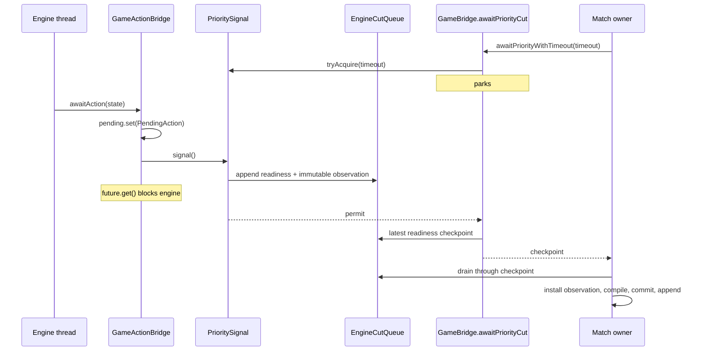

# Bridge Threading

The contract side of the current Forge bridge: which thread owns which state,
what must be true at each boundary, and the structural rules that keep the
engine and the wire coherent. These rules remain mandatory until a seam has
actually migrated. For the current system shape, read
[`architecture.md`](architecture.md); for the accepted runtime destination,
read [`architecture-direction.md`](architecture-direction.md).

---

## 1. Execution domains and critical sections

The current runtime has several physical threads. Correctness comes from engine
confinement, one serial match owner, the ordered engine-cut handoff, and atomic
publication—not from a literal two-thread model.

| Execution domain | Runs | Coordination |
|---|---|---|
| **Engine** — `game-loop-<gameId>` | Forge's `mainGameLoop`, trigger resolution, EventBus dispatch, `GamePlayback` value materialization | Owns the live Forge graph; blocks in controller futures |
| **Match owner** — fed by Netty I/O, web relay dispatcher, engine-cut notifications, test callers, auto-advance requests, and debug-server work | `MatchSession`, `SpectatorSession`, handlers, `AutoPassEngine`, protocol commit | One `MatchOwner` queue is the sole protocol compiler, session executor, and outbox ordering authority; interactive waits may use `PrioritySignal` |
| **Protocol head** | Flushes the committed subsequence for one audience generation and reports completion | Holds the transport; never chooses semantic order or adapts a later generation's entry |

**Engine-owned.** The `Game` object graph—zones, stack, life totals, counters,
phase and priority—plus Forge EventBus dispatch and engine-internal state.

**Interactive-match-owner-owned.** Command dispatch, auto-pass, handler state,
prompt correlation (`OwnerProtocolState`), puzzle replacement, and outbox
commit. Entrant threads submit work to one serial owner; handler implementations
remain private to `MatchSession`. Append advances the prompt horizon and
game-state cursor before a head flushes, and response validation reads them only
after entering the same owner.

**Terminal lifecycle.** Disconnect, failure, and stale-match teardown are
supervisor-side cancellation, not handler work. A connection teardown first
checks the current connection generation, closes the still-registered owner,
shuts down the engine bridge, and only then waits for the owner to terminate.
The owner remains discoverable but rejects work until termination, preventing
a replacement owner from overlapping the closing generation.

**Surviving shared projection and handoff state.** This inventory covers mutable
protocol/projection or interaction payloads read or written by more than one
execution domain in an interactive match, plus flags that schedule that work.
It was audited from the concurrent/volatile/atomic primitives and named handoff
slots under `bridge/`, `game/`, and `match/`. Executor and pump implementation
state, diagnostics/test hooks, and caches whose producers and consumers remain
inside the engine domain are outside this table.

| Primitive | Direction | Why it remains shared | Deletion horizon |
|---|---|---|---|
| `MessageCounter.gsId` / `msgId` atomics plus allocation monitor | Match owner → one protocol sequence | The owner forks and commits planned allocations atomically. Engine callbacks never allocate IDs. | Replace the allocation monitor when every standalone owner message is part of one outbox transaction. |
| `MessageCounter.lastGameStateGsId` atomic | Owner delivery → owner builders | Delivery publishes the latest outbound GSM used by later owner allocations. | One owner outbox owns both delivery order and predecessor selection. |
| `BundleCursor.lastSent` volatile | Match owner projection baseline | Playback compilation and commit run on the owner for interactive and spectator modes. | Make the cursor plain owner-confined state after the remaining builder entry points join the owner. |
| `BundleCursor.pendingPSuT` synchronized slot | Owner handler → next owner/engine builder | Accepted target facts must reach whichever domain commits the next frame. | The owner both records accepted targets and commits every next frame. |
| `InstanceIdRegistry` atomic allocator/maps, `DiffSnapshotter.previousZones`, and `TokenIdentityRegistry` | Engine materialization ↔ owner projection registry | Engine observations reserve identities; owner compilation resolves retired IDs and commits zone/token projection history. | Immutable engine observations carry planned identities and the owner alone commits all projection registries. |
| `GameBridge` spell/modal/stack/trigger/paradigm identity maps | Owner handlers + engine callbacks → owner builders | Accepted choices and engine events journal identity facts consumed during later frame construction. | Typed immutable observations carry the identity facts directly into owner-side frame construction. |
| `GameEventCollector` stamped event/zone queues and pending ability/event maps | Engine EventBus → owner builder | An engine cut reserves a monotonic, source-tagged prefix. Owner commit validates and consumes exactly that prefix; replacement or reset invalidates the reservation. | Move the remaining mapper-side identity work into immutable cut input. |
| `GameActionBridge` lifecycle monitor, future, and token table | Engine ↔ owner | The engine blocks with an exact action command while the owner publishes a catalog and submits or cancels a value token. | Engine continuations consume owner-mailbox commands without a cross-thread pending window. |
| `InteractivePromptBridge` active reference, command/reveal/order/target queues, futures, and monitors | Engine ↔ owner/builders | The engine blocks inside a prompt callback while the owner revalidates/submits values and builders consume prompt-side projection facts. | Prompt publication, revalidation, continuation, and projection all use the owner mailbox. |
| `MulliganBridge` synchronized state, sequence, and keep/tuck futures | Engine → owner → engine | The engine publishes and waits; the owner reads the pending phase and completes the matching future. | Mulligan becomes an owner-mailbox command with an explicit engine continuation. |
| `PlayerController.pendingDamageAssignment`, `pendingOptionalAction`, and `pendingNumericInput` volatile future slots | Engine → owner → engine | The engine publishes a prompt and blocks; owner handlers discover the slot and complete its future. | These prompts publish and resume through the owner mailbox or `InteractivePromptBridge`, with no `PlayerController` field polled across domains. |
| `PromptJournal` concurrent drain/volatile stash slots and `GameBridge.pendingLibraryArrangements` queue | Owner handlers + engine callbacks → owner/engine annotation builders | Prompt responses and callback side effects must survive until the frame or annotation builder consumes them. | Accepted-response effects travel as immutable owner commands or engine observations attached to one frame plan. |
| `PrioritySignal` semaphore | Engine bridges → waiting owner | Engine publication must wake an owner that may not have started waiting yet. The wake is followed by a typed readiness marker in the engine-cut FIFO. | Engine progress is appended as owner work instead of observed through a blocking wait. |
| `MatchSession.autoAdvanceRequested` / `running` / `closed`, `SpectatorSession.closed`, `GameBridge.autoAdvanceRequester`, `engineCutListener`, and `promptTimeoutNeedsAutoAdvance` | Engine playback + lifecycle entrants → owner queue | Interactive timeout work is coalesced; spectator cut notifications enqueue owner work; retirement or replacement suppresses stale requests. | Engine observations enqueue one generation-tagged owner command directly; owner retirement cancels it through queue lifecycle. |
| `ClientAutoPassState` volatile options/concurrent opponent-stop set and `PhaseStopProfile` concurrent map | Owner settings → engine priority loop | Client policy changes must be visible during engine priority decisions. | Engine decisions receive an immutable policy snapshot published by the owner instead of reading mutable connection state. |
| `GameBridge.activeGame` volatile | Engine and pre-play lifecycle → worker observation materializer | Runtime replacement and stop still publish the active generation to engine-side adapters. Match-play owner code does not read it. | The supervisor installs and retires a worker generation through one lifecycle command. |
| `EngineCutQueue` | Engine playback/readiness → match owner | One generation-tagged FIFO orders immutable playback values before the readiness marker that lets the owner resume. | Becomes the worker-to-owner mailbox when engine execution is isolated. |

Every match-play readiness marker carries one immutable `EngineObservation`.
The worker materializes its snapshot, per-seat policy facts, terminal outcome,
pending-event state, naive actions, and combat legality before waking the
owner. The owner installs that observation only while draining its exact FIFO
position. A later worker observation therefore cannot overtake preceding
playback or become a bridge-global "latest" value.

This boundary is intentionally narrower than complete projection purity.
`GsmSnapshot` materialization still allocates projection identities and reads
bridge caches. `StateMapper` still receives the bridge and retains inline
projection computation; that compute-input extraction remains a separate
pure-frame concern. Prompt candidate and executable ability graphs remain
behind their value/token submission seams and are tracked separately. Ordinary
initial handshake and mulligan materialization are the named pre-play lifecycle
horizon: the match-play observation stream begins at the first post-keep
readiness cut. None of these horizons restores protocol construction or
sequence allocation to an engine callback.

Priority-action catalogs contain value-only offers. Exact `PlayerAction`
commands remain in `GameActionBridge`'s per-window token table while the
priority window is live. One lifecycle monitor covers
pending-window publication, token registration, immutable
`(gameStateId, catalog)` replacement, submission, cancellation, timeout
cleanup, and engine consumption. Deferred-response journals commit inside
accepted submission, before the engine future becomes visible. Completion,
replacement, cancellation, and failure clear the bounded window.

`InteractivePromptBridge` publishes a value-only `PendingPrompt`. Its private
active state retains the callback ability and an engine command queue. A
session entrant may request target revalidation or submit a final answer as
values; the blocked engine callback services those commands and restores any
hypothetical target state before waiting again.



Engine callbacks do not build protocol frames. Interactive waits drain through
explicit readiness checkpoints; autonomous spectator progress schedules owner
drains from the same generation-tagged queue. Normal game-loop completion
publishes terminal readiness after preceding observations.

A read of shared state on one execution domain is a snapshot of a moving
system. Decisions whose correctness depends on a value remaining stable must
run under its owning critical section or use the documented publication
primitive.

---

## 2. Signaling at priority

The interactive match owner needs to know when the engine has reached a
priority stop, posted an interactive prompt, or ended the game. The mechanism
is a semaphore—`PrioritySignal`—not polling.

Semaphore over other primitives because permits accumulate: a signal that arrives before the observer starts waiting is not lost, so there is no race between posting a pending item and observing it.



The signal means "a readiness value was appended." It does not establish output
order by itself. The signal's engine-side observer materializes and appends the
typed readiness marker before releasing the semaphore. `awaitPriorityCut`
returns that marker's checkpoint; the owner drains every preceding playback
value through it before returning from the wait. Counter progress is not used
as an engine-completion signal.

---

## 3. Projection baseline vs delivery handoff

Three related timelines exist. The field name `BundleCursor.lastSent` is
historical; the value is the latest projection baseline committed during bundle
construction, not an acknowledgement from a protocol head.

| Timeline | Location | Advances on | Purpose |
|---|---|---|---|
| Projection baseline | `BundleCursor.lastSent: GsmSnapshot?` on `GameBridge.bundleCursor` | A `BundleBuilder` assigns the completed snapshot before returning or enqueueing its messages | Input to the next `StateMapper.buildDiff` call |
| Outbox order | `MatchOutbox` on `MatchOwner` | The owner appends a committed value for concrete head generations | One semantic order across every match-progress producer |
| Head handoff | `MatchProtocolHead` | The transport reports that the current entry was accepted | Advances that generation's prefix; this is not client acknowledgement |

The current state-diff order is:

```text
snapshot Forge state
  -> fork MessageCounter allocation state
  -> reserve the immutable event/reveal prefix
  -> compute and finalize the frame
  -> assemble path-specific messages through frame-local planned IDs
  -> produce immutable FramePlan
  -> commit:
       validate the counter position and reserved input
       invoke the pre-commit diff observer
       apply BridgeMutations
       advance BundleCursor.lastSent
       consume pending frame state
       consume exactly the reserved event/reveal prefix
       advance the shared MessageCounter
  -> append the batch to the owner outbox
  -> let the targeted protocol heads flush it
```

`BridgeMutations` commits in a fixed order—ID reallocations, limbo retirements,
zone bookkeeping, persistent-annotation batch, then `nextAnnotationId`. The
interactive owner compiles each `PlaybackYield`, commits its projection and
reserved prefixes atomically, then sends it before later interaction output.
The spectator path uses the same compile, commit, append, acknowledge, and
delivery order on the match owner. Session replacement retires the displaced
head before queued owner work can target its transport.

Projection commit and outbox append share one owner reduction. An exception
before append advances neither bridge mutations, cursor, shared counter, nor
reserved event/reveal input. Exact-prefix consumption preserves input appended
after compilation for the next frame. Once appended, delivery failure retains
the head's current entry and prevents later entries from becoming visible.
Replacing a head retires that generation and its pending subsequence; a stale
completion cannot acknowledge successor output.

### Outbound delivery paths

| Output | Authority |
|---|---|
| Engine playback, prompts, mulligan, initial Full state, puzzle state, settings, and terminal output | Match-owner outbox append; audience-generation head flush |
| Familiar view | Adapted for its concrete head before the shared outbox commit |
| Authentication response | Channel-local negotiation |
| Playing room-state response | Channel-local connection negotiation, before the initial Full state |

**R1. Never use the projection baseline as client-awareness state.** If a
decision depends on whether delivery occurred, track delivery explicitly.

**R2. One cursor, committed by the owner.** `GamePlayback` publishes a value
only. `MatchSession` or `SpectatorSession`, each running on the match owner, is
the compiler and committer for playback values and later session frames.

**R3. Preserve playback-before-session delivery.** Playback and readiness
share one `EngineCutQueue`. Interactive owner waits drain every playback value
before their readiness marker. Spectator notifications schedule drains through
the published checkpoint, and terminal readiness follows all earlier values.
No lower-ID repair path exists.

---

## 4. Shared allocation, owner-held prompt correlation

`gsId` is protocol-critical: the client-visible `GameStateMessage` stream must
use monotonically increasing, unique IDs with no self-referential predecessor.
`msgId` shares the same counter object for allocation ordering. Prompt response
bookkeeping does not: `OwnerProtocolState.lastPromptGsId` and
`lastPromptMsgId` are plain fields advanced by owner-ordered interactive
delivery. `ActionPerformer`, `CombatHandler`, and `ResponseEnvelopeGuard` read
that state within the same owner domain. Validator hard failures are
intentionally limited to the stable gsId facts plus AIC/AID affector
consistency. Both allocated IDs live on the `MessageCounter` owned by
`MatchSession` for an interactive match. Owner projection paths allocate
against a fork and advance the counter in frame commit; standalone owner
message builders still allocate directly. Every public frame build holds the
counter's allocation lock from fork through commit. Direct standalone
allocation uses that same lock, so legitimate interleaving cannot invalidate
an already compiled frame. Playback never allocates on the engine thread.

A partitioned design (a range of IDs per thread) cannot guarantee client-visible ordering without coordination on every send, which is the problem the shared atomic already solves. A predecessor design with two counters and a `max()`-merge at every bridge callback existed; the current shape removes the problem rather than patching it.

---

## 5. awaitPriority before sending

Detecting a phase from the interactive match owner means the engine *entered*
the phase, not that it is *blocked and waiting*. Engine state can still be
mid-mutation—triggers firing, SBAs resolving, or `GamePlayback` materializing a
frame—when phase transitions fire.

**Invariant.** Before an interactive-session handler builds an outbound GRE
message in response to a phase, it must wait through the owner-bound
`EngineCutAwaiter`.

The wait guarantees three things hold when it returns:

1. The engine has blocked in a bridge callback — a priority stop, an interactive prompt, or game over.
2. The owner has drained every playback value preceding the readiness marker.
3. `BundleCursor.lastSent` has settled because those values were compiled and committed by the owner.

A send that skips `awaitPriority` is a send built from a half-mutated engine state. The resulting GSM diff will be inconsistent with what the client should observe.

---

## 6. Mode choice before stack add

Forge's `PlaySpellAbility.playAbility` resolves charm / modal mode choice **before** the triggered ability is added to the stack:

```
CharmEffect.makeChoices(ability)        ← blocks in chooseModeForAbility
game.getStack().addAndUnfreeze(ability) ← runs only after mode choice returns
```

When `PlayerController.chooseModeForAbility` fires and the session sends
`CastingTimeOptionsReq`, `game.getStack()` is empty — the trigger has not been
added. The client expects to see the triggered ability on the stack before the
modal prompt. Forge's ordering cannot be changed, so
`BundleBuilder.castingTimeOptionsBundle` synthesizes the ability game object
into the outbound GSM. `modalStackCleanup` explicitly deletes the synthetic
object after the prompt completes.

Spell-time modals (kicker, spell modals where the card itself is already on the stack) skip the synthesis; `sourceCardInstanceId` is null on that path.

**Generalization.** Any Forge callback where the engine blocks for input
*before* the mutation the client expects to see has happened fits this pattern.
The `castingTimeOptionsBundle` approach—synthesize the missing object in the
outbound GSM and pair it with an explicit cleanup frame—is the template to
copy.

---

## 7. Engine-thread event subscribers

`GamePlayback` subscribes to Forge's Guava EventBus. EventBus dispatch is synchronous on the engine thread: the `@Subscribe` method runs on `game-loop-<id>`, mid-way through whatever engine operation fired the event. Three rules follow.

**Only bounded internal coordination.** Subscribers may read engine state,
reserve an input prefix, and publish an immutable `PlaybackYield`. They do not
build protocol messages, allocate protocol IDs, advance projection cursors, or
commit reservations. A subscriber must not synchronously enter the match
owner, perform I/O, or wait on an external resource.

**Pausing the engine thread makes observation coherent.** `GamePlayback`
deliberately `Thread.sleep`s at key events to pace remote turns for the human
viewer. The sleep freezes engine progress: engine state cannot mutate while the
subscriber is running, which is the window in which it materializes a coherent
snapshot. When several yields accumulate before the owner regains control,
`MatchSession` also spaces successive playback deliveries so those earlier
engine pauses do not collapse into one client burst.

**Combat declarations are materialized unconditionally.** Unlike other events,
which become playback frames only during remote turns,
`GameEventAttackersDeclared` does so on both seats. The engine runs through the
entire combat step in one burst—declare attackers, tap, blockers, damage, then
Main2—before the next priority stop. On the human's own turn, without an
in-combat frame, `AutoPassEngine` returns after combat is already over,
`combat` is null, and the client never sees attackers tapped. The in-combat
frame produces the first half of a combat double-diff; the subsequent
`awaitPriority`-plus-send in the session's combat handler produces the second.

---

## See also

[`architecture.md`](architecture.md) — system shape (modules, ports, wire frame, match lifecycle).

[`architecture-direction.md`](architecture-direction.md) — accepted destination for engine ownership, pure projection, and ordered delivery.
