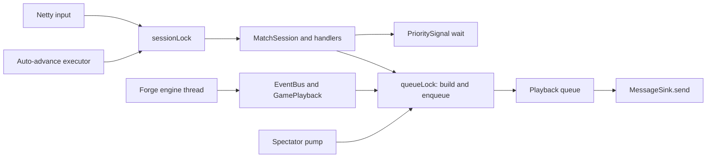
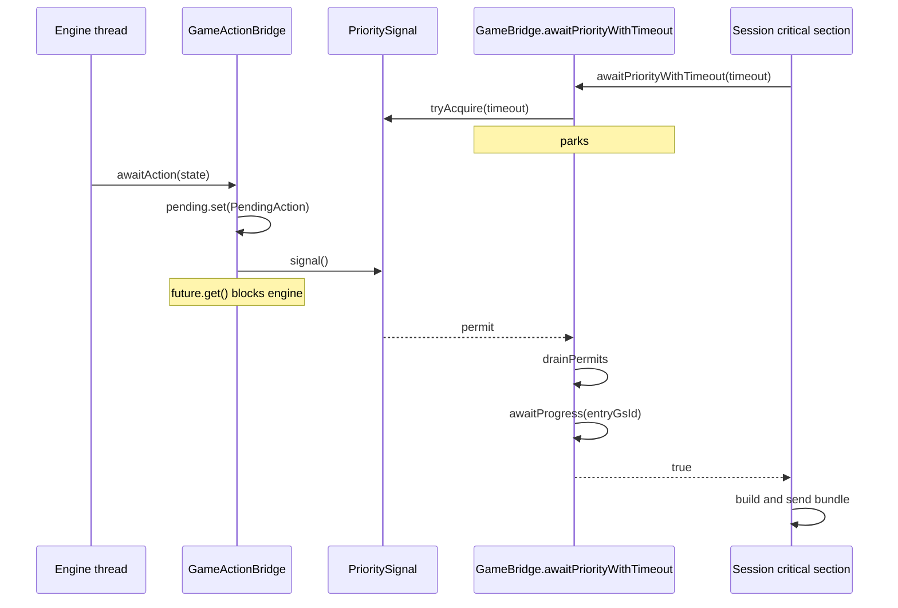

# Bridge Threading

The contract side of the current Forge bridge: which thread owns which state,
what must be true at each boundary, and the structural rules that keep the
engine and the wire coherent. These rules remain mandatory until a seam has
actually migrated. For the current system shape, read
[`architecture.md`](architecture.md); for the accepted runtime destination,
read [`architecture-direction.md`](architecture-direction.md).

---

## 1. Execution domains and critical sections

The current runtime has several physical threads. Correctness comes from a mix
of engine confinement, one interactive-session critical section, a separate
playback queue critical section, and atomic publication—not from a literal
two-thread model.

| Execution domain | Runs | Coordination |
|---|---|---|
| **Engine** — `game-loop-<gameId>` | Forge's `mainGameLoop`, trigger resolution, EventBus dispatch, `GamePlayback` frame construction | Owns the live Forge graph; blocks in controller futures |
| **Interactive session entrants** — Netty I/O, web relay dispatcher, test caller, `match-autoadvance-*` executor, debug-server pool | `MatchSession`, handlers, `AutoPassEngine`, ordinary sends | `MatchSession` game-logic entry points enter `ConnectionState.sessionLock`; may wait on `PrioritySignal` |
| **Spectator pump** — `spectator-pump-*` executor | Drains spectator playback every 50 ms and sends terminal output | Separate non-interactive mode; coordinates with engine playback through `queueLock` |
| **Sink caller** | Marks outbound IDs and invokes `MessageSink.send` | Runs on whichever session or pump domain initiated delivery |

**Engine-owned.** The `Game` object graph—zones, stack, life totals, counters,
phase and priority—plus Forge EventBus dispatch and engine-internal state.

**Interactive-session critical-section-owned.** Command dispatch, auto-pass,
handler state, puzzle replacement, and ordinary interactive delivery. Netty and
the auto-advance executor are different threads, but `sessionLock` makes them
one logical writer.

**Known exceptions to the critical section.** The mulligan flow
(`MatchConnection` dispatching `MulliganHandler`) drives the engine on the
transport thread without entering `sessionLock`, relying on pre-game phase
exclusivity. The debug server's puzzle hot-swap writes `BundleCursor.lastSent`
from its own executor outside the lock. Both are debt for the serial-owner
migration, not license for new lock-free entry points.

**Shared projection and handoff state.** `MessageCounter` uses atomics;
`BundleCursor.lastSent` is volatile; pending actions and prompts use atomic
references; `PrioritySignal` is a semaphore. `GamePlayback.queue` is concurrent,
but `queueLock` deliberately covers the whole close-events/build/advance-cursor/
enqueue window and every drain. The queue type alone is not the transaction.



`sessionLock` can disappear only when Netty input, auto-advance, timeouts, and
other entrants merely submit immutable signals or complete a pending reply;
the Forge runtime thread must be the only logical match owner. `queueLock` and
the playback queue can disappear only when engine callbacks stop building
protocol frames and every producer commits through that runtime thread's one
ordered output path.

A read of shared state on one execution domain is a snapshot of a moving
system. Decisions whose correctness depends on a value remaining stable must
run under its owning critical section or use the documented publication
primitive.

---

## 2. Signaling at priority

An interactive-session entrant needs to know when the engine has reached a
priority stop, posted an interactive prompt, or ended the game. The mechanism
is a semaphore—`PrioritySignal`—not polling.

Semaphore over other primitives because permits accumulate: a signal that arrives before the observer starts waiting is not lost, so there is no race between posting a pending item and observing it.



The signal means "a pending item was posted." It does not mean "the engine has finished writing to shared state." `awaitPriorityWithTimeout` therefore records `MessageCounter.currentGsId()` on entry and, after the wake, waits for the counter to advance past that watermark before returning. Without this second wait, a caller can drain an empty sink.

---

## 3. Projection baseline vs sink handoff

Two independent timelines exist. The field name `BundleCursor.lastSent` is
historical; the value is the latest projection baseline committed during bundle
construction, not an acknowledgement from the sink.

| Timeline | Location | Advances on | Purpose |
|---|---|---|---|
| Projection baseline | `BundleCursor.lastSent: GsmSnapshot?` on `GameBridge.bundleCursor` | A `BundleBuilder` assigns the completed snapshot before returning or enqueueing its messages | Input to the next `StateMapper.buildDiff` call |
| Sink handoff | Implicit in the sink | `sink.send(messages)` is invoked successfully | Server-side delivery attempt; this is not client acknowledgement |

The current state-diff order is:

```text
snapshot Forge state
  -> compute and finalize the frame
  -> invoke the pre-commit diff observer
  -> commit projection:
       apply BridgeMutations
       advance BundleCursor.lastSent
       consume pending frame state
  -> assemble path-specific messages
  -> return or enqueue the batch
  -> later call sink.send
```

`BridgeMutations` commits in a fixed order—ID reallocations, limbo retirements,
zone bookkeeping, persistent-annotation batch, then `nextAnnotationId`. The
interactive path binds offers and sends after `BundleBuilder` returns. The
playback path performs build, projection commit, message assembly, and enqueue
under `queueLock`; a session or spectator domain drains and sends later.

This is not an atomic projection-plus-delivery transaction. An exception after
frame finalization but before projection commit advances neither bridge
mutations nor the cursor. Mutation application and cursor advancement share one
commit function, so later failures cannot split those two baselines. An
exception during path-specific assembly or a sink failure can still leave the
committed projection ahead of returned or delivered output. The current runtime
has no rollback or retry-from-old-baseline contract; the target architecture's
single runtime commit and immutable delivery batch are intended to close this
remaining gap.

**R1. Never use the projection baseline as client-awareness state.** If a
decision depends on whether delivery occurred, track delivery explicitly.

**R2. One cursor per bridge, shared across builders.** `MatchSession` and
`GamePlayback` each construct a `BundleBuilder`, but both receive
`bridge.bundleCursor`. Separate cursors would produce diffs against different
histories. `BundleCursor.lastSent` is volatile for publication, while
`sessionLock`, `queueLock`, priority waits, and queue ordering provide the
larger sequencing contract.

**R3. Preserve playback-before-session delivery.** `sendBundledGRE` drains
queued playback batches with lower message or game-state IDs before sending the
caller's batch. Do not bypass that funnel while engine callbacks can still
construct and enqueue frames.

---

## 4. One shared counter, not two

`gsId` is protocol-critical: the client-visible `GameStateMessage` stream must use monotonically increasing, unique IDs with no self-referential predecessor. `msgId` is still allocated from the same counter object for local ordering and response bookkeeping, but validator hard failures are intentionally limited to the stable gsId facts plus AIC/AID affector consistency. Both IDs live on a single `MessageCounter` instance — shared by `MatchSession`, `GameBridge`, `GamePlayback`, and `BundleBuilder` at construction time. Interactive-session entrants, the spectator pump, and the engine thread call `nextGsId()` / `nextMsgId()` on the same atomic-backed counter.

A partitioned design (a range of IDs per thread) cannot guarantee client-visible ordering without coordination on every send, which is the problem the shared atomic already solves. A predecessor design with two counters and a `max()`-merge at every bridge callback existed; the current shape removes the problem rather than patching it.

---

## 5. awaitPriority before sending

Detecting a phase from an interactive-session entrant means the engine *entered*
the phase, not that it is *blocked and waiting*. Engine state can still be
mid-mutation—triggers firing, SBAs resolving, or `GamePlayback` materializing a
frame—when phase transitions fire.

**Invariant.** Before an interactive-session handler builds an outbound GRE
message in response to a phase, it must call `bridge.awaitPriority()` (or
`awaitPriorityWithTimeout` with a tighter budget).

The wait guarantees three things hold when it returns:

1. The engine has blocked in a bridge callback — a priority stop, an interactive prompt, or game over.
2. `MessageCounter` has advanced past its pre-wait watermark.
3. `BundleCursor.lastSent` has settled: any engine-thread bundle from the preceding action has already advanced the cursor.

A send that skips `awaitPriority` is a send built from a half-mutated engine state. The resulting GSM diff will be inconsistent with what the client should observe.

---

## 6. Mode choice before stack add

Forge's `PlaySpellAbility.playAbility` resolves charm / modal mode choice **before** the triggered ability is added to the stack:

```
CharmEffect.makeChoices(ability)        ← blocks in chooseModeForAbility
game.getStack().addAndUnfreeze(ability) ← runs only after mode choice returns
```

When `PlayerController.chooseModeForAbility` fires and the session sends `CastingTimeOptionsReq`, `game.getStack()` is empty — the trigger has not been added. The client expects to see the triggered ability on the stack before the modal prompt. Forge's ordering cannot be changed, so `BundleBuilder.castingTimeOptionsBundle` synthesizes the ability game object into the outbound GSM: build the base GSM, inject a `GameObjectInfo` for the ability into the `Stack` zone, then write `cursor.lastSent` to the synthesized snapshot so the next diff sees the ability as already-sent. The cursor advance is load-bearing — without it, when the ability eventually resolves, the next diff has no record of the object to delete.

Spell-time modals (kicker, spell modals where the card itself is already on the stack) skip the synthesis; `sourceCardInstanceId` is null on that path.

**Generalization.** Any Forge callback where the engine blocks for input *before* the mutation the client expects to see has happened fits this pattern. When a prompt handler observes `game.getStack().isEmpty` or `battlefield.size == expected - 1` where a different state is expected, the cause is an engine blocked in a bridge callback upstream of the mutation. The `castingTimeOptionsBundle` approach — synthesize the missing object in the outbound GSM, then advance `cursor.lastSent` to the synthesized snapshot — is the template to copy.

---

## 7. Engine-thread event subscribers

`GamePlayback` subscribes to Forge's Guava EventBus. EventBus dispatch is synchronous on the engine thread: the `@Subscribe` method runs on `game-loop-<id>`, mid-way through whatever engine operation fired the event. Three rules follow.

**Only bounded internal coordination.** A subscriber may read engine state,
increment `MessageCounter`, advance `BundleCursor.lastSent`, and enqueue a batch.
`GamePlayback` deliberately acquires `queueLock` around close-events, frame
construction, cursor advance, and enqueue so a drain cannot observe half a
transaction. A subscriber must not acquire `sessionLock`, perform I/O, or wait
on an external resource. Keep `queueLock` hold time bounded and never create a
reverse path where its drainer waits for the engine while holding the lock.

**Pausing the engine thread makes the current projection physically stable.**
`GamePlayback` deliberately `Thread.sleep`s at key events to pace remote turns
for the human viewer. Engine state cannot mutate concurrently while the
subscriber runs, so the current synchronous projection can inspect it safely.
The callback may still be inside a larger logical mutation burst. It is not a
general worker/owner yield point: a future value boundary must journal facts in
the subscriber and materialize them at an explicit safe point after the
relevant operation completes.

**Combat declarations are materialized unconditionally.** Unlike other events,
which become playback frames only during remote turns,
`GameEventAttackersDeclared` does so on both seats. The engine runs through the
entire combat step in one burst—declare attackers, tap, blockers, damage, then
Main2—before the next priority stop. On the human's own turn, without an
in-combat frame, `AutoPassEngine` returns after combat is already over,
`combat` is null, and the client never sees attackers tapped. The in-combat
frame produces the first half of a combat double-diff; the subsequent
`awaitPriority`-plus-send in the session's combat handler produces the second.

---

## See also

[`architecture.md`](architecture.md) — system shape (modules, ports, wire frame, match lifecycle).

[`architecture-direction.md`](architecture-direction.md) — accepted destination for runtime ownership, safe-point inputs, pure projection, and ordered delivery.
