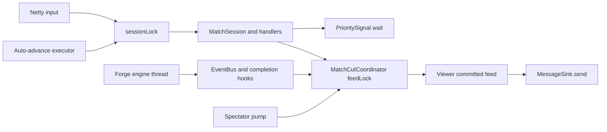
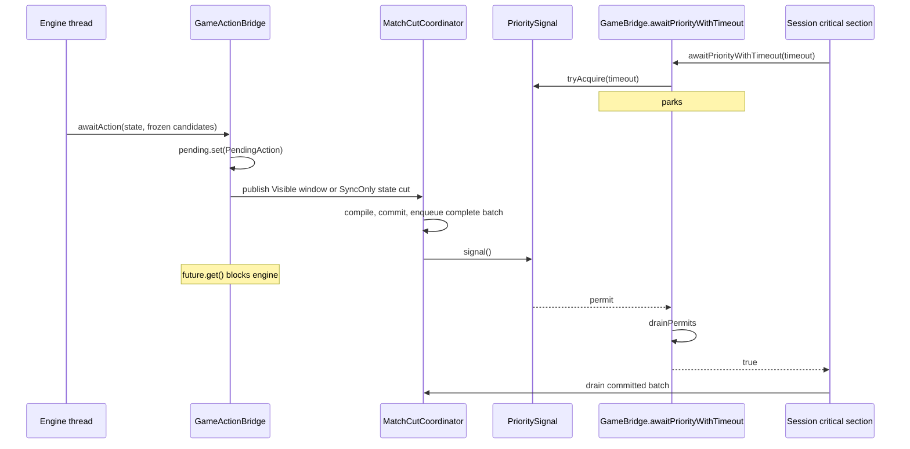

# Bridge Threading

The contract side of the current Forge bridge: which thread owns which state,
what must be true at each boundary, and the structural rules that keep the
engine and the wire coherent. These rules remain mandatory until a seam has
actually migrated. For the current system shape, read
[`architecture.md`](architecture.md); for the accepted runtime destination,
read [`architecture-direction.md`](architecture-direction.md).

---

## 1. Execution domains and critical sections

The current runtime has several physical threads. Correctness comes from a mix
of engine confinement, one interactive-session critical section, a separate
playback queue critical section, and atomic publication—not from a literal
two-thread model.

| Execution domain | Runs | Coordination |
|---|---|---|
| **Engine** — `game-loop-<gameId>` | Forge's `mainGameLoop`, trigger resolution, EventBus dispatch, coordinator cut commits | Owns the live Forge graph; blocks in controller futures |
| **Interactive session entrants** — Netty I/O, web relay dispatcher, test caller, `match-autoadvance-*` executor, debug-server pool | `MatchSession`, handlers, `AutoPassEngine`, ordinary sends | `MatchSession` game-logic entry points enter `ConnectionState.sessionLock`; may wait on `PrioritySignal` |
| **Spectator pump** — `spectator-pump-*` executor | Drains its committed coordinator feed every 50 ms and sends terminal output | Separate non-interactive mode; coordinates with engine publication through `feedLock` |
| **Sink caller** | Marks outbound IDs and invokes `MessageSink.send` | Runs on whichever session or pump domain initiated delivery |

**Engine-owned.** The `Game` object graph—zones, stack, life totals, counters,
phase and priority—plus Forge EventBus dispatch and engine-internal state.

**Interactive-session critical-section-owned.** Command dispatch, auto-pass,
handler state, puzzle replacement, and ordinary interactive delivery. Netty and
the auto-advance executor are different threads, but `sessionLock` makes them
one logical writer.

**Known exceptions to the critical section.** The mulligan flow
(`MatchConnection` dispatching `MulliganHandler`) drives the engine on the
transport thread without entering `sessionLock`, relying on pre-game phase
exclusivity. Puzzle replacement installs a fresh `ProjectionState` from its own
executor outside the lock. Both are debt for the serial-owner migration, not
license for new lock-free entry points.

**Shared projection and handoff state.** `MessageCounter` uses atomics;
`ProjectionState` installs through a revision-checked transition; pending
actions and prompts use atomic references; `PrioritySignal` is a semaphore. The
match-scoped `MatchCutCoordinator` owns viewer-keyed committed feeds, and
`feedLock` covers the whole close-events/build/advance-cursor/enqueue window and
every drain. The queue type alone is not the transaction.
Frame producers that need all three monitors use one order:
`MessageCounter` → `projectionBuildLock` → `feedLock`. Drainers take only
`feedLock`; event subscribers that request a future cut also take only
`feedLock`.



`sessionLock` can disappear only when Netty input, auto-advance, timeouts, and
other entrants merely submit immutable signals or complete a pending reply;
the Forge runtime thread must be the only logical match owner. The shared feed
lock can disappear only after all residual producers commit through that
runtime thread's one ordered output path.

A read of shared state on one execution domain is a snapshot of a moving
system. Decisions whose correctness depends on a value remaining stable must
run under its owning critical section or use the documented publication
primitive.

---

## 2. Signaling at priority

An interactive-session entrant needs to know when the engine has reached a
priority stop, posted an interactive prompt, or ended the game. The mechanism
is a semaphore—`PrioritySignal`—not polling.

Semaphore over other primitives because permits accumulate: a signal that arrives before the observer starts waiting is not lost, so there is no race between posting a pending item and observing it.



For migrated interactions the signal means that the coordinator has committed and enqueued the complete batch while holding its feed lock. Releasing that lock makes the batch drainable; the subsequent signal wakes the session. A Visible priority window includes the immutable action catalog. A SyncOnly stop includes a state-only cut with no action request or client timer and freezes one engine continuation: reevaluate, require Visible, or allow SyncOnly. One drain snapshots the exact SyncOnly action id, delivers committed batches, completes only that stop, awaits once, and delivers the resulting horizon without releasing it. Completion itself cannot arm the continuation; only the engine thread does so after the exact wait returns successfully. Manual flow requires a Visible next stop. Explicit auto-resolve may allow another pass-only SyncOnly stop, while meaningful actions still select Visible. A stale id is not retried. Auto-pass repeats this operation through its explicit outer policy loop; an action response stops after one completed synchronization horizon. Delivery failure or SyncOnly timeout is terminal and cannot resume Forge or alter the next priority decision past an undelivered barrier. A safe priority Skip emits no signal because it closes no journal, allocates no IDs, and blocks on no future. A session submits immutable answers and never infers readiness from a guessed game-state id or settle delay.

An explicitly bound `TargetSelection` callback publishes its initial state and request before signalling, then blocks on the coordinator mailbox. Route identity alone selects this owner; a nullable live ability is retained only for legality and final resolution. Each correlated tap is consumed on the Forge thread, where legality is recomputed against the retained exact ability; the replacement request is committed before the session delivery acknowledgement releases the mailbox. Finish and cancel release only their exact window. A Targeting choice deadline differs from a delivery barrier: timeout atomically retires the unpublished answer state, clears retained handles, returns the configured default, and rejects late commands without failing the match. Materialization, projection install, delivery, and teardown failures remain exceptional and wake the blocked callback.

An explicitly bound Search callback freezes library, candidate, source, and picker-shape values on the engine thread. The coordinator compiles the reveal state and `SearchReq` as one batch under `MessageCounter` → `projectionBuildLock` → `feedLock`, installs it, acknowledges its journal frame, and only then signals. A correlated instance-id response is mapped through the frozen option table and resets the reveal baseline under `projectionBuildLock` → `feedLock` before completing the engine future. Timeout uses the same retirement lock and returns the configured default through the prompt bridge; a concurrent accepted response wins without rollback.

Top- and bottom-library ordering callbacks freeze the route, source, candidates, exact card handles, and any pending hand-to-library move on the engine thread. The coordinator compiles the move state and `OrderReq` in one cut, commits it before signalling, and resolves a correlated full instance-id permutation through the retained option table. Timeout retires the window and returns the original default-first order; late, duplicate, incomplete, and stale responses cannot mutate it.

Discard, resolution sacrifice, Suspect, and Mutate top/bottom callbacks freeze their route kind, source, cardinality, default, candidates, and exact card handles on the engine thread. The coordinator commits one state-and-`SelectNReq` cut before signalling. Correlated `SelectNResp` and compatible `EffectCostResp` values resolve through the retained instance-id table; choice-result facts are staged before the exact engine wait is released. Timeout retires the window and returns the configured default handle, while stale or invalid responses have no side effects.

Color, subtype, and parity callbacks freeze their route kind, source, cardinality, default, and exact protocol enum values on the engine thread. The coordinator commits one state-and-static-`SelectNReq` cut before signalling. A correlated `SelectNResp` maps through the frozen value table to the original option index; its ChoiceResult fact is staged before the exact engine wait is released. Timeout retires the window and returns the configured default index, while stale or invalid responses have no side effects.

Convoke, Improvise, and Waterbend callbacks freeze their candidate, shard, source, and mana-cost values on the engine thread. The coordinator commits the initial state and `PayCostsReq` before signalling. Each correlated MakePayment command updates the immutable selection plan and commits its replacement request before delivery acknowledgement releases the engine mailbox. Pass and Cancel return exact original option indices; timeout atomically retires the window and returns the configured default. Convoke and Improvise payment facts are staged by the replacement cut, corrected to the final engine payment before progression, and retained until stack-exit consumption.

Sacrifice, exile-from-grave, return-unblocked-attacker, Collect Evidence, Station, Enlist, and Teamwork callbacks freeze source, cardinality, weight, and exact option handles on the engine thread. The coordinator commits one state-and-`PayCostsReq` batch before signalling. A correlated immutable instance-id response resolves through the retained option table and returns the exact original handles. Timeout retires the window and returns the configured default; materialization, install, delivery, and teardown failures are terminal.

Candidate-backed `Generic` prompts bind `UnclassifiedCandidate` and remain on the residual bridge/session path. Grouping, modal, dynamic residual SelectN, automatic routes, and mulligan retain their named handoff contracts until they migrate.

---

## 3. Projection baseline vs sink handoff

Two independent timelines exist. The viewer cursor in `ProjectionState` is the
latest projection baseline committed during bundle construction, not an
acknowledgement from the sink.

| Timeline | Location | Advances on | Purpose |
|---|---|---|---|
| Projection baseline | `ProjectionState.viewerCursors` | The coordinator installs the completed transition while publishing a migrated batch under `feedLock`; residual shell paths install before returning messages | Input to the next `StateProjectionCompiler.compileOneViewer` call |
| Sink handoff | Implicit in the sink | `sink.send(messages)` is invoked successfully | Server-side delivery attempt; this is not client acknowledgement |

The interactive state-diff order is:

```text
snapshot Forge state and materialize typed viewer intent
  -> compile the finalized state frame
  -> invoke the pre-commit diff observer
  -> commit projection:
       install complete ProjectionState
       advance the viewer baseline
       acknowledge exact pending shell entries
  -> assemble path-specific messages
  -> return the batch
  -> later call sink.send
```

The transition already contains the resulting identity, zone, annotation, and
cursor values; the shell does not replay per-family mutation batches. The
interactive path binds offers and sends after `BundleBuilder` returns. Ordinary
playback first retains an immutable `PendingCut` with its closed frame input,
prior projection, viewer intent, action values, and logical ids. It compiles
that exact cut, enqueues the fixed batch, and installs its transition under
`feedLock`; a session or spectator domain cannot drain the batch until the
install attempt completes. A stale install cannot succeed against the cut's
exact prior revision and therefore becomes terminal without rebasing or
recapturing.

Projection history and cursor advancement share one commit function. Ordinary
playback assembly and enqueue failures therefore install nothing. A successful
install followed by acknowledgement failure retains the already-enqueued output;
the terminal state prevents replay. Stale, commit, and enqueue failures retain
the exact cut or materialization diagnostic. Sink delivery remains outside that transaction: a
later transport failure can still leave the committed projection ahead of
delivered output.

**R1. Never use the projection baseline as client-awareness state.** If a
decision depends on whether delivery occurred, track delivery explicitly.

**R2. One cursor per bridge, shared across builders.** Per-viewer builders use
the viewer cursor inside the bridge's `ProjectionState`. Separate cursors would
produce diffs against different histories. Transition installation publishes
the viewer cursor, while `sessionLock`, `feedLock`, priority waits, and feed
ordering provide the larger sequencing contract.

**R3. Preserve playback-before-session delivery.** `sendBundledGRE` drains
queued playback batches with lower message or game-state IDs before sending the
caller's batch. Do not bypass that funnel while engine callbacks can still
construct and enqueue frames.

---

## 4. One shared counter, not two

`gsId` is protocol-critical: the client-visible `GameStateMessage` stream must use monotonically increasing, unique IDs with no self-referential predecessor. `msgId` is still allocated from the same counter object for local ordering and response bookkeeping, but validator hard failures are intentionally limited to the stable gsId facts plus AIC/AID affector consistency. Both IDs live on one `MessageCounter` owned by `GameBridge`. The match coordinator and its `BundleBuilder`s allocate migrated batches from it; named lifecycle, routed-prompt, and spectator builders share the same atomic-backed counter until those residual paths migrate. Failed publication may leave gaps, but no producer rewinds the global sequence.

A partitioned design (a range of IDs per thread) cannot guarantee client-visible ordering without coordination on every send, which is the problem the shared atomic already solves. A predecessor design with two counters and a `max()`-merge at every bridge callback existed; the current shape removes the problem rather than patching it.

---

## 5. awaitPriority before sending

Detecting a phase from an interactive-session entrant means the engine *entered*
the phase, not that it is *blocked and waiting*. Engine state can still be
mid-mutation—triggers firing, SBAs resolving, or the match coordinator materializing a
frame—when phase transitions fire.

**Invariant.** Before an interactive-session handler builds an outbound GRE
message in response to a phase, it must call `bridge.awaitPriority()` (or
`awaitPriorityWithTimeout` with a tighter budget).

For coordinator-backed Visible priority, SyncOnly, Targeting, Search, Top/Bottom Order, card-backed SelectN, static-enum SelectN, PayCosts, and blocking interactions, the wait guarantees:

1. The engine has blocked in a bridge callback — a priority stop, an interactive prompt, or game over.
2. The interaction batch is committed and drainable under the coordinator feed lock. SyncOnly batches are state-only; delivery precedes exact-id completion, and a resulting horizon remains owned by the next caller invocation.
3. The projection baseline for that batch has settled.

Grouping, modal, dynamic residual SelectN, generic ordering, automatic, and unclassified-candidate routes plus mulligan retain their named handoff contracts until they migrate.

Direct priority Skip does not enter this wait contract: it is allocation-free and returns an engine pass without publication.

A send that skips `awaitPriority` is a send built from a half-mutated engine state. The resulting GSM diff will be inconsistent with what the client should observe.

---

## 6. Mode choice before stack add

Forge's `PlaySpellAbility.playAbility` resolves charm / modal mode choice **before** the triggered ability is added to the stack:

```
CharmEffect.makeChoices(ability)        ← blocks in chooseModeForAbility
game.getStack().addAndUnfreeze(ability) ← runs only after mode choice returns
```

When `PlayerController.chooseModeForAbility` fires and the session sends `CastingTimeOptionsReq`, `game.getStack()` is empty — the trigger has not been added. The client expects to see the triggered ability on the stack before the modal prompt. Forge's ordering cannot be changed, so `BundleBuilder.castingTimeOptionsBundle` synthesizes the ability game object into the outbound GSM: build the base GSM, inject a `GameObjectInfo` for the ability into the `Stack` zone, then install the synthesized snapshot as the viewer baseline so the next diff sees the ability as already-sent. The cursor advance is load-bearing — without it, when the ability eventually resolves, the next diff has no record of the object to delete.

Spell-time modals (kicker, spell modals where the card itself is already on the stack) skip the synthesis; `sourceCardInstanceId` is null on that path.

**Generalization.** Any Forge callback where the engine blocks for input *before* the mutation the client expects to see has happened fits this pattern. When a prompt handler observes `game.getStack().isEmpty` or `battlefield.size == expected - 1` where a different state is expected, the cause is an engine blocked in a bridge callback upstream of the mutation. The `castingTimeOptionsBundle` approach — synthesize the missing object in the outbound GSM, then advance the viewer baseline in the same transition — is the template to copy.

---

## 7. Engine-thread event subscribers

`GamePlayback` subscribes to Forge's Guava EventBus. EventBus dispatch is
synchronous on the engine thread: the `@Subscribe` method runs mid-way through
the operation that fired the event. Ordinary subscribers therefore request a
cut only. `PhaseHandler` invokes the playback hook once after a successful
`mainLoopStep` mutation burst, including normal early returns.

**Playback subscribers journal intent only.** They must not close the event
journal, inspect Forge for projection, allocate message or object ids, compile,
install, enqueue, sleep, perform I/O, or wait on an external resource. The
coordinator owns those operations under the frame-production lock order; its
drainer never waits for the engine while holding `feedLock`.

**The completion hook is the ordinary projection safe point.** It runs after the
step's mutation burst and before Forge starts another step. It materializes the
closed frame once, then pacing sleeps only after successful install and enqueue.
The unit is one completed Forge step rather than one EventBus event or chosen
action: eligible events within that step keep their causal order in one frame,
with no intermediate bundle.
Hook exceptions propagate through `GameLoopController`, which stops the loop,
wakes bridge waiters, and exposes the terminal cause.

**Combat cuts use narrow completion hooks.** Attacker, blocker, and combat-end
events request typed cuts. Forge invokes the matching hook only after the whole
declaration or teardown has finished, including declaration triggers, combat
view updates, event dispatch, and stack unfreezing where applicable. Attacker
declarations request a frame on both seats so local auto-pass cannot skip the
in-combat state. A pending ordinary request for the same open journal is
subsumed by that combat boundary.

One closed combat journal can legitimately produce first-strike, regular-damage,
and end-combat frames. The pending cut owns that complete immutable frame plan.
Projection folds the frames over private state, publishes their batches in
order, and installs only the final combined transition. A failure in any frame
publishes none of them and retains the whole cut.

---

## See also

[`architecture.md`](architecture.md) — system shape (modules, ports, wire frame, match lifecycle).

[`architecture-direction.md`](architecture-direction.md) — accepted destination for runtime ownership, safe-point inputs, pure projection, and ordered delivery.
