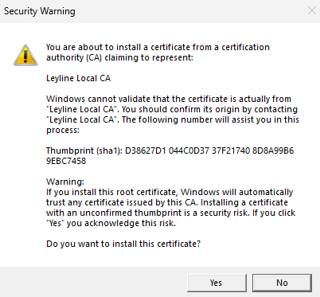

# Installation Guide

## Download

Grab the latest release for your platform:

| Platform | File | Notes |
|----------|------|-------|
| Windows (x64) | `Leyline_vX.Y.Z_x64-setup.exe` | Standard installer |
| macOS (Apple Silicon) | `Leyline_vX.Y.Z_aarch64.dmg` | Right-click → Open on first launch ([#338](https://github.com/delebedev/leyline/issues/338)) |

**[Download latest release →](https://github.com/delebedev/leyline/releases)**

## Windows

1. Run the installer (`Leyline_..._x64-setup.exe`)
2. Launch Leyline from the Start menu or `C:\Program Files\Leyline\`
3. Click **Play**

### Certificate trust dialog

On first launch, Windows shows a security dialog asking you to trust the **Leyline Local CA** certificate:

<p align="center">
  
</p>

Click **Yes** to allow it. This is a one-time prompt — Leyline generates a local certificate authority so your Arena client can connect to the local server over TLS. The certificate is only used for localhost connections and is stored in your user certificate store.

## macOS

1. Open the `.dmg` and drag Leyline to Applications
2. Right-click the app → **Open** (first launch only — the `.dmg` is currently unsigned, see [#338](https://github.com/delebedev/leyline/issues/338))
3. Click **Play** — the app finds Arena, configures it, and starts the server

> **Note:** macOS Gatekeeper blocks unsigned apps by default. Right-click → Open bypasses this for a single app. If you see "damaged" errors, run `xattr -cr /Applications/Leyline.app` in Terminal. Code signing is tracked in [#338](https://github.com/delebedev/leyline/issues/338).

On first launch, macOS will ask for your password to trust the Leyline TLS certificate in your login keychain.

## Requirements

- **MTG Arena** installed via Epic Games or Steam
- Leyline auto-detects the Arena installation and configures it on Play
- No other software needed — the launcher bundles its own Java runtime

## FAQ

<details>
<summary><b>Why does Leyline need a certificate?</b></summary>

Arena communicates over TLS (encrypted connections). For the local server to accept these connections, it needs a TLS certificate that Arena trusts. Leyline generates a local certificate authority, trusts it in your OS, and signs server certificates with it. All certificates are local-only and stored in your user profile.
</details>

<details>
<summary><b>"Play" stays on "Starting..." for a long time</b></summary>

The game engine loads ~32,000 card scripts on first start, which takes 30-60 seconds depending on your machine. This is normal.
</details>

<details>
<summary><b>Arena doesn't show the Forge/Leyline environment</b></summary>

Arena reads its server configuration at launch. If you started Arena before clicking Play in Leyline, restart Arena so it picks up the new configuration.
</details>

<details>
<summary><b>How do I restore Arena to stock?</b></summary>

Click **Stop** in Leyline, then close the app. Leyline removes its configuration from Arena automatically. You can also manually delete `services.conf` from Arena's StreamingAssets folder.
</details>

<details>
<summary><b>macOS: "Leyline is damaged and can't be opened"</b></summary>

This happens because the `.dmg` is not code-signed yet ([#338](https://github.com/delebedev/leyline/issues/338)). Fix:
```bash
xattr -cr /Applications/Leyline.app
```
Then open normally.
</details>

<details>
<summary><b>Where are logs?</b></summary>

- **Windows:** `%LOCALAPPDATA%\dev.leyline.launcher\logs\leyline-server.log`
- **macOS:** `~/Library/Logs/dev.leyline.launcher/leyline-server.log`
</details>
