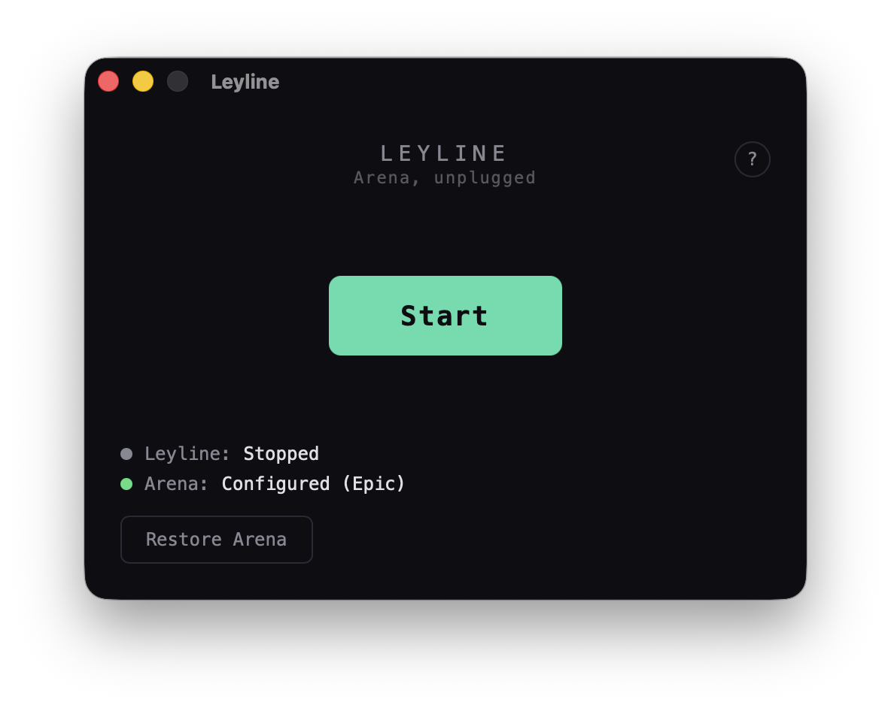

# Leyline Launcher

Desktop app for playing Arena offline. Manages the leyline server and Arena configuration — no terminal needed.

<p align="center">
  
</p>

## What it does

1. **Start** — configures Arena to connect to leyline, starts the local server
2. **Restore** — undoes all changes, Arena connects to official servers again
3. Launch Arena normally — it connects to leyline instead of WotC

## Install

Download `Leyline_0.1.0_aarch64.dmg` from [GitHub Releases](https://github.com/delebedev/leyline/releases). Drag to Applications. Open.

Requires a local [MTGA](https://magic.wizards.com/en/mtgarena) installation (Epic Games or Steam).

## Build from source

Requires [Bun](https://bun.sh) (1.3+) and [Rust](https://rustup.rs) (1.75+).

```bash
# From repo root — build the server bundle first
just bundle

# Build the launcher
cd launcher
bun install
bun tauri build
```

The `.dmg` lands in `src-tauri/target/release/bundle/dmg/`.

For development (hot-reload):

```bash
just bundle          # needed once for sidecar
cd launcher
bun install
bun tauri dev
```

## How it works

The launcher embeds the leyline server (a stripped JVM + game engine, ~80MB) as a sidecar process. When you click Start:

1. Copies `services.conf` into Arena's StreamingAssets (tells Arena to connect to localhost)
2. Creates a stub audio file Arena expects
3. Sets macOS preferences to skip TLS cert verification (localhost uses self-signed)
4. Starts the leyline server and waits for it to be healthy

Restore reverses all of this — removes the config file and resets preferences.

## Platform support

macOS arm64 only for now. Windows and Linux builds are planned.
